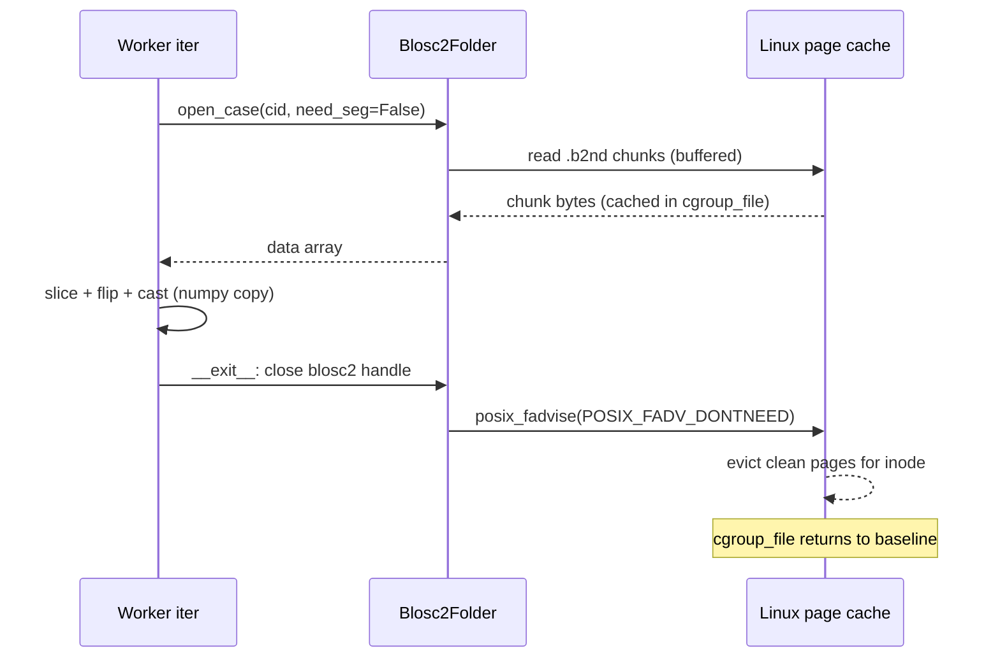

# Fix MAE cgroup OOM at the source

## Root cause (confirmed)

- `cgroup_file` grows because `blosc2.open(..., mmap=False)` still does buffered I/O — the kernel caches every decompressed chunk's underlying disk blocks in the page cache for the `.b2nd` inode. Closing the blosc2 handle does **not** evict those pages.
- `cgroup_shmem` grows because `torch.utils.data.DataLoader` with `num_workers>0` ships tensors between worker and main process via `memfd_create` (default `file_descriptor` strategy) — both `/tmp` and `/dev/shm` are tmpfs on this host (1 TB each), so every memfd byte is accounted as `cgroup_shmem`. The growth slope (~1.5 GB/epoch) matches the well-known PyTorch reductions refcount leak.

Both contributors are independent and both must be fixed.

## Fix A: Page-cache eviction (the only sound way to stop `cgroup_file`)

Add a `_fadvise_dontneed(path)` helper and call it for every `.b2nd` file the instant we close its blosc2 handle. `POSIX_FADV_DONTNEED` evicts clean pages for the inode; our access pattern (read-only, no mmap, handle closed first) is exactly the case where the kernel honors it.

Touch points in [`nanounet/data/blosc2_dataset.py`](nanounet/data/blosc2_dataset.py):

```python
def _fadvise_dontneed(path: str) -> None:
    if not hasattr(os, "posix_fadvise"):
        return
    try:
        fd = os.open(path, os.O_RDONLY)
        try:
            os.posix_fadvise(fd, 0, 0, os.POSIX_FADV_DONTNEED)
        finally:
            os.close(fd)
    except OSError:
        pass
```

- `case_spatial_shape(folder, identifier)`: capture the path, open/read shape/close, then `_fadvise_dontneed(path)`.
- `Blosc2Folder.open_case(...)`: in the `finally:` block, after `_close_b2(...)` for `data`, `seg`, `seg_prev`, call `_fadvise_dontneed` on each opened path. Only the path actually opened is fadvised (skip seg paths when `need_seg=False`).

This is ~10 lines of code in one file. It directly contradicts the failed mode (cache-bypass without the disruption of O_DIRECT).

## Fix B: Eliminate DataLoader IPC shmem leakage

Default MAE pretrain to `num_workers=0`. The MAE per-patch CPU work is a slice, three flips, and a cast — trivial vs. an H200 forward+backward on `[1,96,160,160]` fp16 — so the regression is expected to stay within the 20% budget. With `num_workers=0` no `memfd_create` / `/tmp/torch_*` traffic exists, and shmem growth becomes structurally impossible.

Keep a fallback for users who want workers anyway, gated by an env var; in that branch we switch the sharing strategy to `file_system` and clean up stale torch IPC files between epochs.

Touch points:

- [`nanounet/dataloader_prefs.py`](nanounet/dataloader_prefs.py): add a new bucket lookup helper or extend the existing one — `mae_bucket(name)` (or `dataloader_bucket_for_mae`) that returns a `DataloaderBucket` with `nw_train=0, nw_val=0, prefetch_train=0, prefetch_val=0` unless `NANOUNET_MAE_KEEP_WORKERS=1` is set (then it returns the regular `s/m/l` bucket).
- [`nanounet/pretrain/dataset.py`](nanounet/pretrain/dataset.py) `build_pretrain_dataloaders`:
  - If `nw_tr == 0`, pass `prefetch_factor=None`, `pin_memory=False`, `worker_init_fn=None`, and **do not** pass `persistent_workers=False` (it's invalid for `num_workers=0`).
  - When the fallback env var is set, call once at the top:

```python
import torch.multiprocessing as tmp
if tmp.get_sharing_strategy() != "file_system":
    tmp.set_sharing_strategy("file_system")
```

  - When the fallback is active, register a small `_purge_torch_tmp()` callback that runs at the start of each epoch and `os.unlink`s `/tmp/torch_*` and `/tmp/pymp-*` files older than ~30 s. Hook is invoked from `NanoMAELM.on_train_epoch_start`.
- [`nanounet/cli/train.py`](nanounet/cli/train.py): use the new MAE bucket helper when constructing the MAE dataloaders so the supervised path is untouched.

The supervised path keeps the existing `dl-bucket` semantics.

## Fix C: Diagnostics to prove the fix

Small additions to [`nanounet/mem_diag.py`](nanounet/mem_diag.py) and [`nanounet/pretrain/dataset.py`](nanounet/pretrain/dataset.py):

- New `worker_diag_iter_end(wid, extra)` that logs `cgroup_file_bytes`, `cgroup_shmem_bytes`, opens, patches, and `b2_closes` at the end of every worker iter pass — written to `mem_diag_worker_{wid}.jsonl`. (With `num_workers=0`, the main-process epoch row already captures this; keep the helper so the fallback branch is observable.)
- In `NanoMAELM.on_validation_epoch_end` (already exists), add a per-epoch delta: store the previous epoch's `cgroup_file_bytes` and `cgroup_shmem_bytes` on `self`, compute and log `mem/cgroup_file_delta_gb` and `mem/cgroup_shmem_delta_gb`. This makes the slope visible in W&B without parsing JSONL.

## Sequence diagram of the read+evict flow



## Validation protocol (success criteria)

Run with the existing `--mem-diag` flag. After applying A+B:

1. Smoke test, 5 epochs, single process (default `nw=0`), local dataset:
   - `cgroup_file_bytes` slope < 0.1 GB/epoch
   - `cgroup_shmem_bytes` flat (no IPC at all)
   - it/s within 20% of 2.3 baseline
2. Fallback test, 5 epochs, `NANOUNET_MAE_KEEP_WORKERS=1` with `--dl-bucket s`:
   - `cgroup_file_bytes` slope < 0.1 GB/epoch (Fix A works regardless of workers)
   - `cgroup_shmem_bytes` slope < 0.1 GB/epoch (file_system strategy + cleanup works)
3. Long run under real `#SBATCH --mem=250G` step cgroup, 200+ epochs, no OOM.

Treat the interactive root-cgroup numbers as directional only — the Slurm validation in (3) is the final acceptance gate.

## Out of scope

- `O_DIRECT` reads (incompatible with blosc2's chunk-size-driven reads).
- Splitting MAE into multiple Slurm jobs.
- Any change to the supervised data pipeline.
- Removing the diagnostic module — kept for the validation runs.