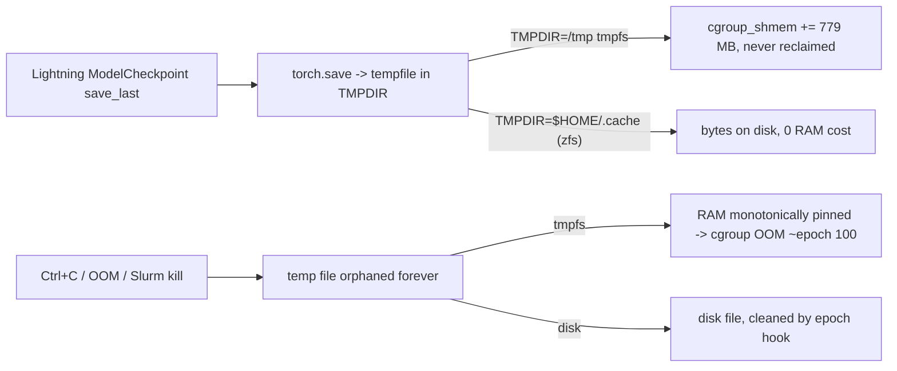

# Fix MAE / training cgroup OOM (Dataset999)

## Diagnosis confirmed from the live host

- `/tmp` is **tmpfs (RAM-backed)**, currently **26 GB used** by 34 leaked files matching `/tmp/tmpXXXXXXXX`, each **779 MB**, header `PK\003\004 archive/data.pkl` (PyTorch zip pickle). `last.ckpt` is **779 MB**. These are checkpoint stage-files left over from interrupted runs. Tmpfs bytes are counted as `cgroup_shmem` and are **not reclaimable**.
- `/proc/self/cgroup` is `0::/` (root cgroup) in this container; `/sys/fs/cgroup` is mounted **read-only** (no sub-cgroup, no `systemd-run`). So all `cgroup_file_delta_bytes` / `cgroup_shmem_delta_bytes` observed on this node are node-wide noise — not the training PID. On Slurm the step cgroup is correct, but the same `/tmp`-tmpfs leak still applies.
- `posix_fadvise(DONTNEED)` is already in `[nanounet/data/blosc2_dataset.py](nanounet/data/blosc2_dataset.py)`; under the Slurm cgroup limit, page cache is reclaimable anyway. **Shmem is the killer, not page cache.**

## Fix plan (small, additive)

### 1. Move tempfile root off tmpfs (primary OOM fix)

Set `TMPDIR` to a non-tmpfs path **before** any `import torch` / `import pytorch_lightning` so `tempfile.gettempdir()` picks it up. Done once in `[nanounet/cli/train.py](nanounet/cli/train.py)` and `[nanounet/cli/pretrain.py](nanounet/cli/pretrain.py)` at top of `main()` (and in a new tiny helper to keep both CLIs identical).

- Helper in a new file `[nanounet/runtime.py](nanounet/runtime.py)` (~30 lines):
  - `set_safe_tmpdir(default=...)`: pick the first writable, **non-tmpfs** path from `$NANOUNET_TMPDIR`, `$HOME/.cache/nanounet_tmp`, `<results_dir>/.tmp`; `mkdir -p`; set `os.environ["TMPDIR"]`, `TMP`, `TEMP`, and `tempfile.tempdir`.
  - `runtime_banner()`: log to mem_diag + stdout — `nanounet.__file__`, `git rev-parse HEAD` (best-effort), `TMPDIR`, `tmp_fs_type` (parse `/proc/mounts`), `cgroup_path`, `cgroup_scope` (`slurm|root|other`), `Slurm job id`.
- Call `set_safe_tmpdir()` at line 1 of both CLIs, before `import torch` chains.

### 2. Detect & prune the tmpfs checkpoint leak

In `[nanounet/mem_diag.py](nanounet/mem_diag.py)`, extend `purge_torch_tmp()`:

- Add a conservative pattern for stale PyTorch zip-pickle stage files in tmpfs only: match `re.fullmatch(r"tmp[a-zA-Z0-9_]{8}", basename)`, file size > 64 MiB, owned by current uid, first 4 bytes == `PK\x03\x04`, age > 60 s. (Header check avoids deleting unrelated `tmpXXXXXXXX` files from other tools.)
- Call from `runtime_banner()` once at startup and from `[NanoMAELM.on_train_epoch_start](nanounet/pretrain/module.py)` / `[NanoUNetLM.on_train_epoch_start](nanounet/train/lightning_module.py)` every epoch (already invoked conditionally — drop the `dl_keep_workers()` guard for this path).
- Belt-and-suspenders only; primary protection is `TMPDIR` redirect.

### 3. Honest cgroup diagnostics

In `[nanounet/mem_diag.py](nanounet/mem_diag.py)`:

- In `_cgroup_dir()`, also return the resolved path string.
- Add `cgroup_scope()`: `"slurm"` if `SLURM_JOB_ID` set, `"root"` if path == `/sys/fs/cgroup`, `"other"` otherwise.
- Every `snapshot()` row gains `cgroup_path` + `cgroup_scope`. W&B scalars unchanged.
- On startup, **abort the run with a clear error** if `--mem-diag` is on, `cgroup_scope == "root"`, and `SLURM_JOB_ID` unset — unless `NANOUNET_ALLOW_ROOT_CGROUP=1`. (Prevents wasting another day chasing root-cgroup noise.)

### 4. Prove Fix A is live

- Replace the thread-local b2 close counter with a process-global `multiprocessing.Value('Q', 0)` plus a new `fadvise_count` Value in `[nanounet/data/blosc2_dataset.py](nanounet/data/blosc2_dataset.py)`. Increment in `_fadvise_dontneed`. Read in `snapshot()` and log per epoch: `b2_closes`, `fadvise_calls`. Both must grow each epoch when `--mem-diag` is on; zero = stale install.
- Add `posix_fadvise(fd, 0, 0, POSIX_FADV_RANDOM)` right after open in `_open_b2` (no-op on filesystems that ignore it, prevents readahead pages on those that don't). Pure win on Linux.

### 5. One-shot cleanup + Slurm validation

- One-time: `rm -f /tmp/tmp????????` (after confirming no live nanounet process is running) — frees ~26 GB tmpfs.
- Slurm validation run (acceptance gate) — single job, `#SBATCH --mem=250G`, 50-epoch MAE only, `--mem-diag`, `TMPDIR=$HOME/.cache/nanounet_tmp`:
  - Pass: `cgroup_shmem_delta < 0.1 GB/ep` and `cgroup_file_delta < 0.1 GB/ep` over epochs 5–50, no OOM, speed within 20% of baseline.
  - mem_diag must show `cgroup_scope == "slurm"` and `fadvise_calls` strictly increasing.

## Why this works

The lockstep 1.6 GB/epoch on the interactive node is **root-cgroup noise**, not the training PID — Fix #3 makes that visible (and fails fast). Real production growth on Slurm is dominated by the checkpoint tmpfs leak; Fix #1 eliminates the source and Fix #2 cleans the residue.

## Out of scope (explicitly rejected)

- `--mem` bump, splitting MAE into multiple jobs, persistent_workers, mmap toggling. Already attempted, do not revisit.
- ZFS `primarycache=metadata` — needs root on the host; not required once shmem leak is closed (page cache is reclaimable under the Slurm cgroup limit).
- O_DIRECT wrapper around blosc2 — heavy, unnecessary.

## Files touched

- `[nanounet/runtime.py](nanounet/runtime.py)` — new, ~50 lines: `set_safe_tmpdir`, `runtime_banner`, `cgroup_scope` helper.
- `[nanounet/mem_diag.py](nanounet/mem_diag.py)` — extend `purge_torch_tmp` pattern + header check; add `cgroup_scope` and `cgroup_path` to snapshots; expose `fadvise_count`.
- `[nanounet/data/blosc2_dataset.py](nanounet/data/blosc2_dataset.py)` — process-global `fadvise_count`, `POSIX_FADV_RANDOM` at open.
- `[nanounet/cli/train.py](nanounet/cli/train.py)` and `[nanounet/cli/pretrain.py](nanounet/cli/pretrain.py)` — call `set_safe_tmpdir()` and `runtime_banner()` at top of `main()`; abort if root-cgroup with `--mem-diag` unless override env set.
- `[nanounet/pretrain/module.py](nanounet/pretrain/module.py)` and `[nanounet/train/lightning_module.py](nanounet/train/lightning_module.py)` — unconditional `purge_torch_tmp()` each `on_train_epoch_start`.

No new dependencies, ~120 LOC net.
