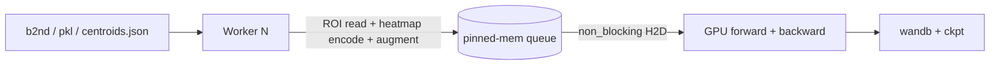

## nanoUNet — design plan

### 0. Goals (in scope)

- Functional parity with the prompt-aware path of `nnUNet-v2-pro` for **3D ResEnc UNet only**:
  - Same network (ResidualEncoderUNet from `dynamic_network_architectures`) with `num_input_channels + 2` (pos + neg prompt heatmap channels).
  - Same 4-mode patch sampling (`pos`, `pos+spurious`, `pos+no_prompt`, `negative`) with propagated-offset centroid simulation.
  - Same DC + CE loss with deep supervision wrapper.
  - Same nnUNet preprocessing (transpose_forward → nonzero crop → per-channel normalize → resample) and same blosc2 `*_data.b2nd` / `*_seg.b2nd` / `*.pkl` layout, including offline `*_centroids.json`.
  - Same `splits_final.json` (5-fold KFold, seed 12345) written next to preprocessed data for crash/resume reproducibility.
  - Same inference post-processing: logits → softmax → resample back → undo nonzero crop → undo `transpose_backward` → write NIfTI with original SimpleITK geometry.
  - Same `nnunet_pro_config.json` schema (renamed `nano_config.json`) copied into the model folder at train start, loaded at inference.
- **Out of scope** (explicitly dropped):
  - 2D / pseudo-2D configs, `3d_lowres`, cascade, region-based labels.
  - Multi-prompt CLI (`nnUNetv2_predict_from_prompts`), warm session, multi-prompt cluster border-expand.
  - Stratified sampler, `case_stats.json`, percentile size bins.
  - Multi-dataset merge, raw dataset integrity verification.
  - `DDP` / multi-GPU training (Lightning gives this for free if needed, but no SLURM array hooks).

### 0.5. Coding philosophy and style (read this first)

This section is **non-negotiable**. Every file in `nanoUNet/nanounet/` must obey it. It is distilled from Karpathy's [nanochat](https://github.com/karpathy/nanochat) plus the user's own style guides.

#### Read first: what nanochat actually does

Direct observations from reading [`nanochat/gpt.py`](https://github.com/karpathy/nanochat/blob/master/nanochat/gpt.py), [`nanochat/dataloader.py`](https://github.com/karpathy/nanochat/blob/master/nanochat/dataloader.py), [`nanochat/common.py`](https://github.com/karpathy/nanochat/blob/master/nanochat/common.py), and [`scripts/base_train.py`](https://github.com/karpathy/nanochat/blob/master/scripts/base_train.py):

- One file = one concept. `gpt.py` (508 LOC) defines the whole transformer; `dataloader.py` is a single generator function; `optim.py` is just the optimizer. Files are **not** split for the sake of being small; they are split only when the concept is independent.
- Every file opens with a short `"""docstring"""` listing notable features ("rotary embeddings", "QK norm", "no bias in linear layers"). The reader knows in 30s what the file contains and what is novel.
- Scripts (`scripts/base_train.py`) are **top-to-bottom procedural**. No `def main()` wrapping. argparse at the top, code falls through to the loop, cleanup at the bottom. They read like a notebook, not a framework entry point.
- Tiny utilities live together in a single `common.py` (~280 LOC: `print0`, `DummyWandb`, `get_dist_info`, `compute_init`, `COMPUTE_DTYPE`, etc.). No `utils/` package, no registries, no "abstract base" anything.
- **Dataclasses for config**, not dicts or Pydantic. `GPTConfig` is 8 fields and a default. argparse parses CLI into a flat namespace and feeds it into the dataclass.
- **Globals are fine when they are constants.** `COMPUTE_DTYPE` is detected once at import time and reused everywhere. No `Settings()` singletons, no DI containers.
- **Classes only when state is needed.** The dataloader is a generator function. `CausalSelfAttention` is a class because it owns `nn.Linear` modules.
- **No defensive programming.** `assert split in ("train","val")` rather than `if ... raise`. Errors die at the call site, not three layers deep.
- Comments say *why*, never *what*. "split scale between Q and K, TODO think through better" is a comment. "Create the model" is not.
- No abstract base classes. No factories. No plugins. No mixin chains. No "Strategy" patterns. If you can replace a class with a function, do.
- No frameworks except PyTorch + a tokenizer. The training loop is literally `for step in range(num_iterations): ...`.

#### How nanoUNet adopts this (and where it deviates)

Same spirit, three explicit deviations:

1. **Subfolders inside `nanounet/`.** nanochat keeps everything flat. The user prefers grouped subfolders. Allowed grouping (one level deep, max 5 files per folder):
   ```
   nanounet/
   ├── data/        # io.py, geometry.py, dataset.py, sampling.py, augment.py
   ├── prompt/      # encoding.py, propagation.py, centroids.py
   ├── plan/        # fingerprint.py, planner.py, preprocess.py, splits.py
   ├── model/       # network.py, losses.py, lr_schedule.py
   ├── train/       # data_module.py, lightning_module.py
   ├── infer/       # predictor.py, border_expand.py, export.py
   ├── cli/         # preprocess.py, train.py, predict.py
   ├── common.py    # paths, env vars, logger, dtype, seed — flat, nanochat-style
   └── config.py    # RoiPromptConfig dataclass + load/save — flat
   ```
   Subfolder names must be **nouns**, never `utils/` or `helpers/`. If a file does not clearly belong, it goes in `common.py`, not in a new folder.
2. **PyTorch Lightning** instead of a hand-rolled loop. The user asked for it. The cost is one `LightningModule` plus one `LightningDataModule`; everything else (logging, ckpt, resume, mixed precision, prefetch) is free. We will not use Lightning *callbacks* for custom logic — anything non-trivial goes in the LightningModule.
3. **Heavy reuse of upstream packages** (`dynamic_network_architectures`, `batchgeneratorsv2`, `acvl_utils`, `cc3d`, `blosc2`, `SimpleITK`). Reimplementing them is bloat. nanochat does this too (PyTorch, `pyarrow`, `wandb`, `filelock`).

#### Hard rules

| # | Rule |
|---|------|
| R1 | **<200 LOC per file** (user style guide). Hard limit. If a file grows past 200, split it on a concept boundary, not arbitrarily. |
| R2 | **No file shorter than ~30 LOC** that exists only to host one function. Inline it into the nearest sibling or put it in `common.py`. nanochat's `common.py` has 12 helpers in one file — copy that pattern. |
| R3 | **No abstract base classes, no factories, no registries, no plugin systems.** If you want to support two of something, write `if cfg.x == "a": ... else: ...`. Two cases is not a registry. |
| R4 | **No `utils/` package.** Real names only. `geometry.py`, `centroids.py`, `propagation.py`. |
| R5 | **No defensive programming.** `assert` on invariants, raise on user input at the boundary (CLI / config / file I/O). Do not wrap things in try/except just to log and re-raise. |
| R6 | **One module-level docstring per file.** Short, lists what is in the file and any non-obvious feature. No section banners, no decorative comments. |
| R7 | **Type hints on public function signatures and dataclasses.** Skip them inside small helpers. Don't paint walls of `Optional[Union[...]]`. |
| R8 | **Dataclasses for config**, argparse for CLI, JSON for on-disk config. No Hydra, no OmegaConf, no Pydantic. |
| R9 | **Constants and detected facts go at module top** as `UPPER_CASE = ...`. No `Settings()` class. |
| R10 | **Comments explain why** (intent, invariant, trade-off, gotcha). Never *what*. Delete any comment that paraphrases the next line. |
| R11 | **No print statements** outside `common.py` (`print0` for rank-0). Logger or `Trainer`/Lightning logging everywhere else. |
| R12 | **No fallbacks for missing data**, ever (user style guide). Centroids file missing → raise. Plan missing → raise. No silent recompute, no synthetic defaults. (nnUNet-pro's runtime centroid recompute is the *one* exception we are dropping.) |
| R13 | **CLI scripts are top-to-bottom procedural.** argparse → setup → call into library → exit. No `def main():` wrapper unless `pyproject.toml` console_scripts requires it (in which case `main()` is 10 lines and does only argparse). |
| R14 | **No code-level abstractions over Lightning.** Use `LightningModule`, `LightningDataModule`, `Trainer`, `WandbLogger`, `ModelCheckpoint` directly. Do not write a `BaseTrainer` or a `LightningModuleFactory`. |
| R15 | **Errors are loud and immediate.** Validate config at load time and crash. Validate inputs at CLI entry and crash. The training loop assumes valid state. |
| R16 | **Tests are temporary.** Per the user style guide: write tests, validate, delete. The final repo has no `tests/` folder. |

#### Naming

- `snake_case` for functions / variables / files / folders.
- `PascalCase` for classes and dataclasses.
- `UPPER_CASE` for module-level constants.
- Names are short and precise: `bbox`, `seg`, `hm`, `lr`, `dl`. nanochat uses `q`, `k`, `v`, `B`, `T`. Don't write `query_tensor` when `q` is unambiguous in context.
- File names are nouns: `centroids.py`, not `centroid_utils.py`. Folder names are nouns: `infer/`, not `inference_helpers/`.

#### Reference: a "good" file looks like this

```python
"""4-mode patch sampling: pos, pos+spurious, pos+no_prompt, negative.

Mode draws from cfg.sampling.mode_probs. For non-negative modes the patch is
forced to overlap a foreground voxel from properties['class_locations'].
Centroids may carry a propagation offset to simulate baseline->follow-up COG.
"""

from dataclasses import dataclass
import numpy as np

from nanounet.config import SamplingConfig
from nanounet.prompt.propagation import apply_propagation_offset

MODE_POS, MODE_SPUR, MODE_NO_PROMPT, MODE_NEG = 0, 1, 2, 3


def mode_bbox(shape, class_locations, cfg: SamplingConfig, rng):
    mode = int(rng.choice(4, p=cfg.mode_probs))
    force_fg = mode != MODE_NEG
    lbs, ubs = _bbox(shape, force_fg, class_locations, rng)
    return lbs, ubs, mode

def _bbox(...): ...
```

100 LOC, no class, no factory, no logger, top docstring tells you everything in 4 lines. **This is the target.**

#### Reference: a "bad" file we will not write

- 400 LOC `BaseSampler` with three subclasses and a registry.
- `sampling_utils/spurious_helpers.py` with one 5-line function.
- A `SamplingStrategy` ABC with a single concrete implementation.
- A try/except around every cc3d call that logs and falls back to scipy.
- A `Settings` singleton imported into every module.

If you catch yourself writing any of the above, stop and inline it.

---

### 1. Architecture and dependencies

Reuse the small focused packages nnUNet already depends on so we don't reimplement well-tested code:

- `dynamic_network_architectures` — `ResidualEncoderUNet` (network).
- `batchgeneratorsv2` — `SpatialTransform`, `GaussianNoise`, `GaussianBlur`, `MultiplicativeBrightness`, `Contrast`, `SimulateLowResolution`, `Gamma`, `Mirror`, `DownsampleSegForDS`, `ComposeTransforms`. Run inside worker processes.
- `acvl_utils` — `crop_and_pad_nd`, `insert_crop_into_image`.
- `blosc2` — lazy ROI reads (only decompress chunks overlapping the bbox).
- `cc3d` — centroid extraction + hull shell connected components for border_expand.
- `SimpleITK` — image I/O + geometry preservation.
- `scipy.ndimage`, `skimage.morphology` — EDT, ball strel.
- `pytorch-lightning` — Trainer, LightningModule, LightningDataModule, `WandbLogger`, `ModelCheckpoint`.
- `wandb` — direct via `WandbLogger`.

No batchgenerators v1 (`NonDetMultiThreadedAugmenter`). Lightning's standard `DataLoader(num_workers, prefetch_factor, persistent_workers, pin_memory)` over a `torch.utils.data.IterableDataset` is sufficient and removes the cross-fork augmentation wrapper.

### 2. Repo layout

```
nanoUNet/
├── pyproject.toml          # uv-managed, single source of dep versions
├── README.md
├── configs/
│   └── default.json        # nano_config.json (prompt/sampling/inference)
├── nanounet/
│   ├── __init__.py
│   ├── common.py           # env paths, logger, COMPUTE_DTYPE, seed, print0 (nanochat-style)
│   ├── config.py           # RoiPromptConfig dataclass + load_config + save_config
│   │
│   ├── data/
│   │   ├── io.py           # SimpleITK read/write (keeps sitk_stuff)
│   │   ├── geometry.py     # nonzero crop, resample, insert_crop, transpose helpers
│   │   ├── dataset.py      # Blosc2Case (lazy mmap'd b2nd + pkl + centroids.json merge)
│   │   ├── sampling.py     # 4-mode bbox + force_fg overlap rule
│   │   └── augment.py      # batchgeneratorsv2 train/val transforms
│   │
│   ├── prompt/
│   │   ├── encoding.py     # EDT/binary heatmap_pair (verbatim port)
│   │   ├── propagation.py  # apply_propagation_offset (verbatim port)
│   │   └── centroids.py    # cc3d centroids + bboxes, JSON read/write, --resume
│   │
│   ├── plan/
│   │   ├── fingerprint.py  # per-case fingerprint extractor → fingerprint.json
│   │   ├── planner.py      # ResEnc 3D plans.json builder (single config "3d_fullres")
│   │   ├── preprocess.py   # per-case preprocess → b2nd/_seg.b2nd/.pkl
│   │   └── splits.py       # KFold seed 12345 → splits_final.json
│   │
│   ├── model/
│   │   ├── network.py      # ResidualEncoderUNet wrapper (in_channels = ch + 2)
│   │   ├── losses.py       # DC+CE + DeepSupervisionWrapper
│   │   └── lr_schedule.py  # PolyLR + StretchedTailPolyLR
│   │
│   ├── train/
│   │   ├── data_module.py    # LightningDataModule + IterableDataset + worker_init_fn
│   │   └── lightning_module.py  # NanoUNet(pl.LightningModule), mode-aware val Dice
│   │
│   ├── infer/
│   │   ├── predictor.py    # ROI predictor: load model, preprocess case, single tile forward
│   │   ├── border_expand.py# hull-shell BFS, multi-face plan, Gaussian merge
│   │   └── export.py       # logits → seg → original space → NIfTI write
│   │
│   └── cli/
│       ├── preprocess.py   # `nanounet_preprocess`
│       ├── train.py        # `nanounet_train`
│       └── predict.py      # `nanounet_predict`
└── scripts/
    └── train_999.sh        # SLURM-friendly training script
```

Strict cap: **<200 LOC per file** (user rule). Subfolders are one level deep, max 5 files each; if a folder grows past 5, the split is wrong, not the cap.

### 3. Configuration (`configs/default.json`)

Identical schema to [nnunetv2/utilities/nnunet_pro_config.json](nnUNet-v2-pro/nnunetv2/utilities/nnunet_pro_config.json), minus `size_bins` and `stratified`:

```json
{
  "prompt":    {"point_radius_vox": 2, "encoding": "edt", "validation_use_prompt": true, "prompt_intensity_scale": 0.5},
  "sampling":  {"mode_probs": [0.35, 0.15, 0.15, 0.35], "n_spur": [1, 2], "n_neg": [1, 3],
                "large_lesion": {"K": 2, "K_min": 1, "K_max": 4, "max_extra": 0},
                "propagated":   {"sigma_per_axis": [2.75, 5.19, 5.40], "max_vox": 34.0}},
  "inference": {"tile_step_size": 0.75, "disable_tta_default": false}
}
```

[`nanounet/config.py`](nanoUNet/nanounet/config.py) — direct port of `RoiPromptConfig`, `_load_prompt`, `_load_sampling`, `_load_inference`, `_load_propagated`, `load_config` from [`nnunetv2/utilities/roi_config.py`](nnUNet-v2-pro/nnunetv2/utilities/roi_config.py) lines 11–67, 71–172, 205–228. Drop `size_bins` and `stratified` branches. Add `save_config(cfg, path)` to write JSON next to checkpoints.

### 4. Preprocessing pipeline

`nanounet_preprocess -d DATASET_ID [--np 8] [--resume] [--config PATH]`:

1. **Fingerprint** ([`nanounet/plan/fingerprint.py`](nanoUNet/nanounet/plan/fingerprint.py), `extract_fingerprint`): per-case nonzero crop bbox, shape, spacing, foreground intensity stats. Saved at `NANOUNET_preprocessed/<dataset>/fingerprint.json`. Direct port of [`nnunetv2/experiment_planning/dataset_fingerprint/fingerprint_extractor.py`](nnUNet-v2-pro/nnunetv2/experiment_planning/dataset_fingerprint/fingerprint_extractor.py) minus 2D paths.
2. **Plan** ([`nanounet/plan/planner.py`](nanoUNet/nanounet/plan/planner.py), `plan_resenc_3d`): port the relevant subset of [`nnunetv2/experiment_planning/experiment_planners/default_experiment_planner.py`](nnUNet-v2-pro/nnunetv2/experiment_planning/experiment_planners/default_experiment_planner.py) `get_plans_for_configuration` for `3d_fullres` only, using ResEnc presets from [`residual_encoder_unet_planners.py`](nnUNet-v2-pro/nnunetv2/experiment_planning/experiment_planners/residual_unets/residual_encoder_unet_planners.py). Output `plans.json` with **one** configuration key `"3d_fullres"`, plus top-level `transpose_forward`, `transpose_backward`, `normalization_schemes`, `foreground_intensity_properties_per_channel`. Architecture is hard-coded as `ResidualEncoderUNet` so no `arch_kwargs._kw_requires_import` indirection needed.
3. **Per-case preprocess** ([`nanounet/plan/preprocess.py`](nanoUNet/nanounet/plan/preprocess.py)): port [`default_preprocessor.py`](nnUNet-v2-pro/nnunetv2/preprocessing/preprocessors/default_preprocessor.py) `run_case_npy` lines 52–111 (transpose, nonzero crop, normalize with per-channel scheme, resample). Write `<id>.b2nd`, `<id>_seg.b2nd`, `<id>.pkl` (with `bbox_used_for_cropping`, `shape_before_cropping`, `shape_after_cropping_and_before_resampling`, `class_locations`, `sitk_stuff`, `spacing`).
4. **Centroids** ([`nanounet/prompt/centroids.py`](nanoUNet/nanounet/prompt/centroids.py)): for every `<id>_seg.b2nd` write `<id>_centroids.json` with `centroids_zyx` + `bboxes_zyx` (cc3d). Skip when `--resume` and file exists. Direct port of [`nnunetv2/preprocessing/precompute_centroids.py`](nnUNet-v2-pro/nnunetv2/preprocessing/precompute_centroids.py).
5. **Parallelism**: `multiprocessing.Pool` with `--np` workers, mirroring nnUNet (no DA augmenter here).

### 5. Splits

[`nanounet/plan/splits.py`](nanoUNet/nanounet/plan/splits.py) — port [`nnunetv2/utilities/crossval_split.py`](nnUNet-v2-pro/nnunetv2/utilities/crossval_split.py). Trainer's `setup()` writes `splits_final.json` next to preprocessed data on first call; subsequent runs reuse it. Crash/resume re-reads the same file. Same seed (12345), 5-fold KFold, sorted case ids.

### 6. Dataset + Sampling + Augmentation

[`nanounet/data/dataset.py`](nanoUNet/nanounet/data/dataset.py) — `Blosc2Case`:

```python
class Blosc2Case:
    def __init__(self, folder, case_id): ...
    def open(self):  # returns (data, seg, properties) with blosc2 mmap handles
```

Direct port of `nnUNetDatasetBlosc2.load_case` ([`nnunetv2/training/dataloading/nnunet_dataset.py`](nnUNet-v2-pro/nnunetv2/training/dataloading/nnunet_dataset.py) lines 128–152), including `centroids.json` merge into `properties`.

[`nanounet/data/sampling.py`](nanoUNet/nanounet/data/sampling.py) — patch logic:

- `mode_bbox(shape, class_locations, cfg, rng)` → `(lbs, ubs, mode)` from `mode_probs` and `force_fg = mode != NEG`, port from [`prompt_aware_data_loader.py`](nnUNet-v2-pro/nnunetv2/training/dataloading/prompt_aware_data_loader.py) `_get_bbox_and_mode` (147–167) + `get_bbox` overlap logic.
- `sample_spurious(seg, n_range, rng)` for spurious bg points and negative-mode neg points (lines 27–40).

[`nanounet/prompt/propagation.py`](nanoUNet/nanounet/prompt/propagation.py) — verbatim port of [`propagated_prompt_simulation.py`](nnUNet-v2-pro/nnunetv2/utilities/propagated_prompt_simulation.py) lines 7–32.

[`nanounet/prompt/encoding.py`](nanoUNet/nanounet/prompt/encoding.py) — verbatim port of [`nnunetv2/utilities/prompt_encoding.py`](nnUNet-v2-pro/nnunetv2/utilities/prompt_encoding.py) `_build_ball_strel`, `encode_points_to_heatmap`, `encode_points_to_heatmap_pair`. Drop `extract_centroids_from_seg` (lives in `nanounet/prompt/centroids.py`).

[`nanounet/data/augment.py`](nanoUNet/nanounet/data/augment.py) — `train_transforms(patch_size, deep_supervision_scales, mirror_axes)` and `val_transforms(deep_supervision_scales)`, mirroring [`nnUNetTrainer.get_training_transforms / get_validation_transforms`](nnUNet-v2-pro/nnunetv2/training/nnUNetTrainer/nnUNetTrainer.py). Operates on `data`/`seg`/`mode` keys.

[`nanounet/train/data_module.py`](nanoUNet/nanounet/train/data_module.py) — `NanoDataModule(pl.LightningDataModule)`:

- `PromptAwareIterableDataset(torch.utils.data.IterableDataset)`: in `__iter__` yields one *patch* at a time. Per item: pick case from `tr_keys`, open Blosc2 handles, draw `(lbs, ubs, mode)`, lazy-read `data[:, slz, sly, slx]` and `seg[:, slz, sly, slx]` (only the ROI is decompressed), build local centroids, apply propagation offset, sample spurious/neg points, encode 2-channel heatmap, concatenate to image channels, transform via `train_transforms`. Returns dict `{data, target, mode}`.
- `train_dataloader()` returns `DataLoader(dataset, batch_size, num_workers=N, prefetch_factor=4, persistent_workers=True, pin_memory=True, collate_fn=stack)`.
- `val_dataloader()` returns the same with `val_transforms` and `force_zero_prompt=not cfg.prompt.validation_use_prompt`.

This is the throughput-critical module. Decisions:

- Use **IterableDataset + many workers** instead of nnUNet's `NonDetMultiThreadedAugmenter`. Each worker draws its own patches → no contention. `pin_memory=True` + `non_blocking=True` device transfer keeps the GPU fed.
- Augmentation runs in the worker process (CPU).
- Epoch length is finite: `num_iterations_per_epoch * batch_size` items per epoch, distributed across workers via `worker_init_fn` (RNG seeding per worker).
- Optional: cache (or not) per-case `properties` in the worker; b2nd handles are already `mmap_mode='r'`.



### 7. Model + loss + LR

[`nanounet/model/network.py`](nanoUNet/nanounet/model/network.py) — thin wrapper:

```python
def build_resenc3d(plan_cfg: dict, num_input_channels: int, num_classes: int, deep_supervision: bool):
    return ResidualEncoderUNet(
        input_channels=num_input_channels + 2,
        n_stages=plan_cfg["n_stages"],
        features_per_stage=plan_cfg["features_per_stage"],
        ...
        deep_supervision=deep_supervision,
    )
```

[`nanounet/model/losses.py`](nanoUNet/nanounet/model/losses.py) — direct port of `DC_and_CE_loss` + `DeepSupervisionWrapper` from `nnunetv2.training.loss` (only the non-region branch). Default `batch_dice=True` to match the trained model.

[`nanounet/model/lr_schedule.py`](nanoUNet/nanounet/model/lr_schedule.py) — port `PolyLRScheduler` + `StretchedTailPolyLRScheduler` from nnUNet trainer. Selectable via `--lr-schedule {poly,stretched_tail_poly}`.

### 8. Lightning trainer

[`nanounet/train/lightning_module.py`](nanoUNet/nanounet/train/lightning_module.py) — `NanoUNet(pl.LightningModule)`:

- `__init__(plan_cfg, dataset_json, cfg: RoiPromptConfig, lr, weight_decay, momentum, lr_schedule, num_epochs)`
- `model = build_resenc3d(...)`; `loss = DC_and_CE_loss + DeepSupervisionWrapper`.
- `training_step(batch, _)`: `out = model(batch["data"])`; `loss = self.loss(out, batch["target"])`; `self.log("train_loss", loss, prog_bar=True)`.
- `validation_step(batch, _)`: forward, per-sample Dice on FG. Group by `batch["mode"]` and log `val_dice_pos`, `val_dice_pos_spur`, `val_dice_pos_no_prompt`, `val_dice_neg`, plus global `val_dice`. Port the per-mode masking logic from [_validation_utils.py](nnUNet-v2-pro/nnunetv2/training/nnUNetTrainer/variants/_validation_utils.py) lines 49–76.
- `configure_optimizers()`: SGD(`lr`, `momentum=0.99`, `nesterov=True`, `weight_decay=3e-5`) + selected scheduler.

Lightning's `Trainer`:

- `WandbLogger(project=..., name=..., resume="allow", id=run_id)` — set via CLI flags `--wandb-project`, `--wandb-run-name`, `--wandb-id`. Run ID also stored in the last checkpoint so `--c` resumes the wandb run.
- `ModelCheckpoint(monitor="val_dice", mode="max", save_last=True, save_top_k=1, filename="best")`.
- `RichProgressBar()` for the same Rich look-and-feel as nnUNet-pro.
- `max_epochs`, `accumulate_grad_batches`, `precision="bf16-mixed"` defaults.
- `--c` flag → `ckpt_path="last"`.

CLI mirrors the user's training script:

```bash
nanounet_train -d 999 -f 0 -tr resenc --epochs 2500 --lr-schedule stretched_tail_poly \
  --use-wandb --wandb-project nano-999 -c
```

### 9. Inference

[`nanounet/infer/predictor.py`](nanoUNet/nanounet/infer/predictor.py) — `ROIPredictor` (border-expand BFS lives in [`nanounet/infer/border_expand.py`](nanoUNet/nanounet/infer/border_expand.py); export in [`nanounet/infer/export.py`](nanoUNet/nanounet/infer/export.py)):

- `initialize(model_folder, fold, device)`: load `plan.json`, `dataset.json`, `nano_config.json`, checkpoint state dict.
- `predict(input_file, output_file, point_zyx, encode_prompt=False, border_expand=False, max_extra=16, disable_tta=False, labels_file=None)`:
  1. Preprocess case via same pipeline as training (transpose, crop, normalize, resample). Carry `data_properties` for export.
  2. `centered_spatial_slices_at_point(point, padded_shape, patch_size)` — port from [roi_predictor.py](nnUNet-v2-pro/nnunetv2/inference/roi_predictor.py) lines 71–85.
  3. `_fill_workon_patch(data, slc, encode_prompt, cfg)` builds the input tile, zero prompts by default or `encode_points_to_heatmap_pair` when `encode_prompt`.
  4. Forward with optional mirroring TTA (`_internal_maybe_mirror_and_predict`).
  5. **Border expand BFS** (when flag set): port from [roi_predictor.py](nnUNet-v2-pro/nnunetv2/inference/roi_predictor.py) `plan_border_expansion_centers_from_fg` (197–272), `plan_border_expansion_centers_from_logits` (275–291), `_predict_logits_single_patch_single_fold` (1042–1115). Hull-shell labels (`cc3d`), multi-face plan, BFS queue, Gaussian-weighted merge across tiles (`compute_gaussian` from `nnunetv2/inference/sliding_window_prediction.py` lines around 974). Cap at `max_extra` extra tiles.
  6. Merged logits → softmax → resample back → undo nonzero crop → undo `transpose_backward` → SimpleITK write preserving `sitk_stuff`. Port [export_prediction.py](nnUNet-v2-pro/nnunetv2/inference/export_prediction.py) lines 24–110.
  7. If `labels_file`, compute per-case Dice and print Rich table at end (port subset of `InferenceDisplay`).

Single-fold by default (matching the `-f 0` workflow). Multi-fold support is one extra loop over `--f` if needed later; not required for parity.

CLI:

```bash
nanounet_predict -i IMG.nii.gz -o OUT.nii.gz -m MODEL_FOLDER -f 0 \
  --point-zyx 60,125,125 [--encode-prompt] [--border-expand] [--max-extra 16] [--disable-tta]
```

`--points-json` accepted as a thin wrapper that loads `{points: [[z,y,x]], points_space: "voxel"}` and feeds the single point.

### 10. CLIs and entry points

[pyproject.toml](nanoUNet/pyproject.toml) console scripts:

```toml
[project.scripts]
nanounet_preprocess = "nanounet.cli.preprocess:main"
nanounet_train      = "nanounet.cli.train:main"
nanounet_predict    = "nanounet.cli.predict:main"
```

Each CLI is a thin argparse → call into the library module; <80 LOC each.

### 11. Reproducibility and resume

- `splits_final.json` written once at first training start; reused on `-c` and on new folds.
- Lightning `ModelCheckpoint(save_last=True)` + `ckpt_path="last"` for resume.
- Wandb run ID written to `{model_folder}/wandb_run_id.txt` after `wandb.init`; `--c` reads and reuses it.
- `nano_config.json` is copied into `{model_folder}` on `train_start`, identical to what nnUNet-pro does at [nnUNetTrainer.py](nnUNet-v2-pro/nnunetv2/training/nnUNetTrainer/nnUNetTrainer.py) lines 994–996. Inference defaults to that file.
- All RNG seeds (numpy / torch / python random / worker rngs) seeded from a single int derived from `(fold, epoch)` so a crash mid-epoch still yields a deterministic next epoch.

### 12. Performance discipline (no GPU starvation)

- Blosc2 lazy ROI reads: only the bbox (`(D, H, W)` of the patch) is decompressed per sample, not the full volume — same trick nnUNet uses.
- DataLoader: `num_workers = max(4, os.cpu_count()//2)`, `prefetch_factor=4`, `persistent_workers=True`, `pin_memory=True`. Transfer with `.to(device, non_blocking=True)`.
- Heatmap encoding done on CPU in the worker (fast: tens of µs per patch with cached EDT strel via `lru_cache`).
- BF16 mixed precision via `Trainer(precision="bf16-mixed")` on H100/A100.
- Optional `torch.compile(model)` behind a `--compile` flag.
- Validation patches reuse the same patch distribution (cheap) — no full-volume sliding window at training time, matching nnUNet-pro.
- Profile knob: `--profile` flag enables a one-epoch PyTorch profiler trace dump.

### 13. Output folder layout

```
NANOUNET_results/
└── Dataset999_X/
    └── nanoUNetTrainerPromptAware__fold_0/
        ├── plan.json
        ├── dataset.json
        ├── nano_config.json
        ├── wandb_run_id.txt
        ├── checkpoints/
        │   ├── last.ckpt
        │   └── best.ckpt
        ├── logs/
        │   └── train.log
        └── progress.png       # optional
```

### 14. Validation and removal-after-test plan

Following the user style guide, tests are temporary. After each subsystem is built I will run one smoke test against `Dataset999`, confirm parity (or document delta), and then delete the test stubs.

Concrete checks before tests are removed:

- Preprocess one case from `nnUNet_raw/Dataset999`; diff `b2nd` shape and `pkl["bbox_used_for_cropping"]` against nnUNet-pro output → must be identical.
- Load one Blosc2 case + draw 4 mode patches; assert prompt channel sums match expected ranges (no zeros for `pos`, zeros for `pos_no_prompt`).
- One-epoch training run on Dataset999 fold 0 with 100 iterations; check `val_dice_pos > val_dice_neg` and wandb logs all four `val_dice_{mode}` keys.
- Inference on one Dataset999 case with `--border-expand` and labels supplied; assert output is in original SimpleITK geometry and Dice is within ±2% of nnUNet-pro single-patch+border_expand output on the same checkpoint converted from nnUNet → nano weights (if convertible; otherwise just sanity geometry).

### 15. Optional follow-ups (NOT in v1)

- Multi-prompt CLI / cluster border-expand (port [prompt_clustering.py](nnUNet-v2-pro/nnunetv2/inference/prompt_clustering.py) + multi-cluster path).
- Warm session for viewer integration.
- DDP / multi-GPU (Lightning gives `strategy="ddp"` for free; add when needed).
- Stratified sampler + `case_stats.json`.

These can be added later as ~150 LOC each without touching the core.