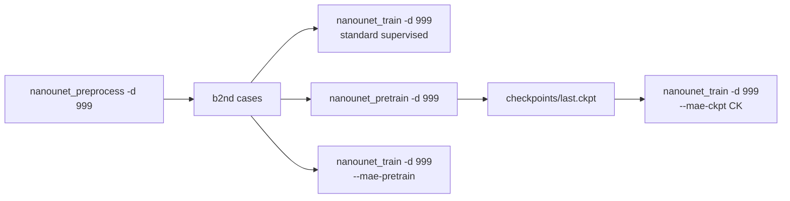

# nanoUNet MAE pretraining

## 0. What we are building (and what we explicitly are not)

A minimal CNN-MAE (Spark3D-class, no sparse-conv tricks) that pretrains the **same** `dynamic_network_architectures.ResidualEncoderUNet` as the supervised path, on the **same** preprocessed b2nd cases, then hands its **encoder** weights (with principled stem handling for the +2 prompt channels) to supervised fine-tuning.

In scope:
- One new sibling folder `nanounet/pretrain/` with 3 small files.
- One new CLI `nanounet_pretrain`.
- Two ~10-line touches to existing code: a `mae_ckpt` arg in `NanoUNetLM`, a `--mae-pretrain`/`--mae-ckpt` flag in `nanounet_train`.
- Hyperparameters defaulted per evidence below (lower LR, no encoder freeze, last checkpoint, encoder-only transfer).

Explicitly **out of scope** for v1 (per philosophy R3 — two cases are not a registry):
- Sparse convolutions / mask tokens / 3×3×3 densification conv (Spark3D extras: +0.31 mean DSC in Tab. 2a, ~250 LOC of dependencies; skip).
- LR warmup scheduler additions (literature recommends warmup, +0.6–1.0 DSC; user can pass `--lr 1e-3` to match the lower fine-tune peak LR which is the bigger effect; warmup is a later add).
- A separate pretrain-dataset preprocessing pipeline. Pretrain reads the same b2nd cases supervised reads. Future separate-dataset case is a one-flag extension (covered in §6).

## 1. Evidence backing the default recipe

All from the Mango Tree corpus:

- **Encoder-only transfer**: discard SSL decoder, load only encoder ([Wald et al., OpenMind 3D SSL, arXiv:2412.17041, 2025](https://arxiv.org/abs/2412.17041); [Wald et al., Revisiting MAE 3D Medseg, CVPR 2025, arXiv:2410.23132](https://arxiv.org/abs/2410.23132)).
- **Fine-tune LR**: peak 1e-3 beats default 1e-2 consistently; never freeze the encoder; warmup helps ~0.6–1.0 DSC (CVPR 2025, Tab. 3).
- **Pretrain length**: 250k steps is the sweet spot on five MRI dev tasks (71.66 avg DSC). 500k and 1M *hurt* (71.31 / 71.10). Don't "just train longer" (CVPR 2025, Tab. 7).
- **Pretrain optimizer/loss defaults**: SGD Nesterov m=0.99, LR 1e-2, wd 3e-5, PolyLR, batch 6, masked-only L2 on z-score voxels, skips kept (CVPR 2025, §4 *Default parameters*).
- **Masking**: bottleneck-grid random masking, 60–75% static or U[60,90] dynamic all tied for best; 30% and 90% static underperform (CVPR 2025, Tab. 2b).
- **Reconstruction beats contrastive for dense seg** (OpenMind 2025).

The colleague's [`anomaly-detection/src/mae_unet/`](anomaly-detection/src/mae_unet/) (97-LOC `model.py`, 28-LOC `masking.py`, 117-LOC `module.py`) is the right style template: minimal, dense, no `nnssl` dependency. We follow its layout but swap in `ResidualEncoderUNet` from `dynamic_network_architectures` so weights actually transfer to supervised.

## 2. Architecture choice for MAE (the only non-obvious design call)

Instantiate the **same** `ResidualEncoderUNet` as supervised, with two changes:

```python
ResidualEncoderUNet(
    input_channels=n_in,             # 1 for CT (NOT n_in + 2 — no prompts here)
    num_classes=n_in,                # reconstruction head outputs same channels as input
    deep_supervision=False,
    **plan_cfg["arch_kwargs"],       # everything else identical to supervised
)
```

Why this is correct:
- The encoder is structurally identical → its state_dict keys (`encoder.stages.*`, `encoder.stem.*`) match the supervised model byte-for-byte except for `encoder.stem.convs.0.conv.weight`'s in-channel dim, handled below.
- We do not transfer the decoder (encoder-only per §1), so the only cost is pretrain GPU memory. Keeping skips in MAE matches CVPR §4.
- `num_classes=n_in` makes the final 1×1 conv produce reconstruction logits in voxel space. Loss is L2 on the masked subset.

`build_net()` in [`nanounet/model/network.py`](nanoUNet/nanounet/model/network.py) currently hard-codes `+2` for prompts:

```43:46:nanoUNet/nanounet/model/network.py
    net = nw(input_channels=n_in + 2, num_classes=lm.num_segmentation_heads, **kwargs)
```

We parametrize the addition with defaults that preserve current behavior:

```python
def build_net(cm, lm, dataset_json, enable_deep_supervision, n_extra_in=2, num_classes_override=None):
    ...
    nc = num_classes_override if num_classes_override is not None else lm.num_segmentation_heads
    net = nw(input_channels=n_in + n_extra_in, num_classes=nc, **kwargs)
```

Supervised callers stay unchanged. MAE caller passes `n_extra_in=0, num_classes_override=n_in`.

## 3. Files to add (each <200 LOC, names are nouns, no `utils/`)

```
nanounet/pretrain/
├── __init__.py
├── masking.py     ~50 LOC  — bottleneck-grid mask, upsample to voxel
├── dataset.py     ~90 LOC  — IterableDataset: random patch from b2nd, mirror aug only
└── module.py     ~150 LOC  — NanoMAELM(pl.LightningModule): build same ResEnc, masked L2

nanounet/cli/
└── pretrain.py    ~110 LOC — nanounet_pretrain CLI (top-down procedural)

nanounet/model/
└── mae_transfer.py  ~50 LOC — load_mae_encoder(seg_net, ckpt_path)
```

That keeps `pretrain/` at 3 noun files + `__init__`, under the 5-file folder cap. `mae_transfer.py` lives under `model/` because it operates on the supervised network at init time.

### 3.1 [`nanounet/pretrain/masking.py`](nanoUNet/nanounet/pretrain/masking.py)

```python
"""Bottleneck-grid random masks upsampled to voxel resolution (Spark3D-style)."""

import torch
import torch.nn.functional as F

def bottleneck_mask(patch_size, total_stride, mask_ratio, batch_size, device):
    grid = tuple(p // s for p, s in zip(patch_size, total_stride))
    n_cells = grid[0] * grid[1] * grid[2]
    n_masked = int(round(mask_ratio * n_cells))
    flat = torch.zeros(batch_size, n_cells, device=device)
    for b in range(batch_size):
        idx = torch.randperm(n_cells, device=device)[:n_masked]
        flat[b, idx] = 1.0
    m = flat.view(batch_size, 1, *grid)
    return F.interpolate(m, size=patch_size, mode="nearest")
```

`total_stride` is `np.prod(cm.pool_op_kernel_sizes, axis=0)` from the plans — re-uses the existing `Config3d.pool_op_kernel_sizes`. Mask ratio default 0.75 (CVPR Tab. 2b sweet spot).

### 3.2 [`nanounet/pretrain/dataset.py`](nanoUNet/nanounet/pretrain/dataset.py)

Mirrors the supervised `_PatchIterable` in [`train/data_module.py`](nanoUNet/nanounet/train/data_module.py) but drops everything prompt-related:

```python
"""Pretrain patch iterable: random crop from preprocessed b2nd, mirror aug, no prompts."""

class PretrainPatchIterable(IterableDataset):
    def __iter__(self):
        rng = np.random.default_rng(seed)
        ds = Blosc2Folder(self.folder, identifiers=self.keys)
        for _ in range(n_here):
            cid = self.keys[int(rng.integers(0, len(self.keys)))]
            data, _seg, _seg_extra, prop = ds.load_case(cid)
            ps = self.patch_size
            shp = data.shape[1:]
            lb = [int(rng.integers(0, max(1, shp[i] - ps[i] + 1))) for i in range(3)]
            patch = np.asarray(data[:, lb[0]:lb[0]+ps[0], lb[1]:lb[1]+ps[1], lb[2]:lb[2]+ps[2]],
                               dtype=np.float32)
            for ax in (0, 1, 2):
                if rng.random() < 0.5:
                    patch = np.flip(patch, axis=ax + 1).copy()
            yield {"data": torch.from_numpy(patch).float()}
```

No `seg`, no `mode`, no centroids, no propagation, no segmentation-targeted augment pipeline. Mirror is the only aug — sufficient per CVPR §4. R12: if a case is smaller than `patch_size`, raise, do not pad.

### 3.3 [`nanounet/pretrain/module.py`](nanoUNet/nanounet/pretrain/module.py)

```python
"""MAE Lightning module: same ResEnc, masked-only L2 reconstruction, SGD + poly LR."""

class NanoMAELM(pl.LightningModule):
    def __init__(self, plans_path, dataset_json_path, output_dir,
                 mask_ratio=0.75, initial_lr=1e-2, weight_decay=3e-5, num_epochs=1000):
        super().__init__()
        self.save_hyperparameters()
        self.pm = Plans(plans_path); self.cm = self.pm.get_configuration("3d_fullres")
        self.dj = load_json(dataset_json_path)
        self.label_manager = self.pm.get_label_manager(self.dj)
        n_in = determine_num_input_channels(self.cm, self.dj)
        self.n_in = n_in
        self.net = build_net(self.cm, self.label_manager, self.dj,
                             enable_deep_supervision=False,
                             n_extra_in=0, num_classes_override=n_in)
        self.total_stride = np.prod(np.array(self.cm.pool_op_kernel_sizes), axis=0).tolist()

    def training_step(self, batch, _):
        x = batch["data"].to(self.device, non_blocking=True)
        m = bottleneck_mask(self.cm.patch_size, self.total_stride,
                            self.hparams.mask_ratio, x.shape[0], x.device)
        pred = self.net(x * (1.0 - m))
        loss = ((pred - x).pow(2) * m).sum() / m.sum().clamp_min(1.0)
        self.log("train_recon_loss", loss, prog_bar=True, batch_size=x.shape[0])
        return loss

    def configure_optimizers(self):
        opt = torch.optim.SGD(self.net.parameters(), lr=self.hparams.initial_lr,
                              momentum=0.99, nesterov=True,
                              weight_decay=self.hparams.weight_decay)
        sched = PolyLRScheduler(opt, self.hparams.initial_lr, self.hparams.num_epochs)
        return {"optimizer": opt, "lr_scheduler": {"scheduler": sched, "interval": "epoch"}}
```

Re-uses existing [`nanounet/model/lr_schedule.py::PolyLRScheduler`](nanoUNet/nanounet/model/lr_schedule.py) — nothing new to add. L2 masked-only with `mask.sum().clamp_min(1.0)` denominator per CVPR §4.

### 3.4 [`nanounet/model/mae_transfer.py`](nanoUNet/nanounet/model/mae_transfer.py)

The principled stem handling (per channel-meaning reasoning in chat):

```python
"""Load MAE checkpoint into a supervised ResEnc: encoder-only, CT-slot stem copy + zero-init prompts."""

import torch

STEM_KEY = "encoder.stem.convs.0.conv.weight"

def load_mae_encoder(seg_net, ckpt_path):
    ck = torch.load(ckpt_path, map_location="cpu")
    sd_pre = ck["state_dict"] if "state_dict" in ck else ck
    sd_pre = {k.replace("net.", "", 1): v for k, v in sd_pre.items() if k.startswith("net.")}
    sd_seg = seg_net.state_dict()
    new = {}
    for k, v in sd_pre.items():
        if not k.startswith("encoder."):            # encoder-only per OpenMind / CVPR
            continue
        if k not in sd_seg:
            continue
        if sd_seg[k].shape == v.shape:
            new[k] = v
            continue
        if k == STEM_KEY and v.shape[1] < sd_seg[k].shape[1]:
            # MAE stem: [out, n_in_pre, *kernel]; seg stem: [out, n_in_pre + 2, *kernel].
            # CT channel(s) get the pretrained filter; the +2 prompt slots are zero-init.
            w = torch.zeros_like(sd_seg[k])
            w[:, : v.shape[1]] = v
            new[k] = w
    miss, unex = seg_net.load_state_dict({**sd_seg, **new}, strict=False)
    return {"loaded": list(new.keys()), "missing": miss, "unexpected": unex}
```

~50 LOC. Logged at fit start so users see exactly what transferred.

### 3.5 [`nanounet/cli/pretrain.py`](nanoUNet/nanounet/cli/pretrain.py)

Top-down procedural, mirrors [`cli/train.py`](nanoUNet/nanounet/cli/train.py). Flags:

```bash
nanounet_pretrain -d 999 --plans nanoUNetResEncUNetPlans \
  --epochs 1000 --batch-size 6 --lr 1e-2 \
  --mask-ratio 0.75 --out PATH \
  --iters-per-epoch 250 --val-iters 50 \
  [--wandb-project nano-mae-999]
```

Output layout:

```
NANOUNET_results/nanounet/<Dataset>_<plans>_pretrain/
  ├── plans.json
  ├── dataset.json
  └── checkpoints/
      ├── last.ckpt       # the one we transfer
      └── best.ckpt       # by val_recon_loss, diagnostics only
```

We pick **`last.ckpt`** for transfer (per CVPR Tab. 7 — pretrain gains plateau; the last step at the recommended schedule length is optimal, not an early-stop on val loss). README documents this.

## 4. Touches to existing code

### 4.1 [`nanounet/model/network.py`](nanoUNet/nanounet/model/network.py) — parametrize the +2

Two new kwargs with defaults that preserve current behavior:

```python
def build_net(cm, lm, dataset_json, enable_deep_supervision, n_extra_in=2, num_classes_override=None):
    ...
    nc = num_classes_override if num_classes_override is not None else lm.num_segmentation_heads
    net = nw(input_channels=n_in + n_extra_in, num_classes=nc, **kwargs)
```

All existing supervised call sites stay literal. MAE module passes `n_extra_in=0, num_classes_override=n_in`.

### 4.2 [`nanounet/train/lightning_module.py`](nanoUNet/nanounet/train/lightning_module.py) — `mae_ckpt` arg

```python
def __init__(self, ..., mae_ckpt: str | None = None):
    ...
    self.net = build_net(self.cm, self.label_manager, self.dj, enable_deep_supervision)
    if mae_ckpt is not None:
        from nanounet.model.mae_transfer import load_mae_encoder
        report = load_mae_encoder(self.net, mae_ckpt)
        print(f"[MAE] loaded {len(report['loaded'])} encoder tensors, "
              f"missing {len(report['missing'])}, unexpected {len(report['unexpected'])}")
```

Single if-branch, ~6 lines. No abstraction.

### 4.3 [`nanounet/cli/train.py`](nanoUNet/nanounet/cli/train.py) — `--mae-ckpt` and `--mae-pretrain`

New flags:

```
--mae-ckpt PATH              Load MAE-pretrained encoder weights at fit start.
--mae-pretrain               Run MAE pretraining inline first, then continue to supervised.
--mae-epochs N               (default 1000)
--mae-lr LR                  (default 1e-2)
--mae-mask-ratio R           (default 0.75)
--mae-iters-per-epoch N      (default same as --iters-per-epoch)
```

Procedural composition in `main()` (top-to-bottom, no helper functions per R13):

```python
mae_ckpt = args.mae_ckpt
if args.mae_pretrain and mae_ckpt is None:
    from nanounet.pretrain.module import NanoMAELM
    from nanounet.pretrain.dataset import build_pretrain_dataloaders
    pre_out = join(out, "mae_pretrain")
    os.makedirs(join(pre_out, "checkpoints"), exist_ok=True)
    pre_lm = NanoMAELM(plans_path, dj_path, pre_out,
                       mask_ratio=args.mae_mask_ratio,
                       initial_lr=args.mae_lr, num_epochs=args.mae_epochs)
    pre_tr, pre_va = build_pretrain_dataloaders(...)
    pre_cb = [ModelCheckpoint(dirpath=join(pre_out, "checkpoints"), save_last=True),
              ModelCheckpoint(dirpath=join(pre_out, "checkpoints"), monitor="val_recon_loss",
                              mode="min", filename="best-{epoch}-{val_recon_loss:.4f}", save_top_k=1)]
    pl.Trainer(max_epochs=args.mae_epochs, accelerator=accel, devices=1,
               precision=args.precision, callbacks=pre_cb, logger=loggers or False,
               default_root_dir=pre_out).fit(pre_lm, pre_tr, pre_va)
    mae_ckpt = join(pre_out, "checkpoints", "last.ckpt")
    del pre_lm, pre_tr, pre_va
    torch.cuda.is_available() and torch.cuda.empty_cache()

lm = NanoUNetLM(..., mae_ckpt=mae_ckpt)
```

Exact shape nanochat uses for multi-stage scripts: one if-block, top-to-bottom. Addition to `cli/train.py`: ~30 LOC.

### 4.4 [`nanoUNet/pyproject.toml`](nanoUNet/pyproject.toml) — new console script

```toml
[project.scripts]
...
nanounet_pretrain = "nanounet.cli.pretrain:main"
```

## 5. Use flows



Three supported flows, no extra orchestration code:

1. **Supervised only** (today): `nanounet_train -d 999 ...`
2. **Pretrain then transfer manually**: `nanounet_pretrain -d 999 ...` then `nanounet_train -d 999 --mae-ckpt PATH --lr 1e-3 ...`
3. **One-shot combined**: `nanounet_train -d 999 --mae-pretrain --mae-epochs 1000 --lr 1e-3 ...`

`--lr 1e-3` in flows 2/3 reflects CVPR Tab. 3 — peak fine-tune LR 1e-3 beats default 1e-2 when starting from MAE weights. Documented in README; we do **not** change the supervised default.

## 6. Future MAE-only dataset (not in v1, but the design is ready)

Today: `nanounet_pretrain -d 999` reads the same b2nd folder as supervised. To support a separate dataset later, add **one** flag: `--pretrain-dataset-id`. If set, pretrain reads that dataset's preprocessed folder. Zero other code changes. Plans/dataset_json must be compatible; fail loudly (R15) if shapes disagree.

## 7. Validation (temporary tests per R16, deleted after)

- Pretrain smoke: 2 epochs × 5 iters on Dataset001_Mini; confirm `train_recon_loss` decreases and `last.ckpt` writes.
- Transfer smoke: instantiate supervised, load the smoke ckpt, print `load_mae_encoder` report, assert `len(loaded) > 0`, assert supervised forward pass runs, assert stem weight at channel 0 equals pretrained numerically, assert channels 1–2 are exactly zero.
- One-shot combined smoke: `nanounet_train --mae-pretrain --mae-epochs 2 --epochs 2 --iters-per-epoch 5 ...` runs both stages in one process; check both `mae_pretrain/checkpoints/last.ckpt` and supervised checkpoints exist plus the MAE transfer log line.

Delete the stubs once green.

## 8. Final file diff summary

- `nanounet/pretrain/__init__.py` — new, 0 LOC
- `nanounet/pretrain/masking.py` — new, ~50 LOC
- `nanounet/pretrain/dataset.py` — new, ~90 LOC
- `nanounet/pretrain/module.py` — new, ~150 LOC
- `nanounet/cli/pretrain.py` — new, ~110 LOC
- `nanounet/model/mae_transfer.py` — new, ~50 LOC
- `nanounet/model/network.py` — touch, +2 LOC (parametrize `+2` and `num_classes`)
- `nanounet/train/lightning_module.py` — touch, +6 LOC (`mae_ckpt`, call `load_mae_encoder`)
- `nanounet/cli/train.py` — touch, +30 LOC (flags + inline pretrain block)
- `pyproject.toml` — touch, +1 LOC (console_scripts entry)

Total new code ~450 LOC across 6 new files, all under 200 each. Total touches to existing code ~40 LOC, single if-branch each.
