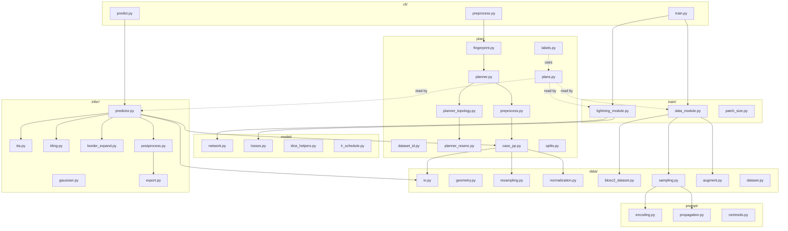

## Goal

Zero `import nnunetv2` anywhere in [nanoUNet/nanounet](nanoUNet/nanounet). Allowed runtime deps stay: `dynamic_network_architectures`, `batchgeneratorsv2`, `acvl_utils`, `cc3d`, `blosc2`, `SimpleITK`, `scipy`, `scikit-image`, `torch`, `pytorch_lightning`, `wandb`. Drop `nnunetv2` from [pyproject.toml](nanoUNet/pyproject.toml).

Upstream ports stay byte-compatible with the existing nnU-Net-pro on-disk layout (`plans.json`, `dataset_fingerprint.json`, `*_data.b2nd / *_seg.b2nd / *.pkl`, `splits_final.json`, `*_centroids.json`). That way, files preprocessed by nnU-Net-pro and by nanoUNet are interchangeable.

## Constraints

- <200 LOC/file (hard).
- One concept per file. Subfolders: `data/`, `prompt/`, `plan/`, `model/`, `train/`, `infer/`, `cli/`.
- No abstract bases, registries, plugins, `utils/` folders. Two-case branches inline.
- Drop 2D / 3d_lowres / cascade / region-based paths during port. ResEnc 3D only.

## Coding philosophy and style — non-negotiable

This is the **identity** of nanoUNet. A line-by-line port that preserves nnU-Net's class hierarchies, registries, mixins, and helper-of-a-helper indirection would produce a smaller nnU-Net, not a nanoUNet. Every ported file must be rewritten in this style as it is ported — copy semantics, not structure.

Distilled from Karpathy's [nanochat](https://github.com/karpathy/nanochat) and the user's style guides (`Coding Ethos: Minimal, Dense, Correct` + `Cursor Python Style Guide`).

### What nanochat does (the model we follow)

- One file = one concept. `gpt.py` (~500 LOC) is the whole transformer; `dataloader.py` is a single generator function. Files are split only when concepts are independent.
- Every file opens with a short `"""docstring"""` listing notable features. Reader knows in 30 s what the file contains and what is novel.
- Scripts are top-to-bottom procedural. argparse at the top, code falls through, cleanup at the bottom. No `def main()` wrapping unless `pyproject.toml` console_scripts require it.
- Tiny utilities live together in a single `common.py`. No `utils/` package, no registries, no abstract bases.
- Dataclasses for config. Globals are fine when they are constants. Classes only when state is needed.
- No defensive programming. `assert` invariants. Errors die at the call site.
- Comments say *why*, never *what*.

### Hard rules (apply to every file in `nanounet/`)

| # | Rule |
|---|------|
| R1 | **<200 LOC per file**, hard. Past 200, split on a concept boundary. |
| R2 | **No file <30 LOC** that hosts a single function. Inline it or put it in [common.py](nanoUNet/nanounet/common.py). |
| R3 | **No abstract base classes, factories, registries, plugins.** Two cases? Write `if cfg.x == "a": ... else: ...`. |
| R4 | **No `utils/` package.** Names are nouns: `geometry.py`, `centroids.py`, `tiling.py`. |
| R5 | **No defensive programming.** `assert` on invariants; raise on user input at CLI / config / file boundary. No try/except just to log and re-raise. |
| R6 | **One module-level docstring per file.** Lists what's in the file and any non-obvious feature. No section banners. |
| R7 | **Type hints on public signatures + dataclasses.** Skip them in small helpers. Don't paint walls of `Optional[Union[...]]`. |
| R8 | **Dataclasses for config**, argparse for CLI, JSON on disk. No Hydra, OmegaConf, Pydantic. |
| R9 | **Constants at module top** as `UPPER_CASE = ...`. No `Settings()` class. |
| R10 | **Comments explain why** — intent, invariant, trade-off, gotcha. Delete any comment that paraphrases the next line. |
| R11 | **No print outside [common.py](nanoUNet/nanounet/common.py)** (`print0` for rank-0). Lightning logging everywhere else. |
| R12 | **No fallbacks for missing data.** Centroids file missing → raise. Plan missing → raise. No silent recompute, no synthetic defaults. |
| R13 | **CLI scripts top-to-bottom procedural.** argparse → setup → call into library → exit. |
| R14 | **No abstractions over Lightning.** `LightningModule`, `LightningDataModule`, `Trainer`, `WandbLogger`, `ModelCheckpoint` used directly. No `BaseTrainer`, no factories. |
| R15 | **Errors are loud and immediate.** Validate config at load; crash. Validate CLI input; crash. Training loop assumes valid state. |
| R16 | **No `tests/` in the final repo.** Write tests, validate, delete. |

### Naming

- `snake_case` for functions / vars / files / folders.
- `PascalCase` for classes and dataclasses.
- `UPPER_CASE` for module constants.
- Short and precise: `bbox`, `seg`, `hm`, `lr`, `dl`. Don't write `query_tensor` when `q` is unambiguous.
- File names are nouns. Folder names are nouns. Never `infer_utils/` or `helpers.py`.

### Port discipline — how to apply this when copying from nnU-Net-pro

The port table below lists upstream sources. Each port must:

1. **Strip every code path we don't use** before measuring LOC: drop 2D, 3d_lowres, cascade, regions, multi-cluster prompts, DDP, distributed sampler, CLI rich displays, debug NIfTI writers, fallback resamplers, etc. The "Target LOC" column already assumes aggressive pruning.
2. **Inline single-use helpers** at the call site. nnU-Net's `recursive_find_python_class`, `recursive_fix_for_json_export`, `empty_cache`, `dummy_context`, `default_num_processes` — most become two lines at the call site or a constant in [common.py](nanoUNet/nanounet/common.py).
3. **Replace class hierarchies with free functions when state isn't owned.** `DefaultPreprocessor.run_case` is a method only because nnU-Net subclasses for verbose flags — nanoUNet's `run_case(...)` is a free function in [plan/case_pp.py](nanoUNet/nanounet/plan/case_pp.py).
4. **Replace registries with dispatch.** `recursive_find_python_class("ResidualEncoderUNet", ...)` becomes `from dynamic_network_architectures.architectures.unet import ResidualEncoderUNet` plus a 5-line `if class_name == "ResidualEncoderUNet": ... else: raise`.
5. **Keep numerical behavior identical.** Comments and structure go; math and constants stay. After each phase we verify against pro on a real case.

If a ported file ends up looking like nnU-Net (long class with `__init__`, `_internal_*`, `_run_*`, `_maybe_*` private helpers, kwargs flowing through five layers), it is wrong. Rewrite as flat functions before committing.

### What a "good" ported file looks like

```python
"""ResEnc 3D plans.json reader. One configuration: 3d_fullres.

Exposes patch_size, spacing, batch_size, pool ops, arch class+kwargs, and
resampling/normalization scheme names. Resampling functions are bound via
partial against nanounet.data.resampling, not nnunetv2.
"""

from dataclasses import dataclass
from functools import partial
from pathlib import Path
import json

from nanounet.data.resampling import resample_data, resample_seg, resample_probs


@dataclass(frozen=True)
class Plan:
    patch_size: tuple[int, int, int]
    spacing: tuple[float, float, float]
    batch_size: int
    pool_op_kernel_sizes: tuple[tuple[int, int, int], ...]
    arch_class: str
    arch_kwargs: dict
    use_mask_for_norm: tuple[bool, ...]
    normalization: tuple[str, ...]
    transpose_forward: tuple[int, int, int]
    transpose_backward: tuple[int, int, int]
    data_identifier: str


def load_plan(path: str | Path) -> Plan: ...
def resample_data_fn(plan: Plan): return partial(resample_data, **_kw(plan))
```

Under 200 LOC. No `PlansManager`, no `ConfigurationManager`, no `recursive_find_python_class`. One dataclass + helpers.

### What we will NOT write

- A `BaseSampler` with subclasses and a registry.
- A `sampling_utils/` folder.
- A try/except around every `cc3d` call that logs and falls back.
- A `Settings` singleton.
- A `PlansManager` class with 15 properties of `partial(...)` calls.

If any of these appear, stop and inline.

---

## Scope of upstream code to port (~3000 LOC after pruning from ~6200 raw)

Each row is **port + rewrite in the style above**, not relocate.

| Upstream file (nnUNet-v2-pro) | LOC | Target file(s) in nanoUNet | Notes |
|---|---|---|---|
| `utilities/plans_handling/plans_handler.py` | 338 | [plan/plans.py](nanoUNet/nanounet/plan/plans.py) (~190) | Replace `PlansManager`/`ConfigurationManager` classes with one frozen `Plan` dataclass + free `resample_*_fn(plan)` helpers. One config only. |
| `utilities/label_handling/label_handling.py` | 332 | [plan/labels.py](nanoUNet/nanounet/plan/labels.py) (~140) | Drop region path. `LabelManager` class → free functions on a small `Labels` dataclass. Keep ignore-label. |
| `utilities/get_network_from_plans.py` | 74 | inline in [model/network.py](nanoUNet/nanounet/model/network.py) | ResEnc only |
| `training/loss/{dice,compound_losses,deep_supervision}.py` | 379 | [model/losses.py](nanoUNet/nanounet/model/losses.py) (~190) + [model/dice_helpers.py](nanoUNet/nanounet/model/dice_helpers.py) (~80) | Copy DC+CE, SoftDice, DS wrapper, `get_tp_fp_fn_tn` |
| `training/dataloading/nnunet_dataset.py` | 313 | [data/blosc2_dataset.py](nanoUNet/nanounet/data/blosc2_dataset.py) (~140) | Strip non-blosc2 variants |
| `imageio/simpleitk_reader_writer.py` | 236 | [data/io.py](nanoUNet/nanounet/data/io.py) (~150) | SimpleITKIO only |
| `preprocessing/resampling/default_resampling.py` | 204 | [data/resampling.py](nanoUNet/nanounet/data/resampling.py) (~180) | `resample_data_or_seg_to_shape` + `compute_new_shape` |
| `preprocessing/normalization/default_normalization_schemes.py` | 98 | [data/normalization.py](nanoUNet/nanounet/data/normalization.py) (~100) | ZScore / CT / None / 01 |
| `preprocessing/preprocessors/default_preprocessor.py` | 513 | [plan/preprocess.py](nanoUNet/nanounet/plan/preprocess.py) (~190) + [plan/case_pp.py](nanoUNet/nanounet/plan/case_pp.py) (~150) | run_case + multiprocessing folder |
| `experiment_planning/dataset_fingerprint/fingerprint_extractor.py` | 232 | [plan/fingerprint.py](nanoUNet/nanounet/plan/fingerprint.py) (~190) | Per-case stats, multiprocessing |
| `experiment_planning/experiment_planners/{default,resencUNet,network_topology,residual_unets/...}.py` | 1235 | [plan/planner.py](nanoUNet/nanounet/plan/planner.py) (~190) + [plan/planner_topology.py](nanoUNet/nanounet/plan/planner_topology.py) (~170) + [plan/planner_resenc.py](nanoUNet/nanounet/plan/planner_resenc.py) (~150) | ResEnc-L only |
| `training/nnUNetTrainer/nnUNetTrainer.py` lines 721-920 | 200 | [data/augment.py](nanoUNet/nanounet/data/augment.py) (~190) | Inline `get_training_transforms` / `get_validation_transforms` |
| `inference/sliding_window_prediction.py` | 65 | [infer/gaussian.py](nanoUNet/nanounet/infer/gaussian.py) (~70) | `compute_gaussian`, `compute_steps_for_sliding_window` |
| `inference/predict_from_raw_data.py` (TTA only) | 1148→~150 | [infer/tta.py](nanoUNet/nanounet/infer/tta.py) (~120) | `_internal_maybe_mirror_and_predict` |
| `inference/roi_predictor.py` (single-tile + border-expand) | 1133→~500 | [infer/tiling.py](nanoUNet/nanounet/infer/tiling.py) (~150) + [infer/predictor.py](nanoUNet/nanounet/infer/predictor.py) (~180) + [infer/border_expand.py](nanoUNet/nanounet/infer/border_expand.py) (~180) | Drop multi-cluster, debug NIfTI, cross-cluster-neg |
| `inference/export_prediction.py` | 186 | [infer/postprocess.py](nanoUNet/nanounet/infer/postprocess.py) (~120) + [infer/export.py](nanoUNet/nanounet/infer/export.py) (~80) | resample-to-original + write NIfTI |
| `utilities/prompt_encoding.py` | 149 | already in [prompt/encoding.py](nanoUNet/nanounet/prompt/encoding.py) | verify no upstream import |
| `inference/prompt_clustering.py` | 61 | drop (multi-cluster out of scope) | — |
| `configuration.py` (constants) | tiny | inline `ANISO_THRESHOLD`, `default_num_processes` in [common.py](nanoUNet/nanounet/common.py) | — |
| `utilities/dataset_name_id_conversion.py` | tiny | [plan/dataset_id.py](nanoUNet/nanounet/plan/dataset_id.py) (~30) | `convert_id_to_dataset_name` |
| `utilities/utils.py` (get_filenames_of_train_images_and_targets) | tiny | inline in [plan/dataset_id.py](nanoUNet/nanounet/plan/dataset_id.py) | — |

## Phased delivery

### Phase 1 — Plans/labels + network + losses (in-place training works without nnunetv2)

- Port plans/labels/loss/network builder. The existing `*.b2nd` cases from prior nnU-Net-pro runs continue to load via Phase 2's reader after this is done, but for Phase 1 we keep the existing `nnUNetDatasetBlosc2` import temporarily so we can run integration smoke after Phase 1+2 jointly.

New/changed files: [plan/plans.py](nanoUNet/nanounet/plan/plans.py), [plan/labels.py](nanoUNet/nanounet/plan/labels.py), [plan/dataset_id.py](nanoUNet/nanounet/plan/dataset_id.py), [model/network.py](nanoUNet/nanounet/model/network.py), [model/losses.py](nanoUNet/nanounet/model/losses.py), [model/dice_helpers.py](nanoUNet/nanounet/model/dice_helpers.py), [train/patch_size.py](nanoUNet/nanounet/train/patch_size.py).

Rewire imports in [train/lightning_module.py](nanoUNet/nanounet/train/lightning_module.py), [train/data_module.py](nanoUNet/nanounet/train/data_module.py), [cli/train.py](nanoUNet/nanounet/cli/train.py).

Verify: `python -c "from nanounet.train.lightning_module import NanoUNetLM; from nanounet.cli import train, preprocess, predict; print('ok')"` — only Phase 4 modules may still hold `nnunetv2` imports.

### Phase 2 — Data pipeline (image I/O, resampling, normalization, blosc2, augment)

New/changed: [data/io.py](nanoUNet/nanounet/data/io.py), [data/resampling.py](nanoUNet/nanounet/data/resampling.py), [data/normalization.py](nanoUNet/nanounet/data/normalization.py), [data/blosc2_dataset.py](nanoUNet/nanounet/data/blosc2_dataset.py), rewrite [data/augment.py](nanoUNet/nanounet/data/augment.py) (inline the transform builders from `nnUNetTrainer`).

`ConfigurationManager` binds `resampling_fn_*` to our new [data/resampling.py](nanoUNet/nanounet/data/resampling.py) functions with the kwargs from `plans.json` (`{"is_seg": False, "order": 3, "order_z": 0, "force_separate_z": None}` etc.).

Verify: `nanounet_train -d 999 -f 0 --plans nnUNetResEncUNetLPlans --config configs/default.json --epochs 1` on existing pro-preprocessed Dataset999 runs one epoch with identical batch shapes and finite loss.

### Phase 3 — Preprocessing port (fingerprint + ResEnc planner + per-case preprocessor)

Most code. Three sub-files:

- [plan/fingerprint.py](nanoUNet/nanounet/plan/fingerprint.py): walk `nnUNet_raw/DatasetXXX_*`, per-case extract spacing, shape, foreground intensity stats (mean/std/p005/p995/median), write `nnUNet_preprocessed/<DS>/dataset_fingerprint.json`.
- [plan/planner_topology.py](nanoUNet/nanounet/plan/planner_topology.py): `get_pool_and_conv_props` (decides network depth + pool ops + patch size).
- [plan/planner_resenc.py](nanoUNet/nanounet/plan/planner_resenc.py): ResEnc-L specific `gpu_memory_target`, n_features, block counts; inherits topology helpers (free functions, no inheritance).
- [plan/planner.py](nanoUNet/nanounet/plan/planner.py): the orchestrator — fingerprint → target spacing → patch size + topology → write `<plans_name>.json` with one config `3d_fullres`.
- [plan/case_pp.py](nanoUNet/nanounet/plan/case_pp.py): `run_case(image_files, seg_file, plans, cm, dj)` — transpose forward, crop_to_nonzero (acvl_utils), per-channel normalize, resample to target spacing, return `(data, seg, props)`.
- [plan/preprocess.py](nanoUNet/nanounet/plan/preprocess.py): multiprocess folder run, write `*_data.b2nd / *_seg.b2nd / *.pkl`, class_locations sampling.

Wire [cli/preprocess.py](nanoUNet/nanounet/cli/preprocess.py) to call our `run_fingerprint` → `run_plan` → `run_preprocess`.

Verify: `nanounet_preprocess -d 999 --planner resenc_l -np 4` on a small dummy dataset (e.g. from `/Users/nielsrocholl/Documents/PhD DIAG - Local/Data/dummy datasets/`) produces a `plans.json` and `*.b2nd` set; spot-check that one case matches nnU-Net-pro byte-for-byte (or close to fp32 tolerance).

### Phase 4 — Inference (TTA + single-tile + border-expand + export)

- [infer/gaussian.py](nanoUNet/nanounet/infer/gaussian.py): `compute_gaussian`, `compute_steps_for_sliding_window`.
- [infer/tta.py](nanoUNet/nanounet/infer/tta.py): `maybe_mirror_and_predict(net, x, mirror_axes)` — distilled from `nnUNetPredictor._internal_maybe_mirror_and_predict`.
- [infer/tiling.py](nanoUNet/nanounet/infer/tiling.py): `centered_spatial_slices_at_point`, `shift_spatial_slices`, `map_points_zyx_unpadded_to_padded`, `local_prompt_points_for_patch`, `_fill_workon_patch`, `spatial_slices_to_tuple` — port from [roi_predictor.py](nnUNet-v2-pro/nnunetv2/inference/roi_predictor.py).
- [infer/predictor.py](nanoUNet/nanounet/infer/predictor.py): single-tile predict (`workon` build, mirror TTA, place in `padded_shape` canvas, revert pad). No Pro fork.
- [infer/border_expand.py](nanoUNet/nanounet/infer/border_expand.py): BFS over hull-shell tiles with Gaussian merge, port from `_predict_logits_single_patch_single_fold` border-expand branch (lines ~1042-end of [roi_predictor.py](nnUNet-v2-pro/nnunetv2/inference/roi_predictor.py)).
- [infer/postprocess.py](nanoUNet/nanounet/infer/postprocess.py): `convert_predicted_logits_to_segmentation_with_correct_shape` (resample → insert crop → transpose back).
- [infer/export.py](nanoUNet/nanounet/infer/export.py): write NIfTI via our [data/io.py](nanoUNet/nanounet/data/io.py).

Verify: load any pro-trained checkpoint (strip `net.` prefix), run `nanounet_predict -i case.nii.gz -o out.nii.gz -m <run_dir> --point-zyx z,y,x` with `--border-expand`. Compare to pro output on the same point; expect identical mask up to numerical noise.

### Phase 5 — Cleanup

- Remove `nnunetv2>=2.5.0` from [pyproject.toml](nanoUNet/pyproject.toml).
- Update [README.md](nanoUNet/README.md): drop Pro-fork note; add a "what we ported" paragraph.
- Add a tiny `tests/smoke.py` (deleted after CI passes per project rules) that imports every public module and asserts `nnunetv2` is not in `sys.modules`.
- `pip install -e .` in fresh venv with `nnunetv2` uninstalled → all CLIs import.

## Module layout after the port



## Key snippets to mirror

- `ConfigurationManager.resampling_fn_data` → free `resample_data_fn(plan)` returning `partial(resample_data, **plan.resampling_kwargs)`. No class. [plan/plans.py](nanoUNet/nanounet/plan/plans.py) holds the dataclass, [data/resampling.py](nanoUNet/nanounet/data/resampling.py) holds the math.
- `get_network_from_plans` → 10 lines: dispatch on `plan.arch_class` to `ResidualEncoderUNet`, instantiate with `input_channels=n_in+2`. Inline in [model/network.py](nanoUNet/nanounet/model/network.py). No `recursive_find_python_class`.
- Border-expand BFS: keep the BFS-over-hull-shells *algorithm* verbatim; rewrite as flat functions in [infer/border_expand.py](nanoUNet/nanounet/infer/border_expand.py) (e.g. `bfs_expand_tiles`, `next_face_tile`, `merge_tile`). No `nnUNetROIPredictor` inheritance.
- `nnUNetPredictor._internal_maybe_mirror_and_predict` → free `mirror_tta(net, x, mirror_axes)` in [infer/tta.py](nanoUNet/nanounet/infer/tta.py).
- `DefaultPreprocessor.run_case` → free `run_case(images, seg, plan, dj)` in [plan/case_pp.py](nanoUNet/nanounet/plan/case_pp.py). No class, no `self.verbose`.

## Risks / unknowns

- **Pro-only quirks in plans**: nnU-Net-pro's planner writes some fields the stock planner doesn't (custom data identifiers, additional metadata). Phase 3 will mirror only fields actually read by Phases 1-4. List of "fields we read" is fixed by [plan/plans.py](nanoUNet/nanounet/plan/plans.py) ahead of time; everything else is preserved as opaque.
- **Resampling parity**: scipy-based separable resampling can drift across versions. We pin `scipy>=1.11` and validate on Dataset999 fold 0.
- **Mirror/TTA semantics**: nnU-Net flips across `mirror_axes` including non-mirrored network output; the port must reproduce `len(mirror_axes)+1` averaging exactly.

## What stays the same

- Existing pure files: [common.py](nanoUNet/nanounet/common.py), [config.py](nanoUNet/nanounet/config.py), [data/sampling.py](nanoUNet/nanounet/data/sampling.py), [data/geometry.py](nanoUNet/nanounet/data/geometry.py), [data/dataset.py](nanoUNet/nanounet/data/dataset.py), [prompt/encoding.py](nanoUNet/nanounet/prompt/encoding.py), [prompt/propagation.py](nanoUNet/nanounet/prompt/propagation.py), [prompt/centroids.py](nanoUNet/nanounet/prompt/centroids.py), [plan/splits.py](nanoUNet/nanounet/plan/splits.py), [model/lr_schedule.py](nanoUNet/nanounet/model/lr_schedule.py).
- All CLIs keep the same argument names. On-disk layout unchanged.