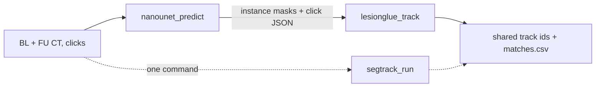

# nanoUNet monorepo

CT lesion research code: one project per top-level folder. Each folder is self-contained (code, `README.md`, `docs/`, `configs/`, `scripts/`), so a paper can link straight to it. Projects stay decoupled and hook into each other through files on disk or through a pipeline project.

| project | what | depends on | start here |
|---|---|---|---|
| [`nanounet/`](nanounet/) | promptable 3D lesion segmentation (ResEnc nnU-Net, Lightning, MAE pretraining) | `core` | [`nanounet/README.md`](nanounet/README.md) |
| [`lesionglue/`](lesionglue/) | LesionGlue: baseline ↔ follow-up lesion matching with a dense PyG GNN | `core` | [`lesionglue/README.md`](lesionglue/README.md) |
| [`segtrack/`](segtrack/) | pipeline: segment both timepoints with nanounet, link lesions with LesionGlue | `core`, `nanounet`, `lesionglue` | [`segtrack/README.md`](segtrack/README.md) |
| [`core/`](core/) | shared terminal UI (one stderr console, headers, config tables, progress) | — | [`core/ui.py`](core/ui.py) |

## Pipeline



## Install

```bash
pip install -e .
pip install -e ".[lesionglue]"
```

The first installs `core` + `nanounet`. The `lesionglue` extra adds torch-geometric and friends for `lesionglue` and `segtrack`.

## Commands

| project | console scripts |
|---|---|
| nanounet | `nanounet_preprocess`, `nanounet_train`, `nanounet_pretrain`, `nanounet_predict`, `nanounet_build_splits`, `nanounet_build_valset`, `nanounet_lesion_weights` |
| lesionglue | `lesionglue_split`, `lesionglue_preprocess`, `lesionglue_train`, `lesionglue_cv`, `lesionglue_oof`, `lesionglue_pool`, `lesionglue_eval`, `lesionglue_report`, `lesionglue_predict`, `lesionglue_track`, `lesionglue_audit`, `lesionglue_qc`, `lesionglue_baseline_distance` |
| segtrack | `segtrack_run` |

## Rules

Code follows the [nanochat-style](.claude/skills/nanochat-style/SKILL.md) standard; `python .claude/skills/nanochat-style/scripts/check.py` enforces it. A project imports only `core` and the projects listed in its "depends on" cell (R21). To add a project, see the "Projects (R21)" section of [code.md](.claude/skills/nanochat-style/references/code.md).
