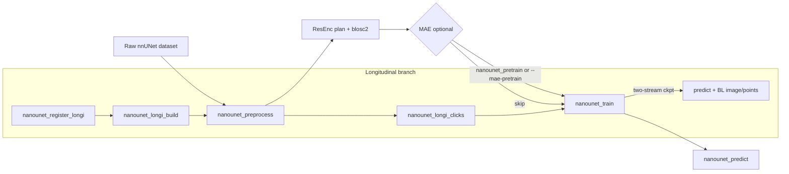

# nanoUNet documentation

Minimal prompt-aware 3D ResEnc U-Net with PyTorch Lightning and optional MAE pretraining; optional longitudinal finetune uses a registered BL+FU dual-stream encoder with difference weighting at skips. The U-Net preprocessing, training, and setup pipeline draws a lot of inspiration from [nnU-Net](https://github.com/MIC-DKFZ/nnUNet).

## Pipeline overview



**Standard path:** fingerprint → plan → preprocess (`3d_fullres`) → (optional MAE) → supervised train → prompt-driven predict.

**Longitudinal path:** register BL→FU → build 2-channel raw dataset → preprocess → map BL clicks → `--longi` finetune → two-stream predict with baseline image and partner points.

## Quickstart

Set environment variables (see [README](../README.md#environment)) then run:

```bash
nanounet_preprocess -d 001 --planner nnUNetPlannerResEncL -np 8
nanounet_train -d 001 -f 0 --plans nnUNetResEncUNetLPlans --config configs/default.json
nanounet_predict -i /path/to/scans -o /path/to/out -m /path/to/run --ckpt last.ckpt --border-expand
```

Tiny laptop smoke train:

```bash
nanounet_train -d 001 -f 0 --plans nnUNetResEncUNetTinyPlans --config configs/default.json \
  --epochs 2 --iters-per-epoch 50 --accelerator cpu --precision 32-true --batch-size 1 --no-wandb
```

## Documentation map

| Topic | Link |
|-------|------|
| Preprocess | [steps/preprocess.md](steps/preprocess.md) |
| Planning knobs | [steps/plan.md](steps/plan.md) |
| MAE pretrain | [steps/pretrain.md](steps/pretrain.md) |
| Supervised train | [steps/train.md](steps/train.md) |
| Inference | [steps/predict.md](steps/predict.md) |
| Longitudinal workflow | [steps/longi.md](steps/longi.md) |
| ROI / prompt config | [reference/config.md](reference/config.md) |
| Patch size playbook | [reference/patch_size.md](reference/patch_size.md) |
| Loss functions | [reference/losses.md](reference/losses.md) |
| Host RAM / cgroup OOM | [dev-notes/cgroup_memory.md](dev-notes/cgroup_memory.md) |
