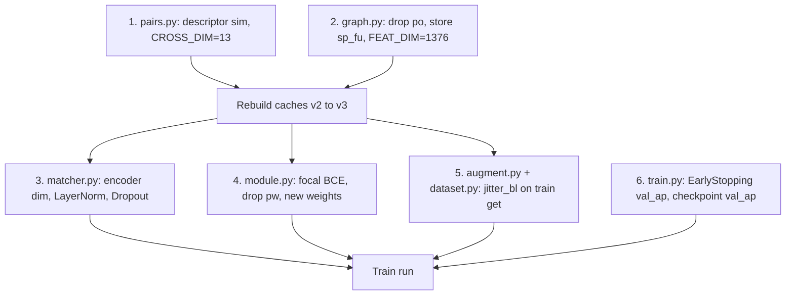

# Dense Matcher Round 2

## Diagnosis Recap

Symptoms (`val_pair_loss` rises from 0.9 -> 1.85 while train -> 0; AUROC 0.95 vs AP 0.60; all metrics plateau at step ~500) point to four coupled root causes:

1. The 1372-D descriptor — the only true identity signal — is not surfaced as a cross-edge feature.
2. Absolute voxel coordinates (`cp/den`) are baked into node features, giving the GNN a memorization shortcut.
3. BCE pair loss + row CE + no regularization + no augmentation = textbook overfit; BCE is the loss that diverges because rank stays the same while confidence sharpens on wrong predictions.
4. No `EarlyStopping`, so the run continues 4500 steps past optimum.

## Change Set

Six independent edits, ordered to require **one** cache rebuild (`v2 -> v3`). Every file stays under 200 LOC.

### 1. Descriptor similarity in cross edge attrs
- File: [tracking/data/pairs.py](tracking/data/pairs.py)
- `CROSS_DIM`: 11 -> 13.
- In `cross_attr(...)`, also compute (using `bl_x[i, :1372]` and `fu_x[j, :1372]`):
  - `desc_cos = F.cosine_similarity(d_bl, d_fu, dim=1, eps=1e-6).unsqueeze(1)`
  - `desc_l2  = (d_bl - d_fu).norm(dim=1, keepdim=True) / sqrt(1372)`  (scale so values land ~O(1))
- Append both to the existing concat. `reverse_cross_attr` leaves the two new columns unchanged (they are symmetric).

### 2. Drop absolute position from node features
- File: [tracking/data/graph.py](tracking/data/graph.py)
- `FEAT_DIM`: 1379 -> 1376.
- `_pack(...)`: remove the `pos` argument and the `x[1376:1379] = pos` write; signature becomes `_pack(desc, lv, mh, sph, lt_i)`. Callers drop the `cp/den` argument.
- Add `data.sp_fu = torch.tensor(sp_fu, dtype=torch.float32)` so augmentation (item 5) can convert PROP_SIGMA from voxels to mm.

### 3. NodeEncoder + GNN regularization
- File: [tracking/matcher.py](tracking/matcher.py)
- `NodeEncoder`: `inn = 1372 + 3 + cfg.lt_embed` (drop `+3`); `forward` no longer concatenates `po`; index `ti = x[:, 1375].long()` becomes the **last** column.
- `HeteroGnn`: wrap each residual with `LayerNorm(d)` and `Dropout(p)`:
  ```python
  h = conv(x_dict, edge_index_dict, edge_attr_dict=edge_attr_dict)
  x_dict = {k: self.drop(self.norm[k](F.relu(x_dict[k] + h[k]))) for k in x_dict}
  ```
  `self.norm` is a `nn.ModuleDict({"bl": LayerNorm(d), "fu": LayerNorm(d)})` per block, `self.drop = nn.Dropout(cfg.dropout)`.
- `Matcher.head`: insert `Dropout(cfg.dropout)` between Linear-ReLU and Linear.
- `ModelConfig`: add `dropout: float = 0.2`.

### 4. Focal pair BCE + rebalanced weights
- File: [tracking/train/module.py](tracking/train/module.py)
- Replace `binary_cross_entropy_with_logits(out.pair, labels, pos_weight=self.pw)` with focal BCE (alpha=0.25, gamma=2.0):
  ```python
  def focal_bce(logits, target, alpha=0.25, gamma=2.0):
      bce = F.binary_cross_entropy_with_logits(logits, target, reduction="none")
      p = torch.sigmoid(logits)
      pt = p * target + (1 - p) * (1 - target)
      w = (alpha * target + (1 - alpha) * (1 - target)) * (1 - pt).pow(gamma)
      return (w * bce).mean()
  ```
- Drop the `pw` buffer entirely. Drop `pos_weight` from `MatcherModule.__init__` and from `MatcherDataModule` (item 7) — focal handles imbalance.
- Default weights: `pair_w=0.5, row_w=1.0, none_w=0.2`. Row CE becomes the primary signal; focal pair becomes the calibration term; no-match heads unchanged.

### 5. Propagation-noise augmentation
- New file: [tracking/data/augment.py](tracking/data/augment.py) (~50 LOC)
- One function:
  ```python
  def jitter_bl(data: HeteroData, sigma_vox=PROP_SIGMA, k_intra=8, rng=None) -> HeteroData:
      sp = data.sp_fu.numpy()
      sig_mm = sigma_vox * sp
      noise = rng.normal(0.0, sig_mm, size=data["bl"].pos.shape).astype(np.float32)
      data["bl"].pos = data["bl"].pos + torch.from_numpy(noise)
      data["bl","intra","bl"].edge_index, data["bl","intra","bl"].edge_attr = _intra_knn(data["bl"].pos, k_intra)
      ea = cross_attr(data["bl"].pos, data["fu"].pos, data["bl"].x, data["fu"].x, data["bl","cross","fu"].edge_index)
      data["bl","cross","fu"].edge_attr = ea
      data["fu","cross","bl"].edge_attr = reverse_cross_attr(ea)
      return data
  ```
  Import `_intra_knn` from `graph.py` (lift it to module-top public name without underscore, or expose via `from .graph import _intra_knn`). Descriptors are NOT touched (the BL descriptor is sampled at `cog_bl`, not `cog_propagated`, so it is independent of the jitter).
- File: [tracking/data/dataset.py](tracking/data/dataset.py)
  - `LesionDataset.__init__` accepts `augment: bool = False`.
  - Override `get(self, idx)`:
    ```python
    d = super().get(idx)
    if self.augment:
        d = jitter_bl(d, rng=np.random.default_rng())
    return d
    ```

### 6. Early stopping + correct monitor
- File: [tracking/cli/train.py](tracking/cli/train.py)
  - Import `EarlyStopping`.
  - `ModelCheckpoint(dirpath=args.out, monitor="val_ap", save_top_k=3, mode="max")`.
  - Append `EarlyStopping(monitor="val_ap", mode="max", patience=15)` to callbacks.
  - `val_loss` is unreliable (rises while ranking holds); monitor `val_ap`.

### Cache rebuild and version bump

- File: [tracking/data/dataset.py](tracking/data/dataset.py): `processed_file_names` returns `f"{split}_v3.pt"`; meta saved as `{split}_v3_meta.pt` (drops `pos_weight` field — keep only `edges`, `positives` for logging).
- File: [tracking/train/datamodule.py](tracking/train/datamodule.py): drop `pos_weight` and `meta` load; pass `augment=True` to the train dataset.
- Per nanochat rule R12 + round-1 plan ("no compatibility fallbacks"), v2 caches are not migrated; user re-runs `preprocess --split {train,val,test}`.

## Order of Execution



Two operator steps:
1. `python tracking/cli/preprocess.py --split train` (then `val`, `test`).
2. `PYTHONPATH=. python tracking/cli/train.py --wandb-project lesion-tracking --wandb-run-name round2`.

## File Touch Summary (all under 200 LOC)

- [tracking/data/pairs.py](tracking/data/pairs.py) ~65 LOC (was 52)
- [tracking/data/graph.py](tracking/data/graph.py) ~155 LOC (was 159; loses `po`, gains `sp_fu`)
- [tracking/data/augment.py](tracking/data/augment.py) NEW ~50 LOC
- [tracking/data/dataset.py](tracking/data/dataset.py) ~115 LOC (was 105)
- [tracking/matcher.py](tracking/matcher.py) ~130 LOC (was 108)
- [tracking/train/module.py](tracking/train/module.py) ~120 LOC (was 108)
- [tracking/train/datamodule.py](tracking/train/datamodule.py) ~55 LOC (was 60)
- [tracking/cli/train.py](tracking/cli/train.py) ~125 LOC (was 124)

No new folders, no factories, no abstract classes, no `utils/`. `augment.py` is a single function file but it is a real concept boundary (per-epoch transform vs. one-shot graph build) and is required for `__getitem__` reuse — passes R2.

## Interaction Audit (no fix harms another)

- Descriptor sim (1) does not depend on position; augmentation (5) jitters position only -> descriptor signal preserved across augmentation.
- Dropping `po` (2) removes the memorization shortcut and also removes the only node feature affected by position jitter, so augmentation no longer creates a node-feature/edge-feature inconsistency.
- LayerNorm + Dropout (3) reduces overconfidence; focal loss (4) also reduces overconfidence on easy negatives -> synergistic, not redundant (LayerNorm fixes activation scale, focal fixes loss surface).
- Focal loss (4) eliminates the rationale for `pos_weight`; removing the `pw` buffer keeps the API clean.
- EarlyStopping monitors `val_ap` (6) rather than `val_loss` precisely because the loss-vs-rank divergence is what the diagnosis identified.
- Cache version bump localizes risk: a single rebuild covers items 1+2, and old `v2` artifacts never accidentally load.

## Verification Protocol

1. **Cache sanity** (one-shot, manual): after `preprocess --split train`, open one graph and assert `data["bl"].x.shape[1] == 1376`, `data["bl","cross","fu"].edge_attr.shape[1] == 13`, `data.sp_fu.shape == (3,)`.
2. **Smoke (5 epochs, no early stop, augment off)**: confirm `val_pair_loss` does not blow up; logs finite.
3. **Smoke (5 epochs, augment on)**: same; confirms augment recompute path works under multi-worker DataLoader.
4. **Full run (200 epochs, early stop on val_ap)**: expect early stop well before 200; `val_ap` > 0.60; `val_loss` no longer rises monotonically.
5. **Quick ablations from the same script** (only if step 4 underperforms):
   - augment off
   - descriptor sim off (`CROSS_DIM=11` path)
   - dropout 0.0
   These are flag flips on existing dataclasses, not new code.
6. **Baseline comparison**: out of scope for this plan; the round-1 plan already calls for a distance-only baseline script. If it does not yet exist, raise it as a follow-up.

## Risks and Rollbacks

- **Dropout 0.2 underfits.** Symptom: train loss also plateaus high. Drop to 0.1.
- **Focal `alpha=0.25` over-suppresses positives** on this dataset (~5% positive edges). Symptom: row CE stays high, pair loss collapses to easy-neg confidence. Bump `alpha` to 0.5.
- **Augment recompute cost** (~13 dims x n_bl*n_fu per sample) is negligible at observed graph sizes; if profiling ever shows it, cache the un-augmented `bl.pos` and add noise without rebuilding intra-knn for `k_intra` unchanged.
- **All edits are localized to 8 files.** Rollback = `git revert` of this single commit + delete `*_v3.pt` caches.

## Out of Scope (deliberately)

- Distance-only baseline script (round-1 plan item; separate change).
- Reducing model capacity (d=64, layers=2). Try only if items 1-6 do not beat baseline.
- Axial flip augmentation (requires flipping the L0 descriptor grid; non-trivial).
- Replacing L0 descriptor with a pose-invariant alternative. Deeper redesign, separate plan.
