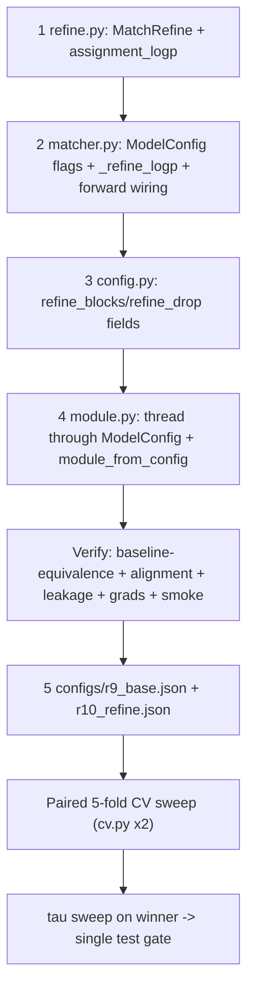

caveman mode

My coding agent made this plan. Now I want you, the expert model to have a critical look at this plan. The main goal: A model with significantly better performance. If you come up with a better plan, write this down in a MD file (no coding)

---

# Round 10: Assignment-Anchored Match Refinement

Panel: Ilya (representation/regularization, small-data), Jure (GNN/matching structure), Fabian (medical validation rigor). All three sign off on this plan.

## Context — why this change, and why now

**The task.** Track lesions from a baseline CT (BL) to a follow-up CT (FU). The model is a bipartite GNN matcher: BL lesions and FU lesions are nodes; a dense BL↔FU edge set carries relational features (`cross_attr`, 27-D). The model must produce an assignment that covers every clinical case:
- **UNCHANGED / SPLIT** — BL *i* → FU *j* (one positive cross edge).
- **DISAPPEARED** — BL *i* → dustbin (`no_match_label`).
- **NEWLYAPPEARING** — FU *j* → dustbin.
- **MERGED** — several BL → one FU (multi-positive Sinkhorn FU target, `tracking/train/sinkhorn.py`).

All of these are read off **one shared object: the pair-logit landscape** `out.pair`. The matching head reads it; the `RowMatchability` dustbin head reads it (so disappeared/newly inherit its quality); merges read it; Sinkhorn globalizes it. Improving that landscape lifts every case at once. That is the lever this round pulls.

**Where the model is** (from the W&B readings recorded in `.cursor/plans/round5…round9`):
- `val_acc_disappeared` ≈ 0.97 and `val_acc_newly_appearing` ≈ 0.97 at peak — **near-ceiling**, but both *decay during training* (the dustbin still memorizes; best-ckpt rescues it).
- `val_acc_unchanged_split` ≈ **0.90 — the real ceiling**. This is same-anatomy matching discrimination: when two co-located same-type lesions (e.g. two lung mets) compete for one BL, the model picks the wrong FU. It carries weight 0.5 in `val_match_score`, so it dominates the headline number.
- Net R6→R8 gain (~1pp) is **inside the 30-patient val noise floor**; R9 added a 5-fold CV harness (`tracking/cli/cv.py`, `tracking/data/splits.py`) to make deltas trustworthy.
- **R7 is the cautionary tale**: adding *un-conditioned, un-gated* `SetAttn` capacity regressed 0.92→0.78 on 240 patients. The R7.1 post-mortem is explicit: `HeteroGnn` *already* does edge-conditioned bipartite cross-attention (`TransformerConv` with `edge_dim=CROSS_DIM`). Plain attention on top added capacity without signal.

**The R10 lever (decided with the user).** A single **assignment-anchored, zero-gated cross-attention refinement block** inserted after the GNN and before the matching head. It is built to *not* repeat R7: it adds a signal the GNN structurally lacks, in a dedicated subspace, behind a residual gate initialized to zero so it starts as the exact R9 model and can only earn weight if the data supports it.

Evaluation (per user): **ship the lever and evaluate it head-to-head against R9-base in one paired 5-fold CV sweep** (`refine_blocks=0` vs `refine_blocks=1`), tau-sweep the winner, gate once on the held-out test split.

### What the block adds that the 4 GNN layers do not (the non-redundancy argument — read before coding)

R7 failed because another edge-conditioned attention layer is redundant with `HeteroGnn`. This block is different on three axes, each deliberate:

1. **Assignment anchoring (the new signal).** Attention logits are biased by the current **soft Sinkhorn assignment** `log P_ij` computed from `pair0`. The GNN has *no* assignment signal anywhere — it never sees "who currently believes they match whom." This is the SuperGlue/LightGlue mechanism the architecture is missing: each BL node pulls representation from its current best FU candidate, sharpening the contrast against same-type decoys. Sinkhorn is already run for the dustbin marginals, so this reuses existing, cheap, log-domain machinery.
2. **Dedicated match subspace (regularized capacity, not smoothing).** The block operates on `m = match_proj(z)`, a separate projection, leaving `z` for the dust head and InfoNCE. Identity discrimination no longer has to survive 4 layers of `aggr="sum"` smoothing that also serve other objectives.
3. **Zero-init gated residual (strict safety).** `m' = m + g ⊙ attn(m)` with the gate `g` and the final logit projection both zero-initialized. At init, `pair == pair0 == R9`. On 240 patients this is the disciplined way to add structure: it cannot regress the baseline, only deviate where it helps.

## File changes

All files stay < 200 LOC (nanochat R1). New file is a real noun (`refine.py`, R4). No factories/registries/ABCs (R3). One module docstring per file (R6). Config via the existing `Config` dataclass + JSON (R8). No cache rebuild — `v5_l0` caches and `CROSS_DIM=27` are untouched.

### 1. NEW `tracking/refine.py` (~110 LOC) — the block

```python
"""Assignment-anchored cross-attention refinement of the matching subspace.

One gated block per call. Projects GNN nodes into a separate match space, then
lets each BL node attend over its FU candidates (and symmetric) with attention
biased by (a) the current soft Sinkhorn assignment log P -- the anchoring signal
the bipartite GNN structurally lacks -- and (b) a learned projection of the 27-D
cross_attr. The residual is zero-initialized (g=0 => exact R9 baseline) so on 240
patients the block can only help: it starts as identity and earns its weight.
"""
```

Module-top + helpers:

- `assignment_logp(pair, n_bl, n_fu, iters) -> Tensor`: build the augmented `(n_bl+1, n_fu+1)` score matrix with **zero dust rows/cols** (a parameter-free matchability prior, same convention as `row_dust_marginals` in `tracking/matchability.py`), run `log_sinkhorn(S, iters, *superglue_marginals(...))`, return `P_log[:n_bl, :n_fu].reshape(-1).detach()` — a `(n_bl*n_fu,)` edge-aligned prior. Edges are row-major dense (`dense_pair_index`: `row.repeat_interleave(n_fu)`, `col.repeat(n_bl)`), so `.reshape(-1)` aligns with `("bl","cross","fu").edge_index` for that graph. Import `log_sinkhorn`, `superglue_marginals` from `tracking.train.sinkhorn`.

- `class MatchRefine(nn.Module)`:
  - `__init__(self, d, heads, cross_dim, drop=0.3)`:
    - `self.proj = nn.Linear(d, d)` (match subspace).
    - `self.q = nn.Linear(d, d); self.k = nn.Linear(d, d); self.v = nn.Linear(d, d)` (shared across both directions; query/key roles swap per direction).
    - `self.edge_bias = nn.Linear(cross_dim, heads)` (per-head scalar bias from `cross_attr`).
    - `self.assign_w = nn.Parameter(torch.zeros(heads))` (per-head weight on `log P`; starts 0 so anchoring fades in).
    - `self.out = nn.Linear(d, d); self.drop = nn.Dropout(drop)`.
    - `self.g_bl = nn.Parameter(torch.zeros(1)); self.g_fu = nn.Parameter(torch.zeros(1))` (zero gates).
    - `self.score = nn.Linear(d, 1, bias=False)` over the **element-wise product** `m_bl[i] * m_fu[j]` (a gated bilinear-style refinement logit); **zero-init `self.score.weight`** so the added pair term starts at 0.
    - `self.heads = heads; self.dh = d // heads`.
  - `_attend(self, q_nodes, kv_nodes, src, dst, e_bias, logp) -> Tensor`: one directional edge-softmax attention. `q = self.q(q_nodes)[src]`, `k = self.k(kv_nodes)[dst]`, `v = self.v(kv_nodes)[dst]`, reshape to `(E, heads, dh)`; `att = (q*k).sum(-1)/sqrt(dh) + e_bias + self.assign_w*logp.unsqueeze(-1)` → `(E, heads)`; `a = torch_geometric.utils.softmax(att, src)` (segment softmax grouped by query node → respects graph boundaries automatically because edges are within-graph); `msg = a.unsqueeze(-1) * v`; `agg = scatter(msg, src, dim=0, dim_size=N_q, reduce="sum")` → `(N_q, heads, dh)` → flatten `(N_q, d)`. Use `torch_geometric.utils.scatter`.
  - `forward(self, z_bl, z_fu, edge_index, cross_attr, logp) -> tuple[Tensor, Tensor]`:
    - `m_bl, m_fu = self.proj(z_bl), self.proj(z_fu)`.
    - `i, j = edge_index[0], edge_index[1]`; `e_bias = self.edge_bias(cross_attr)`.
    - BL←FU: `a_bl = self._attend(m_bl, m_fu, src=i, dst=j, e_bias, logp)`.
    - FU←BL: `a_fu = self._attend(m_fu, m_bl, src=j, dst=i, e_bias, logp)` (same edges, query/kv swapped, softmax grouped by `j`).
    - `m_bl = m_bl + self.g_bl * self.drop(self.out(a_bl))`; same for `m_fu` with `g_fu`.
    - `refine_logit = self.score(m_bl[i] * m_fu[j]).squeeze(-1)` → `(E,)`.
    - return `refine_logit, (m_bl, m_fu)` (return the refined embeddings too, for optional reuse; matcher only needs `refine_logit` for R10-minimal).

Keep it single-block. Do **not** stack or loop blocks this round (R7 discipline). `heads`, `cross_dim` come from `ModelConfig`.

### 2. `tracking/matcher.py` — wire the block behind a flag (~+12 LOC)

- `ModelConfig`: add `refine_blocks: int = 1` and `refine_drop: float = 0.3`. `refine_blocks=0` ⇒ exact R9 (block skipped entirely); `1` ⇒ R10.
- `Matcher.__init__`: `self.refine = MatchRefine(cfg.d, cfg.heads, CROSS_DIM, cfg.refine_drop) if cfg.refine_blocks else None`. Import `MatchRefine, assignment_logp` from `tracking.refine`.
- `Matcher.forward`, after `pair = self.head(h)... + self.bilin(...)` (call it `pair0`), before the dust step:
  ```python
  pair = pair0
  if self.refine is not None:
      logp = self._refine_logp(pair0.detach(), data)        # edge-aligned (E,) prior
      rl, _ = self.refine(z["bl"], z["fu"], ei, ea, logp)
      pair = pair0 + rl
  dust_bl, dust_fu = self._dust_graph(pair.detach(), data, z["bl"], z["fu"])
  return MatcherOutput(pair, dust_bl, dust_fu, z["bl"], z["fu"])
  ```
- Add `_refine_logp(self, pair0, data)`: mirror the batch-splitting already in `_dust_graph` (the batched / single-graph branch using `data["bl"].batch`, `torch.bincount`, `torch.split` on `pair0` by `(nb*nf)`). For each graph call `assignment_logp(p, nbg, nfg, self.cfg.sinkhorn_iters)` and `torch.cat` the results in graph order. This guarantees the `(E,)` prior is aligned with the concatenated cross `edge_index`. Reuse the exact splitting pattern from `_dust_graph` so ordering matches.

`MatcherOutput` is unchanged (R9 checkpoints with `refine_blocks=0` still load; R10 checkpoints are new — expected, retrain from scratch).

### 3. `tracking/config.py` — config fields (+2 lines)

Add to the `Config` dataclass: `refine_blocks: int = 1` and `refine_drop: float = 0.3`. Place near `d/layers/heads`. (`load_config` already rejects unknown keys and ignores missing ones, so an R9-base config that omits these falls back to defaults — but for the paired sweep we set them explicitly, see below.)

### 4. `tracking/train/module.py` — thread config into the model (+3 lines)

- `MatcherModule.__init__`: add params `refine_blocks: int = 1, refine_drop: float = 0.3`; pass into `ModelConfig(...)` alongside `d, layers, heads, dropout, sinkhorn_iters`. Keep `save_hyperparameters()` (already present) so the checkpoint records them and `eval.py`/`load_from_checkpoint` reconstruct the right architecture.
- `module_from_config`: pass `refine_blocks=cfg.refine_blocks, refine_drop=cfg.refine_drop`.

No change to `_loss` — the refinement only changes `out.pair`; the Sinkhorn loss, focal pair loss, InfoNCE and dust BCE all consume `out.pair`/`out.dust_*` unchanged and now benefit from the sharper logits.

### 5. No CLI changes needed

`cv.py` shells to `train.py --config <json>`; everything flows through `Config`. The paired sweep is **two config files**, no new flags.

## Evaluation protocol (paired 5-fold CV, one sweep)

Two configs derived from `configs/base.json`:
- `configs/r9_base.json`: copy of `base.json` with `"refine_blocks": 0`.
- `configs/r10_refine.json`: copy of `base.json` with `"refine_blocks": 1`, `"refine_drop": 0.3`.

Run both (cluster):

```
PYTHONPATH=. python tracking/cli/cv.py --config configs/r9_base.json   --out runs/cv_r9base   --wandb --wandb-run-name r9base
PYTHONPATH=. python tracking/cli/cv.py --config configs/r10_refine.json --out runs/cv_r10     --wandb --wandb-run-name r10
```

Each writes `cv_summary.json` with per-fold + mean±std of `val_match_score_ema` and the three sub-accuracies (`tracking/data/splits.py:aggregate_cv_folds`, `CV_METRICS`). Decision rule (Fabian): **ship R10 only if its 5-fold mean `val_match_score_ema` clears R9-base with non-overlapping (mean±std) bands, AND `val_acc_unchanged_split` mean improves ≥ 2pp, AND disappeared/newly do not regress.**

Then:
- **tau sweep** on the R10 winner: for each fold's `best.ckpt`, `eval.py --split val --dust-tau {0.10,0.15,0.18,0.20,0.22,0.25,0.30,0.35}`; pick CV-argmax `val_match_score`. (`--dust-tau` override already exists.)
- **test gate (once)**: retrain R10 on the full train+val pool at the chosen tau, run `eval.py --split test` a single time. This is the only touch of the 30-patient test split.

## Verification (before the cluster run)

1. **Baseline-equivalence (the safety claim).** With `refine_blocks=1` at initialization, assert `Matcher` output `pair` equals the `refine_blocks=0` output on the same batch to ~1e-5 (gates `g_bl=g_fu=0` and `score.weight=0` ⇒ `refine_logit==0`). This is the single most important check: it proves R10 starts == R9 and cannot regress at step 0.
2. **Prior alignment.** On one multi-graph batch, assert `_refine_logp` returns shape `(total_cross_edges,)` and that per-graph slices match `assignment_logp` recomputed from each graph in `batch.to_data_list()` (catches any batch-order / row-major misalignment).
3. **No cross-graph leakage.** Construct a 2-graph batch; assert a BL node's attention weights (`softmax` output) are zero outside its own graph's FU nodes (guaranteed by `softmax(att, src)` grouping, but verify once).
4. **Gradient flow.** After one backward, assert `refine.q/k/v/edge_bias/score`, `assign_w`, `g_bl`, `g_fu` all have non-None, finite grads.
5. **Smoke (cluster, short).** `train.py --config configs/r10_refine.json --fold 0` for `max_steps≈1500`, `val_check_steps=250`: all losses finite, `val_match_score` rising, `g_bl/g_fu` drift away from 0 (the block is being used). Per nanochat R16, delete these checks after they pass.

## Risks & rollback

- **The gate stays ~0 (block earns nothing).** Then R10 ≈ R9 by construction — no regression, just no gain. Honest negative result; report it under CV and fall back to the deferred lever below. This is the designed-in safe failure mode.
- **Anchoring destabilizes early** (logp prior noisy when `pair0` is random). Mitigated: `assign_w` is zero-init (anchoring fades in), and `logp` is `.detach()`ed (no second-order grads through Sinkhorn). If `train_loss` spikes in the first 200 steps, clamp `assign_w` init to a small negative or add a 500-step linear ramp on `assign_w` mirroring `_dust_weight`.
- **Extra Sinkhorn cost.** One `log_sinkhorn` per graph per forward, on top of the dust-marginal pass. Largest graph ≈46×40; log-domain, ~20 iters; negligible vs the 4 `TransformerConv` layers. If profiling ever flags it, share one Sinkhorn pass between `_refine_logp` and `_dust_graph`.
- **Rollback** = set `refine_blocks=0` (config flip; no code revert). R9-base checkpoints keep loading.

## Deferred (explicit, if R10 gate stays flat)

- **Registration-uncertainty geometry (v6)**: append `dp/sigma_mm` (3ch) + `Mahalanobis/5` (1ch) to `cross_attr` (`CROSS_DIM 27→31`), `sigma_mm = PROP_SIGMA * sp_fu`. Lowest-risk feature lever, but needs a v6 cache rebuild. This is the natural next pull if the architecture lever is flat — and it would feed *both* the GNN and this block's `edge_bias`.
- **Synthetic same-type decoy augmentation** in `augment.py` (mirrors the R6 node-drop win) — higher ceiling, real distribution-drift risk.
- Descriptor swap/fusion (MAE/yerebakan) — already underperformed L0; stays out.

## Order of execution

