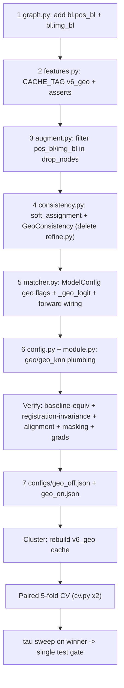

# Round 11 — Registration-Free Second-Order Geometry Consistency

**Supersedes the R10 "assignment-anchored refinement" approach** (see
`round10_critique_and_alternative.md` for why R10 is mostly redundant and aimed off the ceiling).

**Goal:** lift `val_acc_unchanged_split` (the real 0.90 ceiling: co-located same-type decoys) by
adding a matching signal that is **invariant to registration error** — pairwise distances *within*
each lesion cloud, which no rigid BL→FU transform can change.

This document is a complete, literal implementation spec. An agent with **no prior context** must be
able to implement it without guessing. It obeys `.cursor/rules/nanochat-style.mdc` (R1–R16).

---

## 0. The idea in one paragraph

BL lesion coordinates are propagated into FU space by registration (`cog_propagated`), which injects
error into `bl.pos`, the BL intra-kNN, and every geometric cross feature (`dp/dist/log dist`). You
**cannot** compute a BL↔FU distance without that transform (the two clouds live in different frames),
so naive cross-space Chamfer does not escape registration. What **is** registration-free is each
cloud's *internal* geometry: `D_bl[i,i'] = ‖cog_bl[i]−cog_bl[i']‖` (native BL frame) and
`D_fu[j,j'] = ‖cog_fu[j]−cog_fu[j']‖` (native FU frame) are invariant to the rigid BL→FU transform.
So we don't match points across spaces — we **require the matching to preserve each cloud's internal
geometry**. For candidate match `i→j`, penalize how much it breaks the surrounding constellation:
compare the known BL distance `D_bl[i,i']` to the FU distance from `j` to wherever neighbour `i'`
currently maps under the soft Sinkhorn assignment `P`. This second-order (quadratic-assignment)
signal is exactly what disambiguates two co-located same-type decoys, and it is **absent** from the
current model.

---

## 1. Scope and invariants

- **Touches 6 source files + 2 config files.** No new package, no factory, no registry (R3).
- **One new file** `tracking/consistency.py` (~55 LOC), a real noun (R4). **Delete** `tracking/refine.py`
  (the R10 block is replaced, not kept).
- **Cache rebuild required** (bump `CACHE_TAG`): native BL coordinates are not in the current cache.
  The cluster rebuild is acceptable (raw data lives on the cluster).
- **Zero-init safety:** the geometry term is a zero-initialised `nn.Linear`, so at step 0 the model is
  **bit-identical to geo-off** and can only earn weight via gradient. This is the only safety claim and
  it must be verified (§7, test 1).
- **A/B is a single config flag** `geo: bool`. `geo=False` reproduces the current model exactly
  (block skipped). `geo=True` is R11.

---

## 2. Data: add native BL geometry to the graph

### 2.1 `tracking/data/graph.py`

In `build_hetero_data`, the BL node loop currently is:

```python
    xb, pb = [], []
    for lid in bl_ids:
        r = bl_rep[lid]
        assert r.cog_bl is not None
        cb, ab, sb, mb = bl_cache[r.img_id_bl]
        mf_b = mask_stats(mb, lid, sb, cb)
        c = np.asarray(r.cog_bl, dtype=np.float64)
        xb.append(pack_node(descriptor_l0(cb, ab, c), mf_b, LESION_TYPES.index(r.lesion_type)))
        pb.append(np.asarray(r.cog_propagated, dtype=np.float64) * sp_fu)
```

Change to accumulate native BL mm coordinates and the source baseline image id:

```python
    xb, pb, pbl, ibl = [], [], [], []
    for lid in bl_ids:
        r = bl_rep[lid]
        assert r.cog_bl is not None
        cb, ab, sb, mb = bl_cache[r.img_id_bl]
        mf_b = mask_stats(mb, lid, sb, cb)
        c = np.asarray(r.cog_bl, dtype=np.float64)
        xb.append(pack_node(descriptor_l0(cb, ab, c), mf_b, LESION_TYPES.index(r.lesion_type)))
        pb.append(np.asarray(r.cog_propagated, dtype=np.float64) * sp_fu)
        # native BL mm in the lesion's own baseline frame; same elementwise (cog * spacing)
        # convention as pb/pf above, so intra-cloud distances are self-consistent. Registration
        # never touches this -> D_bl below is registration-free.
        pbl.append(c * sb)
        ibl.append(int(r.img_id_bl))
```

Then, right after the existing `data["bl"].pos = ...` / `data["fu"].pos = ...` lines, add:

```python
    data["bl"].pos_bl = torch.tensor(np.stack(pbl), dtype=torch.float32)
    data["bl"].img_bl = torch.tensor(ibl, dtype=torch.long)
```

**Why `img_bl`:** a patient may have lesions from >1 baseline image (`bl_cache` iterates over a set of
`img_id_bl`). Native coordinates from different baseline frames are **not** mutually comparable, so the
consistency term must mask cross-image BL pairs (§4). Do **not** rewire the intra-kNN topology here
(that would break BL-graph connectivity across multiple baseline images); the registration-free signal
enters only through the consistency term, which masks correctly.

`data["fu"].pos` already holds native FU mm (`cf * sp_fu`) and is the single common FU frame — reuse it
for `D_fu`. No FU-side change needed.

### 2.2 `tracking/data/features.py`

Force a cache rebuild and assert the new fields are present (R15, loud):

```python
CACHE_TAG = "v6_geo"   # was "v5_l0"; native BL geometry added to the cached graph
```

In `assert_graph_feat(g)`, append:

```python
    assert g["bl"].pos_bl.shape == (g["bl"].num_nodes, 3)
    assert g["bl"].img_bl.shape[0] == g["bl"].num_nodes
```

### 2.3 `tracking/data/augment.py`

`drop_nodes` filters BL node tensors by the keep mask `kb`. The new tensors must be filtered too or they
desync from `bl.x`. After the existing line `data["bl"].pos = data["bl"].pos[kb]`, add:

```python
    data["bl"].pos_bl = data["bl"].pos_bl[kb]
    data["bl"].img_bl = data["bl"].img_bl[kb]
```

**`jitter_both`: do NOT modify it.** It perturbs `bl.pos` (propagated, FU frame) to simulate
registration noise. `pos_bl` is registration-free by construction and must stay clean — leaving it
untouched is correct. (Side benefit: jitter makes the registration-laden cross features noisier at
train time, which *raises* the relative value of the registration-free term.)

---

## 3. New module: `tracking/consistency.py`

Create this file verbatim (delete `tracking/refine.py` afterwards — §5):

```python
"""Registration-free second-order geometry consistency for the matching logits.

The bipartite GNN and the cross features both ride on registration-propagated BL
coordinates (cog_propagated -> FU frame), so their geometry carries registration
error. This module adds a signal that needs NO registration: pairwise distances
*within* each cloud are invariant to the (rigid) BL->FU transform. For a candidate
match i->j we measure how much it breaks the surrounding constellation -- the known
native BL distance D_bl[i,i'] vs the FU distance from j to wherever neighbour i'
currently maps under the soft Sinkhorn assignment P. The per-edge discrepancy is
turned into a logit added to pair0 by a zero-initialised Linear (starts == geo-off
baseline, can only earn weight). Cross-baseline-image BL pairs are masked out
because their native distances live in different frames.
"""

from __future__ import annotations

import torch
from torch import nn

from tracking.train.sinkhorn import log_sinkhorn, superglue_marginals

DIST_SCALE = 50.0  # mm; brings distance discrepancies to O(1) before the linear head


def soft_assignment(pair: torch.Tensor, n_bl: int, n_fu: int, iters: int) -> torch.Tensor:
    """Detached soft Sinkhorn assignment P[:n_bl, :n_fu] from pair logits.

    Dust rows/cols are zero (parameter-free matchability prior, same convention as
    row_dust_marginals), so P is a pure function of the current pair landscape.
    """
    S = torch.zeros((n_bl + 1, n_fu + 1), device=pair.device, dtype=pair.dtype)
    S[:n_bl, :n_fu] = pair.reshape(n_bl, n_fu).detach()
    la, lb = superglue_marginals(n_bl, n_fu, pair.device, pair.dtype)
    P = log_sinkhorn(S, iters, la, lb).exp()
    return P[:n_bl, :n_fu].detach()


class GeoConsistency(nn.Module):
    def __init__(self, knn: int = 3):
        super().__init__()
        self.knn = knn
        self.head = nn.Linear(2, 1)  # [mean discrepancy, knn discrepancy] -> logit
        nn.init.zeros_(self.head.weight)  # zero-init => geo term starts at 0 == geo-off baseline
        nn.init.zeros_(self.head.bias)

    def _knn_mask(self, d_bl: torch.Tensor, valid: torch.Tensor) -> torch.Tensor:
        n = d_bl.shape[0]
        k = min(self.knn, n - 1)
        if k <= 0:
            return torch.zeros_like(valid)
        dm = d_bl.masked_fill(~valid, float("inf"))
        idx = dm.topk(k, dim=1, largest=False).indices
        m = torch.zeros_like(valid)
        m.scatter_(1, idx, True)
        return m & valid  # drop padded picks when a row has < k valid neighbours

    def forward(
        self, pos_bl: torch.Tensor, pos_fu: torch.Tensor, img_bl: torch.Tensor, p_soft: torch.Tensor
    ) -> torch.Tensor:
        n_bl = pos_bl.shape[0]
        d_bl = torch.cdist(pos_bl, pos_bl)  # (n_bl,n_bl) native BL mm  -- registration-free
        d_fu = torch.cdist(pos_fu, pos_fu)  # (n_fu,n_fu) native FU mm
        eye = torch.eye(n_bl, dtype=torch.bool, device=pos_bl.device)
        valid = (img_bl[:, None] == img_bl[None, :]) & ~eye  # same baseline image, exclude self
        efu = p_soft @ d_fu  # (n_bl,n_fu): FU dist from FU node j to where neighbour i' maps
        disc = (d_bl.unsqueeze(-1) - efu.unsqueeze(0)).abs()  # (n_bl,n_bl,n_fu) indexed [i,i',j]
        vf = valid.float().unsqueeze(-1)
        c_mean = (vf * disc).sum(1) / valid.float().sum(1, keepdim=True).clamp_min(1.0)
        kf = self._knn_mask(d_bl, valid).float().unsqueeze(-1)
        c_knn = (kf * disc).sum(1) / kf.sum(1).clamp_min(1.0)
        feat = torch.stack([c_mean, c_knn], dim=-1) / DIST_SCALE  # (n_bl,n_fu,2)
        return self.head(feat).squeeze(-1).reshape(-1)  # (n_bl*n_fu,) row-major == dense_pair_index
```

### Shape / correctness notes (read before editing)
- `disc[i, i', j] = |D_bl[i,i'] − EFU[i',j]|` where `EFU = P @ D_fu`, `EFU[i',j] = Σ_{j'} P[i',j'] D_fu[j',j]`.
  Summation axis is `i'` (dim 1).
- Output order is **row-major** `[i*n_fu + j]`, which matches `dense_pair_index`
  (`row.repeat_interleave(n_fu)`) and therefore `("bl","cross","fu").edge_index` for that graph.
- `n_bl == 1` ⇒ `valid` all-False ⇒ `c_mean == c_knn == 0` ⇒ logit from zero-init bias only ⇒ 0. Safe.
- Memory: `disc` is `(n_bl,n_bl,n_fu)` ≤ 46·46·40 ≈ 85k floats per graph, built one graph at a time. Negligible.
- `p_soft` is detached, `pos_*`/`img_bl` carry no grad ⇒ gradients reach only `head.weight/bias`
  (3 params). Tiny capacity = minimal overfit surface on 240 patients = the point. `pair0` is still
  trained directly by the Sinkhorn/focal losses through the `+ pair0` path.

---

## 4. Wire it into the matcher: `tracking/matcher.py`

### 4.1 Imports
Replace:
```python
from tracking.refine import MatchRefine, assignment_logp
```
with:
```python
from tracking.consistency import GeoConsistency, soft_assignment
```

### 4.2 `ModelConfig`
Replace the two R10 fields:
```python
    refine_blocks: int = 1
    refine_drop: float = 0.3
```
with:
```python
    geo: bool = True
    geo_knn: int = 3
```

### 4.3 `Matcher.__init__`
Replace the `self.refine = ...` block with:
```python
        self.geo = GeoConsistency(cfg.geo_knn) if cfg.geo else None
```

### 4.4 Replace `_refine_logp` with `_geo_logit`
Delete the entire `_refine_logp` method and add:
```python
    def _geo_logit(self, pair0: torch.Tensor, data: HeteroData) -> torch.Tensor:
        iters = self.cfg.sinkhorn_iters
        pos_bl, pos_fu, img_bl = data["bl"].pos_bl, data["fu"].pos, data["bl"].img_bl
        if hasattr(data["bl"], "batch") and data["bl"].batch is not None:
            ng = int(data.num_graphs)
            nb = torch.bincount(data["bl"].batch, minlength=ng)
            nf = torch.bincount(data["fu"].batch, minlength=ng)
            pp = torch.split(pair0, (nb * nf).tolist())
            pbs, ibs = torch.split(pos_bl, nb.tolist()), torch.split(img_bl, nb.tolist())
            pfs = torch.split(pos_fu, nf.tolist())
            outs = [
                self.geo(pb, pf, ib, soft_assignment(p, nbg, nfg, iters))
                for p, pb, ib, pf, nbg, nfg in zip(pp, pbs, ibs, pfs, nb.tolist(), nf.tolist())
            ]
            return torch.cat(outs)
        n_bl, n_fu = int(data["bl"].num_nodes), int(data["fu"].num_nodes)
        return self.geo(pos_bl, pos_fu, img_bl, soft_assignment(pair0, n_bl, n_fu, iters))
```
This mirrors the batch-splitting in `_dust_graph` so the `(E,)` output stays aligned with the
concatenated cross `edge_index`.

### 4.5 `Matcher.forward`
Replace the refine block:
```python
        pair = pair0
        if self.refine is not None:
            logp = self._refine_logp(pair0.detach(), data)
            rl, _ = self.refine(z["bl"], z["fu"], ei, ea, logp)
            pair = pair0 + rl
```
with:
```python
        pair = pair0
        if self.geo is not None:
            pair = pair0 + self._geo_logit(pair0.detach(), data)
```
Everything downstream (`_dust_graph(pair.detach(), ...)`, `MatcherOutput`) is unchanged.

---

## 5. Delete the R10 block
Delete `tracking/refine.py`. Confirm no remaining importers:
```
grep -rn "tracking.refine\|MatchRefine\|assignment_logp\|refine_blocks\|refine_drop" tracking/ configs/
```
must return nothing after §4, §6 edits.

---

## 6. Config plumbing

### 6.1 `tracking/config.py`
In the `Config` dataclass, replace:
```python
    refine_blocks: int = 1
    refine_drop: float = 0.3
```
with (place right after `heads: int = 4`):
```python
    geo: bool = True
    geo_knn: int = 3
```
`load_config` already rejects unknown keys, so any JSON still carrying `refine_blocks` must be updated.

### 6.2 `tracking/train/module.py`
- In `MatcherModule.__init__`, replace the params `refine_blocks: int = 0, refine_drop: float = 0.3`
  with `geo: bool = True, geo_knn: int = 3`.
- In the `ModelConfig(...)` constructor call, replace `refine_blocks=refine_blocks, refine_drop=refine_drop`
  with `geo=geo, geo_knn=geo_knn`.
- Keep `self.save_hyperparameters()` (already present) so checkpoints record `geo/geo_knn` and reload
  the right architecture.
- In `module_from_config`, replace `refine_blocks=cfg.refine_blocks, refine_drop=cfg.refine_drop` with
  `geo=cfg.geo, geo_knn=cfg.geo_knn`.

`_loss` is unchanged: the consistency term only sharpens `out.pair`; Sinkhorn loss, focal pair loss,
InfoNCE and dust BCE all consume `out.pair`/`out.dust_*` unchanged.

### 6.3 Config files (the A/B sweep)
Two files derived from the canonical training config (`configs/base.json` or whichever the CV harness
already consumes — copy it, then set the one flag):
- `configs/geo_off.json`: copy of base with `"geo": false`. (Reproduces the current model exactly.)
- `configs/geo_on.json`:  copy of base with `"geo": true`, `"geo_knn": 3`.

If `base.json` still contains `"refine_blocks"`/`"refine_drop"`, **remove those keys** from both files
(else `load_config` raises on unknown keys).

---

## 7. Verification (local, no cluster) — temporary tests, delete after they pass (R16)

Build one or two small `HeteroData` graphs (or load 2 from a tiny fixture) and a `Matcher(ModelConfig(geo=True))`.

1. **Baseline equivalence (the safety claim).** At init, `model._geo_logit(pair0, batch)` must be all
   zeros to ~1e-6 (zero-init head). Therefore `pair == pair0`, i.e. geo-on == geo-off at step 0.
   *This is the single most important check.*
2. **Registration invariance (the core claim).** Apply a random rotation `R` + translation `t` to
   `pos_bl` (`pos_bl @ R.T + t`); the `GeoConsistency.forward` output must be unchanged to ~1e-4
   (`cdist` is rigid-invariant). Repeat independently for `pos_fu`. This proves the signal carries no
   registration dependence.
3. **Prior alignment.** On a 2-graph batch, assert `_geo_logit` returns shape `(total_cross_edges,)`
   and that per-graph slices equal `GeoConsistency.forward` recomputed from each graph in
   `batch.to_data_list()` (catches batch-order / row-major misalignment).
4. **Multi-image masking.** Construct a graph with `img_bl = [0,0,1]`; assert the BL node whose only
   neighbours are in the other image gets `c_mean == 0` (its `valid` row is all-False), and that no
   `disc` term across images contributes.
5. **Gradient flow.** After one `loss.backward()`, assert `geo.head.weight` and `geo.head.bias` have
   non-None, finite grads.
6. **Smoke (cluster, short).** `train.py --config configs/geo_on.json --fold 0`, `max_steps≈1500`,
   `val_check_steps=250`: all losses finite, `val_match_score` rising, and `geo.head.weight` drifts
   away from 0 (the term is being used).

---

## 8. Cluster run

1. **Rebuild cache.** Bumping `CACHE_TAG` to `v6_geo` makes `processed_file_names` change, so the next
   `LesionDataset(...)` construction auto-triggers `process()` and rebuilds `train/val/test_v6_geo.pt`
   from raw data. (Descriptors are recomputed — the expensive part — but this is unavoidable since
   native BL coordinates are not in the old cache.) Run the project's normal preprocess/train entry once
   per split so all three caches are built before the sweep.
2. **Paired 5-fold CV (one sweep).** Mirror the existing harness:
   ```
   PYTHONPATH=. python tracking/cli/cv.py --config configs/geo_off.json --out runs/cv_geo_off --wandb --wandb-run-name geo_off
   PYTHONPATH=. python tracking/cli/cv.py --config configs/geo_on.json  --out runs/cv_geo_on  --wandb --wandb-run-name geo_on
   ```
   Each writes `cv_summary.json` with per-fold + mean±std of `val_match_score_ema` and the three
   sub-accuracies.
3. **Decision rule (ship geo only if all hold):**
   - 5-fold mean `val_match_score_ema` clears geo-off with non-overlapping (mean±std) bands;
   - `val_acc_unchanged_split` mean improves **≥ 2 pp**;
   - `val_acc_disappeared` and `val_acc_newly_appearing` do **not** regress.
4. **Tau sweep on the winner.** For each fold's `best.ckpt`, `eval.py --split val --dust-tau
   {0.10,0.15,0.18,0.20,0.22,0.25,0.30,0.35}`; pick the CV-argmax `val_match_score`.
5. **Single test gate.** Retrain geo-on on the full train+val pool at the chosen tau; run
   `eval.py --split test` exactly once. Only touch of the test split.

---

## 9. Risks & rollback

- **Term earns ~0 weight (`geo.head.weight ≈ 0`).** Then geo-on ≈ geo-off by construction — no
  regression, honest null. Report under CV and fall to the deferred enrichments below.
- **Non-rigid change** (real growth/deformation) means native distances are only *approximately*
  preserved. Mitigated: the head learns a soft, signed weighting of the discrepancy (it is a feature,
  not a hard constraint); `knn` restricts to the most-local, most-rigid neighbours.
- **Small graphs / symmetric constellations** give few or ambiguous distance constraints. That is why
  the term is *additive* to the existing appearance + (registration-laden) geometry, not a replacement.
- **Extra Sinkhorn cost.** One `soft_assignment` per graph per forward (log-domain, ~20 iters) on top
  of the dust-marginal pass; negligible vs the 4 `TransformerConv` layers. If ever profiled, share one
  Sinkhorn pass between `_geo_logit` and `_dust_graph`.
- **Rollback** = set `"geo": false` (config flip, no code revert). The `v6_geo` cache still loads for
  geo-off (the extra fields are simply unused).

---

## 10. Deferred (only if the CV gate is flat)

- **Richer consistency features:** replace `nn.Linear(2,1)` with a small MLP and add a couple more
  registration-free features (e.g. angle consistency: preserve `∠(i,i',i'')` between matched triplets;
  or a soft min-discrepancy over neighbours). Keep zero-init on the final layer.
- **Rewire BL intra-kNN onto native coordinates** (per-`img_bl` group), removing registration error from
  the GNN's BL message passing too. Deferred because of the multi-baseline-image connectivity wrinkle.
- **Registration-uncertainty features (v6 of the original plan):** append `dp/sigma_mm` + `Mahalanobis`
  to `cross_attr` so the network trusts the propagated geometry *less where registration is unreliable*.
  Complementary to this round; another cache change.

---

## 11. Order of execution


