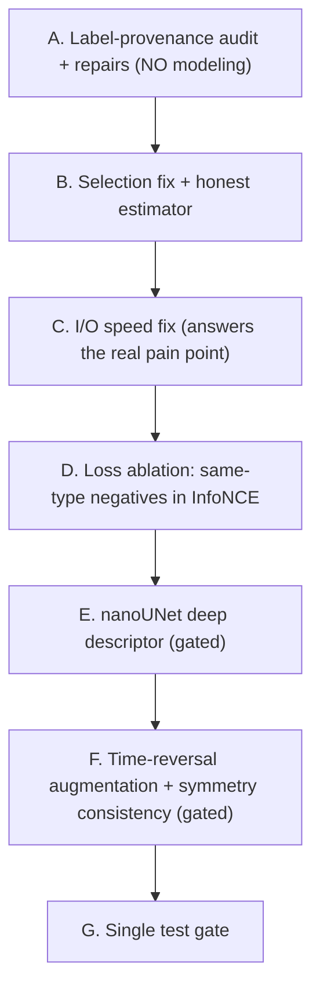
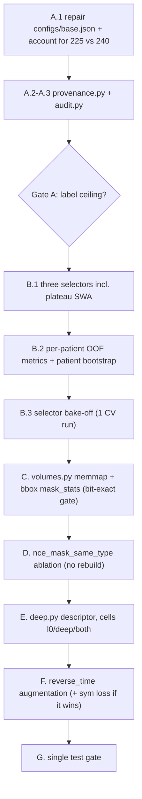

# Round 12 — Fix the Measurement, Fix the Premise, Then One Representational Bet

**Status:** plan only. No code written yet.
**Predecessors:** R9 (`round9_cv_matcher_dustbin_c68d185b.plan.md`), R10 (`round-10.md`,
`round10_critique_and_alternative.md`), R11 (`round11_registration_free_geometry.md`).
**Panel:** Ilya Sutskever (representation / regularization, small-data), Jure Leskovec (GNN &
matching structure), Fabian Isensee (medical validation rigour). All three agree:
**measurement before modeling.**

This document is a complete, literal implementation spec. An agent with **no prior context** must be
able to execute it without guessing. Read §1 (Coding philosophy) before writing a single line.

---

## 0. Executive summary — why this round looks nothing like R10/R11

### 0.1 The empirical record says: stop touching the matcher

| Round | Lever type | Outcome |
|---|---|---|
| R6 | **data** (node-drop augmentation) | the win (~0.936) |
| R7 | architecture (set attention) | regressed to ~0.83, rolled back |
| R7.1 | architecture | ~0.917, did not beat R6 |
| R8 | loss/arch (hard-neg BCE, descriptor LayerNorm) | rolled back in R9 |
| R9 | **measurement** (patient-level k-fold CV) | kept; proved all configs tie within noise |
| R10 | architecture (assignment-anchored refinement) | rolled back |
| R11 | architecture (registration-free geometry consistency) | **rolled back** |

Verified from git: commit `8c40711` ("final version") **deletes** `tracking/consistency.py`, both
`configs/geo_{on,off}.json`, `scripts/round{10,11}.sh`, and reverts `CACHE_TAG` from `v6_geo` back to
`v5_l0`. HEAD is functionally identical to r9_base. **Four consecutive architecture rounds produced
nothing shippable. The one data round produced the win. The one measurement round proved the rest
were unmeasurable.**

At 300 patients / 359 transitions this is not bad luck — it is the signature of a problem that is
**measurement-, label- and representation-limited, not capacity-limited**. R12 therefore changes
**zero lines** of `tracking/matcher.py`, `tracking/matchability.py`, `tracking/decode.py` and
`tracking/train/sinkhorn.py`.

### 0.2 Five concrete defects found this round (all verified, none previously known)

**D1 — `CKPT_MONITOR` selects the last checkpoint by construction. Worth ~2 pp, free.**
`CKPT_MONITOR = "val_match_score_ema"` (`tracking/config.py:10`) is an EWMA with `beta=0.3` over
validation checks. An EWMA converging upward toward a plateau **is still rising when it reaches the
plateau**, so `ModelCheckpoint(monitor=..., mode="max", save_top_k=1)` degenerates into "save the
last checkpoint". Confirmed on every W&B run retrieved:

| run | `val_acc_disappeared` peak | `..._newly_appearing` peak | `val_match_score` (raw) peak | `val_match_score_ema` peak |
|---|---|---|---|---|
| r9_mergesplit_fold0 | 0.9979 @ **72** | 0.9953 @ **72** | 0.9458 @ 883 | 0.9443 @ **1105** (of 1180) |
| r9_mergesplit_fold1 | 1.0000 @ **144** | 1.0000 @ **71** | 0.9610 @ 763 | 0.9590 @ **872** |
| r9_mergesplit_fold2 | 0.9976 @ **109** | 1.0000 @ **72** | 0.9012 @ 662 | 0.8968 @ **1105** (of 1180) |
| r9_base_final | 0.9962 @ **68** | 1.0000 @ **102** | 0.9153 @ 691 | 0.9138 @ **933** (of 1108) |
| r9_base_fold0 | 1.0000 @ **106** | 1.0000 @ **106** | 0.9429 @ 574 | 0.9380 @ **1006** (of 1152) |
| r9_base_fold4 | 0.9929 @ **70** | 0.9950 @ **34** | 0.9515 @ 604 | 0.9453 @ **746** |

And the score being selected on is
`val_match_score = 0.5·unchanged_split + 0.25·disappeared + 0.25·newly_appearing`
(`tracking/train/module.py:133-141`). **`disappeared` + `newly_appearing` carry 50% of the weight**,
and both have decayed 3–9 pp by the EMA-selected step. Recovering half of that is ~2 pp on the
headline metric — **an order of magnitude larger than the 0.3 pp architecture deltas R9 declared
unmeasurable.**

> **Correction to the R9 diagnosis, which this round must not inherit.** R9 read the early
> peak-then-decay of `disappeared`/`newly_appearing` as "the dustbin memorizes". That is only half
> right. At step ~34–70, `val_acc_unchanged_split` is ~0.07–0.11 — the model matches almost
> *nothing*, so routing everything to the dustbin makes `disappeared`/`newly` ≈ 1.0 **trivially**.
> The early peak is a degenerate null model and must never be selected. The *genuine* overfit is
> only the **late** segment: after `unchanged_split` plateaus (step ~550–1000), `disappeared` keeps
> falling (e.g. r9_base_fold4: 0.97 → 0.9078) for zero gain. The fix is therefore **"select at
> plateau onset / average across the plateau"**, never **"stop early"** — stopping early collapses
> matching entirely. Getting this distinction wrong inverts the result.

**D2 — There are ZERO real SPLIT events. Two rounds were aimed at a partly synthetic target.**
`meta/*.csv` `topology_class` takes exactly four native values across all 300 files:

| class | count | share of 4,638 rows |
|---|---:|---:|
| UNCHANGED | 2,506 | 54.0% |
| DISAPPEARING | 1,407 | 30.3% |
| NEWLYAPPEARING | 559 | 12.1% |
| MERGING | 166 (**38 distinct groups**) | 3.6% |
| SPLIT | **0** | 0% |

`derivatives/graph-based-tracking/rerun_mergesplit/MANIFEST.md` states it outright: *"Split cases are
SYNTHETIC (reversed merges)."* So `val_acc_unchanged_split` is ~98.5% plain UNCHANGED accuracy with a
synthetic tail, and **every split-specific number in this repo is unfounded**. R10 and R11 were both
designed to lift a ceiling defined partly by manufactured labels.

**D3 — ~30% of ground-truth positions are registration-imputed. The ceiling may be a LABEL ceiling.**
`derivatives/unigrad-icon-registration/clickfix_report.csv` (307 cases, 4,486 lesions):
**678 BL positions imputed** (`n_bl_filled`), **1,364 FU positions imputed** (`n_fu_filled`),
**137 flagged `n_sanity_bad`**, 20/307 cases "partial".

I have **not** established that the *correspondence labels* were derived from registration proximity
— only that a large share of the *coordinates* were. But if they were, it explains three otherwise
puzzling facts at once: the distance-only baseline is competitive; R11's registration-**free**
geometry produced nothing (it was fighting the label-generating process); and the ceiling sits at
~0.91. **This is testable and is Stage A of this round.** If residual errors concentrate on
imputed-label lesions, no architecture will ever move the number and the honest deliverable is a
cleaned evaluation subset plus a stratified report.

**D4 — The premise behind "radiomics is slow" is wrong, and nanoUNet would make it slower.**
There is **no pyradiomics in this repo** (verified: absent from `requirements.txt`, no import
anywhere; the word in `tracking/data/appearance.py:1` is the authors' own term for 14 hand-computed
scalars). `tracking/data/descriptor.py::descriptor_l0` is 4 scales × 7³ = **1,372 trilinear point
samples** via `scipy.ndimage.map_coordinates(order=1)` — microseconds per lesion, ~7,200 lesions
total. The bottleneck is **I/O**: `nib.load(...).get_fdata()` fully decompressing 512×512×(70–268)
`.nii.gz` volumes (26 GB BL + 22 GB FU), plus `mask_stats` doing **full-3D-mask passes per lesion**.

Swapping in a nanoUNet encoder still requires loading the same volumes **and** adds a 3D CNN forward.
It is strictly additive to the real bottleneck. **The speed fix is Stage C (I/O), and it is
independent of the feature question.** nanoUNet must be justified on **accuracy only** — where the
prior is unfavourable (R8's MAE descriptor scored 0.919 vs L0's 0.946).

**D5 — `configs/base.json` does not exist.** The only config is `configs/r9_base.json`. Both
`scripts/round9.sh` (`CFG=${CONFIG:-configs/base.json}`) and `scripts/lesion-round9-cv.sh`
(`export CONFIG=configs/base.json`) default to the missing path — the documented command in
`README.md` §4 fails with `FileNotFoundError`. Also `processed/cv/train` holds **225** graphs against
**240** train patients in `data_split.json`; the 15 missing are unexplained and must be accounted for.

### 0.3 What R12 does, in order



Stages A–C are **not** experiments; they are repairs and must land regardless of outcome. Stages D–F
are three cheap, independent bets, each with a kill gate. Nothing in D–F touches the matcher.

---

## 1. Coding philosophy — HARD RULE, read before writing any code

This repo follows **nanochat style**, distilled from Karpathy's
[nanochat](https://github.com/karpathy/nanochat) plus the user's own style guides. It is
**non-negotiable**. Do not assume you already know it — the rules are reproduced here in full because
the implementing agent may have no prior context.

**Spirit:** minimal, dense, correct. One file = one concept. Few lines, high information density.
Remove layers, do not add them. Distrust magic. You must be able to maintain it alone in 5 years.

**What nanochat actually does** — direct observations, worth internalizing:
- One file = one concept. `gpt.py` (508 LOC) defines the whole transformer. Files are **not** split
  to be small; they are split only when the concept is independent.
- Every file opens with a short `"""docstring"""` listing notable features. The reader knows in 30 s
  what is in the file and what is novel.
- Scripts are **top-to-bottom procedural**. No `def main()` wrapper. argparse at the top, code falls
  through to the loop, cleanup at the bottom. They read like a notebook, not a framework.
- Tiny utilities live together in one `common.py`. No `utils/` package, no registries, no "abstract
  base" anything.
- **Dataclasses for config**, not dicts, not Pydantic.
- **Globals are fine when they are constants**, detected once at import time.
- **Classes only when state is needed.** If you can replace a class with a function, do.
- **No defensive programming.** `assert split in ("train","val")`, not `if ... raise`. Errors die at
  the call site, not three layers deep.
- Comments say **why**, never **what**.
- No abstract base classes. No factories. No plugins. No mixin chains. No "Strategy" patterns.

**Hard rules — apply to every file touched in R12:**

| # | Rule |
|---|---|
| R1 | **<200 LOC per file.** Hard limit. Past 200, split on a *concept* boundary, not arbitrarily. |
| R2 | **No file shorter than ~30 LOC** that exists only to host one function. Inline it into the nearest sibling or `tracking/common.py`. |
| R3 | **No abstract base classes, no factories, no registries, no plugin systems.** Two cases is `if cfg.x == "a": ... else: ...`. Three cases is `if/elif/else`. That is not a registry. |
| R4 | **No `utils/` or `helpers/` package.** Real noun names only: `provenance.py`, `deep.py`, `volumes.py`. |
| R5 | **No defensive programming.** `assert` on invariants; raise only at the boundary (CLI / config / file I/O). Never try/except that just logs and re-raises. |
| R6 | **One module-level docstring per file.** Short, lists what is in the file and any non-obvious feature. No section banners, no decorative comments. |
| R7 | **Type hints on public signatures and dataclasses only.** Skip them inside small helpers. No `Optional[Union[...]]` walls. |
| R8 | **Dataclasses for config, argparse for CLI, JSON on disk.** No Hydra, no OmegaConf, no Pydantic. |
| R9 | **Constants and detected facts at module top** as `UPPER_CASE = ...`. No `Settings()` singleton. |
| R10 | **Comments explain WHY** (intent, invariant, trade-off, gotcha), never what. Delete any comment that paraphrases the next line. |
| R11 | **No `print`** outside `tracking/common.py` (`print0` for rank-0). Lightning/logger everywhere else. |
| R12 | **No fallbacks for missing data, ever.** Missing cache/split/ckpt → raise. No silent recompute, no synthetic defaults. |
| R13 | **CLI scripts are top-to-bottom procedural.** argparse → setup → call into library → exit. No `def main()` wrapper. |
| R14 | **No abstractions over Lightning.** Use `LightningModule`, `LightningDataModule`, `Trainer`, `WandbLogger`, `ModelCheckpoint` directly. No `BaseTrainer`. Non-trivial logic lives in the `LightningModule`, not in callbacks. |
| R15 | **Errors loud and immediate.** Validate config at load, inputs at CLI entry, crash. The training loop assumes valid state. |
| R16 | **Tests are temporary.** Write them, validate, delete. The final repo has no `tests/` folder. |

**Naming:** `snake_case` for functions/variables/files/folders; `PascalCase` for classes and
dataclasses; `UPPER_CASE` for module-level constants. Short and precise — `bbox`, `seg`, `n_bl`, `z`,
`tau`, `fold`. Do not write `query_tensor` when `q` is unambiguous. File names are nouns
(`provenance.py`, never `provenance_utils.py`).

**Anti-patterns to refuse outright:** a `BaseSampler` with three subclasses and a registry; a
one-function `*_helpers.py`; an ABC with a single concrete implementation; try/except-with-fallback
around a library call; a `Settings` singleton imported everywhere. If you catch yourself writing any
of these, **stop and inline it**.

---

## 2. Stage A — Label-provenance audit and repairs (NO modeling)

**Goal:** find out whether the 0.91 ceiling is a model ceiling or a label ceiling, before spending
another GPU-week on either. Nothing here trains anything.

### A.1 Repair D5 (10 minutes, do first)

1. `git mv configs/r9_base.json configs/base.json` — the scripts, the README and `HANDOFF.md` all
   already say `configs/base.json`. Make reality match the docs rather than the reverse.
2. Verify: `grep -rn "r9_base.json" . --include=*.sh --include=*.md --include=*.py` returns nothing.
3. Account for the 225-vs-240 gap. Write a throwaway script (delete after, R16) that loads
   `data_split.json`, lists `processed/cv/train/*.pt`, and prints the 15 missing patient IDs together
   with, for each, the reason it was skipped — cross-reference `tracking/data/graph.py`
   (`build_hetero_data` returns `None` when either side is empty) and `tracking/data/meta.py` (rows
   with `linking_unclear` truthy are dropped). **Record the reasons in
   `.cursor/plans/round12_findings.md`.** If any are dropped for a fixable reason, fix it — 15/240 is
   6% of the training set.

### A.2 New file: `tracking/data/provenance.py` (~90 LOC)

Joins each lesion to its registration-QC provenance so every downstream metric can be stratified.

```python
"""Per-lesion registration provenance: was this position observed, or imputed by registration?

clickfix_report.csv counts imputations per case (n_bl_filled / n_fu_filled / n_sanity_bad) but does
not name the lesions. registration_error_table.json carries the per-case frame + resampled voxel
geometry. We therefore derive a per-lesion flag from the meta CSV itself: a BL row whose cog_bl is
empty, or an FU row whose cog_fu is empty while cog_propagated is present, was positionally imputed.
Used only for stratified reporting -- never as a model input, because that would leak the label
generating process into the model.
"""
```

Public surface:

```python
@dataclass
class Provenance:
    pid: str
    lesion_id: int
    side: str          # "bl" | "fu"
    imputed: bool      # position came from registration, not annotation
    sanity_bad: bool   # case-level flag from clickfix_report.csv

def lesion_provenance(pid: str, root: Path) -> list[Provenance]: ...
def case_flags(root: Path) -> dict[str, dict]:   # pid -> clickfix_report row
```

`case_flags` parses `derivatives/unigrad-icon-registration/clickfix_report.csv` once and caches it in
a module-level dict (R9: constants and detected facts at module top).

### A.3 New CLI: `tracking/cli/audit.py` (~120 LOC, top-to-bottom procedural per R13)

```
PYTHONPATH=. python3 tracking/cli/audit.py --ckpt <best.ckpt> --split val --out runs/audit
```

It must produce **exactly** these numbers and write them to `{out}/audit.json`:

1. **Class balance recomputed from `meta/*.csv`**, per split — confirm the §0.2 D2 table holds within
   train/val/test individually. Report native SPLIT count (expected: 0) explicitly and loudly.
2. **Imputation rates** per split: fraction of BL nodes and FU nodes with `imputed=True`.
3. **Error stratification — THE decisive number.** Run the checkpoint, Hungarian-decode, and
   split `val_acc_unchanged_split`, `val_acc_disappeared`, `val_acc_newly_appearing` into
   `imputed=True` vs `imputed=False` subsets. Report each accuracy and each subset's `n`.
4. **Distance-baseline agreement.** For every BL row the model gets *wrong*, report whether the
   nearest-FU-lesion-by-`cog_propagated` was the label. This separates "model is worse than a ruler"
   from "label is a ruler".
5. **Lesion-size stratification.** Bucket by `volume_bl` into quartiles; report the three accuracies
   per bucket. (Motivates the stage choice in Stage E; small lesions are where deep features can help
   and where the bottleneck cannot.)

### A.4 Decision gate A — this gate governs the whole round

Let `acc_imp` and `acc_obs` be `val_acc_unchanged_split` on imputed-position vs observed-position
lesions.

- **If `acc_obs − acc_imp ≥ 5 pp`**: the ceiling is substantially a *label* ceiling. Then:
  (a) Stages D–F still run, but the **primary reported metric becomes the observed-position subset**,
  with the full-set number reported alongside and explicitly labelled as label-noise-limited.
  (b) Add a "clean subset" evaluation to `report.json` and say so in the paper/README.
  (c) **Do not** attempt further geometry modelling — R11 already died on this rock.
- **If `acc_obs − acc_imp < 5 pp`**: label noise is not the dominant term. Proceed with the full set
  as primary and treat the ceiling as genuinely model-side.

Either way: **write the answer into `.cursor/plans/round12_findings.md` before starting Stage D.**

---

## 3. Stage B — Selection fix and an honest estimator

This is the highest-expected-value stage in the round and costs no new modelling.

### B.1 Stop selecting the last checkpoint (fixes D1)

**Diagnosis restated precisely:** a causal EWMA that is still converging upward toward a plateau
attains its maximum at the *end* of that plateau. With `save_top_k=1, mode="max"`, monitoring
`val_match_score_ema` is therefore approximately equivalent to `save_last=True`. This is a selection
bug, not a smoothing preference.

**Change — `tracking/train/module.py`.** Keep the EWMA (it is a fine *early-stopping* signal, which
is what it was originally added for) but stop selecting on it. Save three checkpoints per run and let
Stage B.3 decide empirically which selector wins:

1. `best_ema.ckpt` — monitor `val_match_score_ema` (status quo; keep for comparison).
2. `best_raw.ckpt` — monitor `val_match_score` (raw). Note `rerun_mergesplit/folds/fold_*/` already
   contains a `best_raw.ckpt`, so this path is partly built; verify and reuse rather than duplicate.
3. `swa_plateau.ckpt` — **new**. A uniform average of the matcher weights over the plateau window.

**Plateau-window SWA, concretely.** In `MatcherModule`, maintain a second `AveragedModel` with the
default (uniform) `avg_fn`, updated **only** on validation checks where the raw `val_match_score` is
within `SWA_BAND = 0.01` of the running max. Add at module top:

```python
SWA_BAND = 0.01   # raw val_match_score within 1pp of running max counts as "on the plateau"
SWA_MIN_UPDATES = 5
```

Update it inside `on_validation_epoch_end`, immediately after `raw` is computed and after
`_best_raw_score` is updated:

```python
        # Averaging weights across the plateau captures the window where unchanged_split has
        # converged but disappeared/newly have not yet decayed; a single checkpoint cannot sit at
        # both optima because they peak ~500 steps apart.
        if raw >= self._best_raw_score - SWA_BAND:
            self.swa_matcher.update_parameters(self.matcher)
            self._swa_updates += 1
```

At `on_train_end`, write `swa_plateau.ckpt` only if `self._swa_updates >= SWA_MIN_UPDATES`; otherwise
raise (R12: no silent fallback — a run that never plateaued is a broken run and must be visible).

**Do not** change `EarlyStopping` — it continues to monitor `val_match_score_ema`, which is the
correct use of a lagging smoother.

### B.2 Per-patient out-of-fold metrics + patient bootstrap (Fabian's contribution)

The current estimator is the mean±std of 5 fold-level scalars, and the R9/R10/R11 decision rule was
"non-overlapping mean±std bands". That rule is both **statistically wrong for a paired design** and
**badly underpowered**: it discards the pairing entirely, and the fold spread is enormous — retrieved
`val_acc_unchanged_split` ranges **0.833 (mergesplit fold2) → 0.957 (mergesplit fold1)**. Fold
identity, not config, dominates the variance. That is precisely why R10 and R11 read as flat.

**Replace it with:**

1. **Per-patient metrics.** In `tracking/train/match_utils.py::graph_val_counts`, additionally return
   per-graph `(uc_ok, uc_tot, dis_ok, dis_tot, new_ok, new_tot)`. In `MatcherModule`, accumulate
   these into a dict keyed by `batch.pid` and dump to `{out}/val_per_patient.json` at the selected
   checkpoint.
2. **Out-of-fold pooling.** Every patient appears in the val side of **exactly one** fold, so
   concatenating the per-patient records across all 5 folds yields one score per patient over the
   whole 240-patient pool — a single, properly out-of-fold estimate rather than 5 noisy fold means.
3. **Patient-level bootstrap CI.** Resample patients with replacement (`B = 10_000`, seeded), recompute
   the weighted `match_score` on each resample, report the 2.5/97.5 percentiles. Add to
   `tracking/data/splits.py` (it already owns `aggregate_cv_folds` and `CV_METRICS`, so this is the
   correct home — no new file, R2):

```python
BOOTSTRAP_B = 10_000
BOOTSTRAP_SEED = 0

def bootstrap_match_score(per_patient: dict, b: int = BOOTSTRAP_B) -> tuple[float, float, float]:
    """Point estimate + (2.5, 97.5) percentile CI, resampling PATIENTS not lesions.

    Lesions within a patient are correlated (shared anatomy, shared registration error), so a
    lesion-level bootstrap would understate the interval by a large factor.
    """
```

4. **Paired deltas for every A/B.** For config `c` vs base, report `Δ_i = score_i(c) − score_i(base)`
   **per patient**, then bootstrap `mean(Δ)`. Because the same patients and the same folds are used,
   the pairing cancels the fold-identity variance that dominates the marginal bands. This is a large
   power gain for zero compute.

**New decision rule, replacing "non-overlapping mean±std" everywhere in this round:**
> Ship a change iff the **patient-bootstrap 95% CI of the paired delta excludes 0** on
> `match_score`, **and** neither `disappeared` nor `newly_appearing` has a paired-delta CI whose
> upper bound is below −0.01.

### B.3 Selector bake-off (the first experiment of the round)

Run **one** 5-fold CV on `configs/base.json` unchanged, saving all three checkpoints per fold.
Evaluate each selector on its fold's val set and report the pooled per-patient bootstrap for each.

| selector | expected | why |
|---|---|---|
| `best_ema` | baseline | status quo; selects ~last |
| `best_raw` | **+1 to +2 pp** | sits at the raw peak, before the late decay |
| `swa_plateau` | **+1 to +3 pp** | averages the window; should also reduce fold variance |

Adopt the winner as the new `CKPT_MONITOR` semantics and record it in `HANDOFF.md`.
**This costs one CV run and is the cheapest point gain available anywhere in the project.**

---

## 4. Stage C — Make preprocessing fast (fixes D4, the user's actual pain point)

**This is the answer to "radiomics takes extremely long". It is an I/O fix, not a feature swap.**

Current cost per patient in `tracking/data/graph.py::build_hetero_data`:
- `nib.load(...).get_fdata()` on BL CT, FU CT, BL mask, FU mask — full gzip decompression of
  512×512×(70–268) volumes, then a float64 materialization of the whole array;
- `tracking/data/appearance.py::mask_stats` called once per lesion, each call scanning the **full**
  3D mask array.

Neither depends on the descriptor. Both are pure waste.

### C.1 New file: `tracking/data/volumes.py` (~110 LOC)

```python
"""Uncompressed memmap cache for CT + instance masks, and bbox slicing per lesion.

.nii.gz is gzip: every read decompresses the entire volume even for a 30mm crop. We decompress once
into .npy (float32 CT, int16 mask) under {cache}/volumes/ and memmap thereafter, so a lesion crop
touches only its own pages. Masks additionally get a per-lesion bbox table so mask_stats never scans
the full array.
"""

CT_DTYPE = np.float32
MASK_DTYPE = np.int16

def ensure_volume(nii_path: Path, cache: Path) -> Path: ...      # -> .npy, builds once
def open_volume(npy_path: Path) -> np.memmap: ...
def lesion_bboxes(mask: np.ndarray) -> dict[int, tuple[slice, slice, slice]]: ...
```

`lesion_bboxes` computes **all** lesion bounding boxes in a single pass over the mask
(`scipy.ndimage.find_objects` on the labelled array) instead of one full scan per lesion.

### C.2 Rewire the two consumers

- `tracking/data/appearance.py::mask_stats(mask, lesion_id, spacing, ct)` → add a `bbox` parameter and
  operate on `mask[bbox]` / `ct[bbox]`. All 14 scalars are bbox-local except none — verify each:
  volume, HU stats, sphericity (surface via face counting), bbox extents, PCA eigenvalues are **all**
  computable from the crop. **Pad the bbox by 1 voxel** on each side so the face-counting surface-area
  term sees the outside boundary; without the pad, sphericity is wrong for lesions touching the crop
  edge. This is the one correctness trap in Stage C.
- `tracking/data/graph.py` → replace `nib.load(...).get_fdata()` with `open_volume(ensure_volume(...))`
  and pass bboxes through. Keep the existing `_NII_CACHE` per-patient clearing semantics.

### C.3 Acceptance

- Wall-clock `preprocess.py --split val --jobs 1` before vs after, printed. **Target ≥5× faster.**
- **Bit-exactness gate:** rebuild the `val` cache with the same `CACHE_TAG` and assert every node
  feature matches the existing cached tensor to `atol=1e-5`. If Stage C changes any number, it is a
  bug, not an optimization — fix it before proceeding. (Expect a genuine mismatch only if the
  sphericity pad is wrong; that is the point of the gate.)
- Disk: uncompressed CT for 300 patients ≈ 130 GB → **write `volumes/` to `{cache}`, not to the
  read-only dataset root, and check free space before starting.**

---

## 5. Stage D — Loss ablation: stop hiding the hard negatives

**Cheapest real bet in the round. No cache rebuild. ~3 lines.**

`tracking/train/match_utils.py:46` masks same-lesion-type pairs out of the InfoNCE negatives:

```python
same = lt_bl[:, None] == lt_fu[None, :]
```

The stated intent is to avoid penalizing indistinguishable same-organ lesions as false negatives.
But **the entire `unchanged_split` ceiling is same-type, co-located decoys** — two lung mets
competing for one baseline lesion. The contrastive loss is being explicitly told not to discriminate
the one thing that defines the failure mode. Across eleven rounds nobody has tested this.

Ilya's framing: in the small-data regime the contrastive term is the main source of *identity*
pressure on the descriptor embedding. Masking its hardest negatives removes exactly the gradient that
would separate co-located same-type lesions.

**Implementation.** Add one config field (`tracking/config.py`, after `nce_tau`):

```python
    nce_mask_same_type: bool = True   # R12-D: False exposes same-type negatives to InfoNCE
```

Thread it to `infonce_graphs` / `_infonce` and branch (R3 — a bool is an `if`, not a registry).

**Cells (paired 5-fold, Stage B estimator, selector = Stage B.3 winner):**
1. `nce_mask_same_type=True` (base)
2. `nce_mask_same_type=False`
3. `nce_mask_same_type=False, nce_w=0.5` — if exposing hard negatives helps, the term likely deserves
   more weight; if cell 2 is flat, skip cell 3.

**Gate:** ship by the §3 B.2 rule. Expect either a clear win or a clear loss — this is a genuinely
two-sided experiment, which is what makes it worth running.

---

## 6. Stage E — nanoUNet deep descriptor (gated, accuracy-only)

**Framing, stated honestly up front:** R8 already tried MAE-derived descriptors and lost (0.919 vs
0.946 for L0). This stage is a *hypothesis about why that attempt failed*, not an assumption that
deep features win. It also does **not** make preprocessing faster (see D4) — Stage C does that.

### E.1 Why the previous attempt probably failed, and what changes

The nanoUNet encoder's cumulative stride is **(16, 32, 32)**. At the plans spacing
`(1.25, 0.78125, 0.7890620231628418)` mm, **one bottleneck voxel spans ≈ 20 × 25 × 25 mm**. Observed
lesion volumes run ~270–18,000 mm³, i.e. roughly 8–33 mm diameter. **A typical lesion is a fraction of
a single bottleneck voxel.** Pooling `skips[-1]` yields mostly surrounding anatomy, and small lesions
get essentially no lesion-specific signal at all. Any descriptor built that way measures context, not
identity — which is exactly what a matching task must not confuse.

**Therefore: pool stages 1–4, never the bottleneck.**

| stage | channels | cumulative stride (z,y,x) | voxel extent (mm) |
|---|---:|---|---|
| 0 | 32 | (1,1,1) | 1.25 × 0.78 × 0.79 |
| **1** | **64** | (2,2,2) | 2.5 × 1.6 × 1.6 |
| **2** | **128** | (4,4,4) | 5.0 × 3.1 × 3.2 |
| **3** | **256** | (8,8,8) | 10 × 6.3 × 6.3 |
| **4** | **320** | (16,16,16) | 20 × 12.5 × 12.6 |
| 5 (bottleneck) | 320 | (16,32,32) | 20 × 25 × 25 — **excluded** |

Stage 0 is excluded too: 32 channels at full resolution is near-raw intensity, which `descriptor_l0`
already covers better and cheaper.

### E.2 New file: `tracking/data/deep.py` (~170 LOC — near the R1 limit, keep it tight)

```python
"""nanoUNet encoder descriptor: multi-scale mask-weighted pooling around a lesion.

Loads the supervised nanoUNet ResidualEncoderUNet once (module-level, lazily) and runs
net.encoder on a prompt-conditioned crop centred on the lesion, then pools stages 1..4 with the
lesion mask downsampled to each stage's resolution. The bottleneck (stage 5) is deliberately
excluded: at cumulative stride (16,32,32) one voxel spans ~20x25x25 mm, larger than a typical
lesion here, so it encodes context rather than identity. Mask-weighted rather than global pooling
for the same reason -- a lesion occupies a tiny fraction of the 96x160x160 patch.
"""

NANO_CKPT = Path("/nnunet_data/NanoUNet_results/nanounet/"
                 "Dataset999_Merged_nnUNetResEncUNetLPlans_h200_smallpv_f0_h200/checkpoints/"
                 "best-epoch=156-val_dice=0.7457.ckpt")
NANO_PLANS = Path("/nnunet_data/NanoUNet_preprocessed/Dataset999_Merged/"
                  "nnUNetResEncUNetLPlans_h200_smallpv.json")
NANO_DATASET_JSON = Path("/nnunet_data/NanoUNet_raw/Dataset999_Merged/dataset.json")

TARGET_SPACING = (1.25, 0.78125, 0.7890620231628418)
CROP = (96, 160, 160)          # the trained patch size; InstanceNorm stats are size-sensitive
STAGES = (1, 2, 3, 4)          # channels 64+128+256+320 = 768; mean+max -> 1536
DEEP_DIM = 1536
HU_CLIP = (-921.0, 1643.0)     # plans foreground percentile_00_5 / 99_5
HU_MEAN, HU_STD = 23.1214, 324.7888
PROMPT_RADIUS_VOX, PROMPT_SCALE = 2, 0.5   # from nano_config.json (encoding="edt")
```

**Critical implementation notes — get these wrong and the descriptor is silently garbage:**

1. **Use `CROP = (96,160,160)`, the trained patch size.** The encoder uses
   `InstanceNorm3d(affine=True)`, which normalizes per-channel over the *spatial* extent. Changing the
   crop size shifts those statistics away from training and silently degrades features. Do not
   "optimize" this to a smaller crop without an ablation.
2. **Resample the crop to `TARGET_SPACING` before the forward pass.** Source spacing varies
   (~0.6–0.85 mm in-plane, 3.0 mm slice — note the **3.0 mm slice thickness vs the plans' 1.25 mm**,
   so z is upsampled ~2.4×). Use `order=3` for CT (matching
   `resample_data_or_seg_to_shape`) and `order=1` for the mask, then threshold the mask at 0.5.
3. **Normalize exactly as the plans do**, in this order:
   `np.clip(ct, -921.0, 1643.0)`, then `-= 23.1214`, then `/= 324.7888`.
4. **Build 3 input channels**: `[ct, hm_pos, hm_neg]`. `hm_pos` = EDT ball of radius 2 voxels at the
   lesion centroid scaled by 0.5 (reuse `nanounet.prompt.encoding.encode_points_to_heatmap_pair`
   rather than reimplementing); `hm_neg` = zeros. The stem weight is `(32,3,3,3,3)` — a 1-channel
   input will not load.
5. **Load via the nanoUNet loader pattern**, not by hand:
   `torch.load(..., map_location="cpu", weights_only=False)` → `sd = ck["state_dict"]` → strip the
   `net.` prefix (`{k[4:]: v for k, v in sd.items() if k.startswith("net.")}`) → `build_net(cm, lm,
   dj, enable_deep_supervision=False)` → `load_state_dict(strict=True)`. Note the state dict contains
   `net.decoder.encoder.*` **tied duplicates** of `net.encoder.*` — this is `UNetDecoder` storing the
   encoder as a plain attribute, not a second network. `strict=True` handles it; do not "deduplicate".
6. **Call `net.encoder(x)`, never `net(x)`.** There is no existing hook for features; `net(x)` runs
   the decoder and returns logits. `net.encoder` returns a list of 6 stage tensors (`return_skips=True`).
7. **Freeze and eval**: `net.eval()`, `torch.no_grad()`, `torch.autocast("cuda", dtype=torch.float16)`.
   The target GPU is an **RTX 2080 Ti (Turing, 11 GB) — bf16 is NOT supported**, so fp16 only.
8. **Mask-weighted pooling per stage.** Downsample the binary lesion mask to stage resolution with
   `F.avg_pool3d` (giving fractional occupancy weights `w`), then
   `mean_s = (f * w).sum(dim=(-3,-2,-1)) / w.sum().clamp_min(1e-6)` and
   `max_s = f.masked_fill(w <= 0, -inf).amax(dim=(-3,-2,-1))`.
   Concatenate `[mean_1, max_1, ..., mean_4, max_4]` → **1536-D**. Assert the shape.
9. **Empty-mask guard:** if a lesion's downsampled mask is all-zero at stage 4 (possible for the
   smallest lesions), fall back to the single nearest voxel to the centroid at that stage — and
   `assert` it is non-empty. This is not a silent fallback (R12); it is a defined behaviour for a
   known geometric edge case, and it must be documented in the docstring.

### E.3 Wiring

- `tracking/config.py`: add `desc: str = "l0"` with `assert cfg.desc in ("l0", "deep", "both")` in
  `load_config` (R15, validate at load).
- `tracking/data/features.py`: `DESC_DIM` becomes a function of `cfg.desc` —
  `{"l0": 1372, "deep": 1536, "both": 2908}`. `FEAT_DIM = DESC_DIM + 14 + 1`.
  `CACHE_TAG = f"v7_{cfg.desc}"`. Update `assert_graph_feat`.
- `tracking/matcher.py::NodeEncoder` reads `desc_dim` from `ModelConfig`; the first `Linear` becomes
  `Linear(desc_dim + 14 + 8, 256)`. **This is the only matcher line R12 touches, and it is a
  dimension, not a mechanism.**
- `tracking/data/pairs.py`: `desc_cos` / `desc_l2` are computed on whatever descriptor is active —
  no change needed, but **assert** the slice width matches `DESC_DIM`.

### E.4 Cost estimate (state it, then measure it)

7,182 lesions × one encoder forward at 96×160×160×3. On a 2080 Ti under fp16, expect ~0.1–0.3 s per
lesion → **20–40 minutes total, one-off**, batched 4–8 at a time (~8 GB free VRAM; stage-0 activation
is 32 ch × 96×160×160 ≈ 157 MB/sample at fp16). Measure and record the real number. **Report it next
to the Stage C number so the speed and accuracy questions stay separated.**

### E.5 Cells and gate

Paired 5-fold, Stage B estimator, all other knobs at base:
1. `desc="l0"` (base, 1372)
2. `desc="deep"` (1536)
3. `desc="both"` (2908)

**Gate:** ship by the §3 B.2 rule. **Prior expectation: cell 3 ≥ cell 1 > cell 2.** If cell 2 loses
badly, that reproduces R8 and the honest conclusion is that the L0 HU descriptor is simply well
matched to this task — record it and move on. Do **not** iterate on pooling variants more than once;
if `both` is flat, the representation lever is closed and Stage F becomes the round's headline.

**Optional sub-ablation, only if cell 2 or 3 wins:** repeat with the MAE checkpoint
(`.../mae_pretrain/checkpoints/last.ckpt`, stem `(32,1,3,3,3)` — **1 input channel, no prompt**, so
the prompt-channel code path must be skipped). This tests supervised-vs-SSL features. Skip entirely
if E.5 is flat.

---

## 7. Stage F — Time-reversal augmentation + symmetry consistency (gated)

**The data lever. History says this is where the wins are (R6).**

### F.1 The idea

A BL→FU pair reversed in time is a *valid, exactly-labelled* training example:

| forward | reversed |
|---|---|
| UNCHANGED (i→j) | UNCHANGED (j→i) |
| DISAPPEARING | NEWLYAPPEARING |
| NEWLYAPPEARING | DISAPPEARING |
| MERGING (many→1) | SPLIT (1→many) |

The assignment matrix simply transposes. **Crucially, the data already supports the geometry:**
`meta/*.csv` carries **`cog_backpropagated`** alongside `cog_propagated`, i.e. FU centroids already
mapped into the BL frame. So reversal needs no new registration.

This does three things at once:
1. **Doubles the effective dataset** with exact labels — the strongest small-data lever available.
2. **Manufactures the only SPLIT examples that can exist** (D2: there are 0 native ones), from the 38
   real merge groups, rather than from nothing.
3. **Removes a direction shortcut.** 30% of BL lesions disappear vs 12% newly appearing; a model can
   exploit that asymmetric prior instead of learning appearance. Reversal balances it.

Note `derivatives/graph-based-tracking/rerun_mergesplit/code/` already contains a *one-off* reversal
script (`build_mergesplit_cache.py`, `graph_mergeaware.py`). **Read it first and generalize it into a
train-time augmentation — do not reimplement it from scratch.**

### F.2 Implementation

- `tracking/data/augment.py`: add `reverse_time(data, p, rng)` applied in `LesionDataset.get` before
  `drop_nodes`, gated by a new config field `p_reverse: float = 0.0` (default off, so the base config
  is unchanged and the A/B is a single flag).
- The transform swaps the `bl`/`fu` node stores, transposes `edge_index` and the label matrix,
  swaps `no_match_label`, and rebuilds `cross_attr` via the existing `reverse_cross_attr`
  (`tracking/data/pairs.py`) — **which already exists for the `fu→bl` edge direction**, so the sign
  conventions are solved. Verify the 14 appearance-diff channels flip sign correctly.
- `pos` must come from `cog_backpropagated` on the reversed side. **This requires a cache rebuild**
  (`CACHE_TAG` → `v7_{desc}_rev`) because `cog_backpropagated` is not currently loaded in
  `tracking/data/meta.py::LesionRow`. Add the field there.

### F.3 Symmetry consistency loss (only if F.2 wins)

With reversal available, add a zero-label-cost regularizer: for a graph and its reverse, the pair
logits should satisfy `P_fwd ≈ P_revᵀ`. Implement as an MSE on the two logit matrices, weight
`sym_w: float = 0.0` (default off). Ilya's lever: an invariance the task genuinely possesses is the
cheapest regularizer that exists in a small-data regime.

### F.4 Cells and gate

1. `p_reverse=0.0` (base)
2. `p_reverse=0.5`
3. `p_reverse=0.5, sym_w=0.1` (only if cell 2 clears the gate)

Gate per §3 B.2. **Report SPLIT accuracy separately and label it explicitly as synthetic-derived** —
per D2 it cannot be validated against real annotations, and this round must not repeat R10/R11's
mistake of optimizing an unvalidated target.

---

## 8. Stage G — Single test gate

Touch `test` **exactly once**, at the very end, per the standing carry-over.

1. Take the winning config from Stages B–F (base + whichever cells cleared their gates).
2. Retrain on the full train+val pool.
3. Sweep `dust_tau ∈ {0.10, 0.15, 0.18, 0.20, 0.22, 0.25, 0.30, 0.35}` on **val only**
   (`tracking/cli/eval.py --dust-tau`); pick the CV-argmax.
4. Run `eval.py --split test` **once**, at that tau, with the Stage B selector.
5. Report: point estimate + **patient-bootstrap 95% CI**, the three sub-accuracies, and — if Gate A
   fired — the observed-position subset alongside the full set.

Update `scripts/round9.sh` → `scripts/round12.sh` with the corrected `configs/base.json` path (D5) and
the new selector. Keep the "skip if `cv_summary.json` exists" resumability.

---

## 9. Carry-overs that MUST survive this round

1. **Batch-size independence** (R8): step clock + EMA-by-update-count. Do not reintroduce epoch
   semantics.
2. **Patient-level k-fold CV** (R9) with EMA-best monitoring retained as the *early-stopping* signal.
   Stage B changes only the **checkpoint selector**, not the CV structure and not early stopping.
3. **Peaks not finals.** Now mechanized by Stage B rather than left to the reader.
4. **Test split touched once**, Stage G only.
5. **nanochat style** (§1), enforced on every file touched.

## 10. Explicitly out of scope

- Any change to `tracking/matcher.py` beyond the `NodeEncoder` input dimension (§6.3).
- Any change to `tracking/matchability.py`, `tracking/decode.py`, `tracking/train/sinkhorn.py`.
- Reviving `tracking/consistency.py` / `tracking/refine.py` (R10/R11, both rolled back).
- SE(3) equivariance, cross-patient mixup, set attention, TTA — all previously tried or premature.
- Further `dust_w` / `nce_w` / `dust_pos_w` knob sweeps: R9 closed this, and Stage B explains why
  those sweeps were unmeasurable in the first place.

## 11. Expected outcome, stated in advance so it can be falsified

| Stage | Expected Δ on `match_score` | Confidence |
|---|---|---|
| B (selector) | **+1 to +3 pp** | high — mechanism is understood and verified in 6/6 runs |
| C (I/O) | 0 pp, **≥5× faster** | high — pure engineering, bit-exactness gated |
| D (same-type negatives) | −1 to +2 pp | low — genuinely two-sided, which is why it's worth running |
| E (deep descriptor) | −2 to +2 pp | low — R8 prior is unfavourable; the stage-choice argument is the new information |
| F (time reversal) | **0 to +3 pp** | medium — data levers have the best track record here (R6) |

If B is the only stage that clears its gate, **this round still ends ahead of R7–R11 combined**, and
it ends with an estimator that can actually detect a 1 pp effect next time.

## 12. Order of execution



Stages A–C must all land before any of D–F is judged, because D–F are unmeasurable without B.
