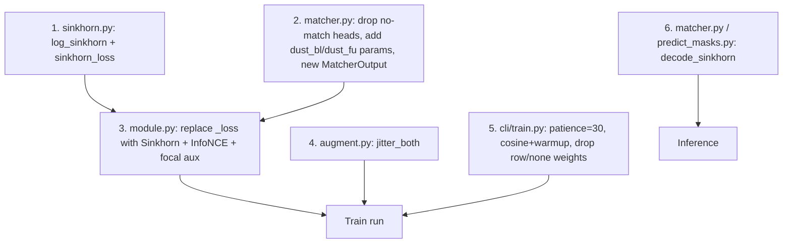

# Dense Matcher Round 3

## Thesis

After round 2, training is geometry-ceiling-limited. AUROC 0.98 + AP 0.83 + row_acc 0.83 = "easy negatives crushed, hard ties unresolved." The bottleneck is the **objective**, not the model:

1. Per-edge BCE + per-row CE never enforce the column constraint -> Hungarian-at-test-time has to mop up inconsistencies the model never saw at train time.
2. No-match prediction is delegated to two free-floating linear heads on node embeddings (overfit, val_none_loss climbs).
3. The descriptor channel only ever sees gradient through the edge head; the representation has no direct contrastive signal.
4. EarlyStopping patience=15 killed the run while val_ap was still rising.

Fix all four by reframing matching as a single SuperGlue-style assignment loss plus a representation contrastive term, then let it train.

## Change Set (single, coherent rewrite of the loss)

### 1. Sinkhorn-with-dustbins loss

New file: [tracking/train/sinkhorn.py](tracking/train/sinkhorn.py) (~60 LOC)

```python
def log_sinkhorn(M: torch.Tensor, iters: int = 20) -> torch.Tensor:
    # M: (n_bl+1, n_fu+1) log-scores; returns log-doubly-stochastic matrix
    u = torch.zeros(M.size(0), device=M.device)
    v = torch.zeros(M.size(1), device=M.device)
    for _ in range(iters):
        u = -torch.logsumexp(M + v[None, :], dim=1)
        v = -torch.logsumexp(M + u[:, None], dim=0)
    return M + u[:, None] + v[None, :]

def sinkhorn_loss(pair_logits, n_bl, n_fu, dust_bl, dust_fu, lab, iters=20):
    # Build (n_bl+1) x (n_fu+1) score matrix; corner = 0
    S = torch.full((n_bl + 1, n_fu + 1), 0.0, device=pair_logits.device)
    S[:n_bl, :n_fu] = pair_logits.reshape(n_bl, n_fu)
    S[:n_bl, n_fu] = dust_bl
    S[n_bl, :n_fu] = dust_fu
    P = log_sinkhorn(S, iters)
    # Targets: per BL the assigned FU or dustbin; per FU the assigned BL or dustbin
    pos = (lab.reshape(n_bl, n_fu) > 0.5)
    bl_tgt = torch.where(pos.any(dim=1), pos.float().argmax(dim=1), torch.full((n_bl,), n_fu, device=S.device))
    fu_tgt = torch.where(pos.any(dim=0), pos.float().argmax(dim=0), torch.full((n_fu,), n_bl, device=S.device))
    bl_term = -P[torch.arange(n_bl, device=S.device), bl_tgt].mean()
    fu_term = -P[fu_tgt, torch.arange(n_fu, device=S.device)].mean()
    return 0.5 * (bl_term + fu_term)
```

- Log-domain stable (no exp overflow); 20 iters is standard from LightGlue, ~free.
- Single learnable dustbin scalar per side via `nn.Parameter` lives on `Matcher` (per item 3); or via small MLP from mean-pool of the side. **Decision: single learnable scalar, broadcasted.** Simpler, fewer params, well-conditioned. Mean-pool MLP is a follow-up if it underperforms.
- Many-to-one merges: each BL row still has a single target column (the merged-into FU). FU's `fu_tgt` is the *first* BL row that maps to it; the others contribute via the BL term. This is the same compromise SuperGlue makes for keypoint dupes and is fine for our merge rate.

### 2. Drop the two free-floating no-match heads

File: [tracking/matcher.py](tracking/matcher.py)

- Remove `self.bl_none`, `self.fu_none` (lines 84-85, 95-96).
- Add `self.dust_bl = nn.Parameter(torch.zeros(()))` and `self.dust_fu = nn.Parameter(torch.zeros(()))`.
- `MatcherOutput` becomes `(pair, dust_bl, dust_fu)`.
- This kills the `val_none_loss` divergence by construction: no-match probability now arises from the assignment matrix, not from a separately-trained head with no inductive bias.

### 3. Symmetric bipartite supervision

File: [tracking/train/module.py](tracking/train/module.py)

The Sinkhorn loss is already symmetric (BL term + FU term). Remove `row_loss`, `row_w`, `none_w`, `pair_w` from hparams; keep one knob: `sinkhorn_w=1.0`, plus the contrastive weight below.

Keep `focal_bce_with_logits` as an **auxiliary calibration term** with small weight `pair_w=0.1`. Without it, the score matrix entries can drift in absolute scale; focal BCE pins them. Disable with `--pair-w 0` for ablation.

### 4. InfoNCE on node embeddings

In `tracking/train/module.py`, add a 64-D linear projection of post-GNN `h_bl`, `h_fu`. For every true positive `(i, j)` in the batch:

```python
sim = (proj_bl @ proj_fu.T) / tau  # (sum n_bl, sum n_fu) across batch
# positives: indices where edge_label==1; negatives: ALL other FU embeddings in the batch
loss = F.cross_entropy(sim[pos_bl_idx], pos_fu_idx)  # symmetric: also FU->BL
```

- `tau = 0.1` fixed (no learning; learning tau is unstable on small batches).
- Cross-patient negatives are the entire point: round 2's contrastive signal was *only* the dense intra-patient negatives. This step multiplies the negative pool by ~batch_size and finally forces the embedding to encode identity, not just position.
- Symmetric (BL->FU and FU->BL averaged).
- Weight: `nce_w=0.3` to start.

### 5. FU centroid jitter (symmetric augmentation)

File: [tracking/data/augment.py](tracking/data/augment.py)

Add an optional FU jitter with smaller sigma (FU centroids come from the actual mask, not propagation; their noise is the mask-quality noise, not PROP_SIGMA). Implement as:

```python
def jitter_both(data, k_intra=8, sigma_bl=PROP_SIGMA, sigma_fu_scale=0.3, rng=None):
    # jitter BL by PROP_SIGMA * sp_fu; jitter FU by 0.3 * PROP_SIGMA * sp_fu (~mask noise)
    # refresh both intra-knns and both cross attrs
```

Replace the current `jitter_bl` call site in [tracking/data/dataset.py](tracking/data/dataset.py) `get()` with `jitter_both`. Toggle FU jitter off via `sigma_fu_scale=0` if it hurts.

### 6. Relax EarlyStopping and tune LR schedule

File: [tracking/cli/train.py](tracking/cli/train.py)

- `EarlyStopping(monitor="val_ap", mode="max", patience=30)` (was 15). Round-2 stopped at epoch 96 with val_ap still rising.
- LR schedule: replace `ReduceLROnPlateau` with **cosine over 200 epochs with 5-epoch linear warmup**. Stable schedule beats plateau-reactive on small data.

```python
def configure_optimizers(self):
    opt = torch.optim.AdamW(self.parameters(), lr=self.hparams.lr, weight_decay=self.hparams.weight_decay)
    warm = torch.optim.lr_scheduler.LinearLR(opt, start_factor=0.1, total_iters=5)
    cos = torch.optim.lr_scheduler.CosineAnnealingLR(opt, T_max=max(1, self.trainer.max_epochs - 5))
    sch = torch.optim.lr_scheduler.SequentialLR(opt, [warm, cos], milestones=[5])
    return {"optimizer": opt, "lr_scheduler": {"scheduler": sch, "interval": "epoch"}}
```

### 7. Inference: use Sinkhorn assignment, retire ad-hoc Hungarian threshold

File: [tracking/matcher.py](tracking/matcher.py) and [tracking/cli/predict_masks.py](tracking/cli/predict_masks.py)

- Add `decode_sinkhorn(P_log, tau=0.2)`: argmax per row over the (n_bl, n_fu+1) submatrix of `exp(P_log)`. If best column is dustbin OR probability < `tau`, declare no-match. Drops the `linear_sum_assignment` + ad-hoc cost matrix in favor of the same decode the loss optimizes.
- Keep `decode_hungarian` only if a script still uses it; otherwise delete to avoid two decoders.

## Order of Execution



No cache rebuild: all changes are model + training + augmentation only. Existing `*_v3.pt` caches reused as-is. Old `MatcherModule` checkpoints **not** compatible (different `MatcherOutput`, different hparams) - retrain from scratch.

## File Touch Summary (all under 200 LOC)

- [tracking/train/sinkhorn.py](tracking/train/sinkhorn.py) NEW ~60 LOC
- [tracking/matcher.py](tracking/matcher.py) 113 -> ~120 (swap heads, add decode_sinkhorn)
- [tracking/train/module.py](tracking/train/module.py) 122 -> ~165 (Sinkhorn loss wiring, InfoNCE, cosine scheduler)
- [tracking/data/augment.py](tracking/data/augment.py) 30 -> ~55 (jitter_both)
- [tracking/data/dataset.py](tracking/data/dataset.py) ~115 (rename call site only)
- [tracking/cli/train.py](tracking/cli/train.py) 129 -> ~130 (patience, hparams)
- [tracking/cli/predict_masks.py](tracking/cli/predict_masks.py) ~68 (swap decoder)

No new folders, no factories. `sinkhorn.py` is a clear concept boundary (loss math separated from Lightning glue), aligns with nanochat-style.

## Interaction Audit (no fix harms another)

- Sinkhorn (1) subsumes per-row CE and the two no-match heads (2, 3). One loss, well-posed, doubly-stochastic - the no-match overfitting cannot recur because dustbin scores are tied to global assignment, not predicted independently.
- InfoNCE (4) operates on a *separate* 64-D projection of node embeddings; gradients flow into the GNN but not into the head, so it cannot interfere with calibration. Cross-patient negatives are the lever distance-baseline does not have.
- Focal BCE (kept at `pair_w=0.1`) only constrains score magnitude; Sinkhorn rescales anyway, so it is a stabilizer not a competitor.
- FU jitter (5) and BL jitter combine to teach pose invariance on both sides without inducing label leakage (descriptors are sampled at fixed `cog_bl` and `cog_fu`, untouched by position jitter).
- Cosine + warmup (6) is monotonic and seed-stable; ReduceLROnPlateau on `val_ap` (which is noisy on small val sets) was probably triggering at the wrong epochs.

## Verification Protocol

1. **Sinkhorn sanity** (unit-test in head): random `M`, `log_sinkhorn(M, 20).exp()` rows and columns sum to ~1.0 (tol 1e-4).
2. **One-batch overfit** (3-5 patients, 100 epochs, augment off): pair AP -> 1.0, row_acc -> 1.0. If not, the loss is wired wrong.
3. **5-epoch smoke** (full train, augment on, all losses on): all loss terms finite; total decreases monotonically on train.
4. **Full run** (200 epochs, patience 30): expect val_ap > 0.92 and val_row_acc > 0.90. Hard target.
5. **Distance-Hungarian baseline script** (separate small CLI, ~40 LOC, if not already implemented from earlier plan): compute val AP using only `-dist` as score; if >= 0.83 we confirm round 2 was tied with baseline.
6. **Ablations** (single flag flips after step 4):
   - InfoNCE off (`--nce-w 0`) — measures the contrastive contribution.
   - Sinkhorn iters = 5 vs 20 — confirms convergence isn't the bottleneck.
   - FU jitter off (`--fu-jitter 0`) — quantifies symmetric augmentation benefit.

## Risks and Rollbacks

- **Sinkhorn iter count too low** -> assignment not converged on graphs with hundreds of nodes (e.g. 496e05e1ae with bl=46, fu=40). Bump to 50 iters; cost is negligible because it's log-domain matmul-free.
- **InfoNCE temperature wrong** -> training collapses (all-positives) or never converges (all-negatives). 0.1 is the canonical CLIP value; if collapse, try 0.07.
- **Many-to-one merges hurt FU term** -> ~5% of positives are merges where multiple BL rows map to the same FU column. FU term picks one BL as target; others go through BL term. If merge-only val_row_acc is low, switch FU target to multinomial (uniform over BLs mapping to that FU).
- **EarlyStopping at patience=30 still too tight on 200 epochs** -> bump to 50 or remove entirely (rely on cosine + best-val ckpt). Cost: one extra full run.
- **Sinkhorn loss has scale ambiguity with focal BCE** -> if focal BCE drives logits to extreme magnitudes and Sinkhorn becomes one-hot too early, drop focal weight to 0.05 or zero. Watch `train_pair_loss`: if it collapses to <0.001 by epoch 5, we're in that regime.

## Out of Scope (deliberately)

- **Replacing L0 descriptor with a learnable 3D CNN.** Right move long-term (the descriptor is pose-fragile), but it's a separate redesign. Round 3 first proves the loss/objective is the bottleneck; then we know whether the descriptor is the next ceiling.
- **Mixup across patients.** InfoNCE already provides cross-patient negative signal more efficiently and without label-noise risk.
- **Set Transformer / pure cross-attention architecture.** TransformerConv with dense bipartite edges is already attention-flavored; refactoring the GNN is premature.
- **Anatomy-conditioned matching head.** Worth doing if per-organ ablation shows uneven gains, not before.
