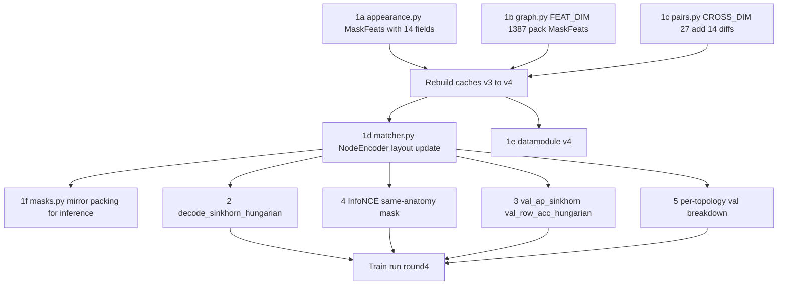

# Dense Matcher Round 4

## Diagnosis

- `val_row_acc` 0.79 -> 0.85 between round 2 and round 3 = real progress on the clinical metric.
- `val_ap` 0.83 -> 0.75 is a metric artifact: [tracking/train/module.py](tracking/train/module.py) computes AP on `sigmoid(out.pair)`, but Sinkhorn optimizes the row/column normalized matrix, not calibrated sigmoids. We are grading the new model with the old metric.
- `train_sinkhorn_loss` still decreasing at epoch 140 with patience 30 EarlyStopping idling — the model has capacity left, but each marginal bit of fitting costs val. **Bottleneck is information per node, not parameters.**

Per-lesion features today (FEAT_DIM=1376):
- `1372-D` L0 descriptor (pose-fragile, single-point sample from a 7x7x7 grid x 4 scales)
- **3 scalars** from `mask_stats`: `log1p(volume)`, `mean_hu`, `sphericity`
- `1` lesion_type integer

That is it. A radiologist tracking lung mets uses ~30 cues from the mask alone. We are starving the GNN.

## Change Set

Five changes, ordered by impact. The first one requires a cache rebuild (v3 -> v4); the rest are model/train/inference only.

### 1. Pose-invariant mask radiomics (THE lever)

File: [tracking/data/appearance.py](tracking/data/appearance.py) — extend `mask_stats` to return a dataclass / tuple with the existing 3 scalars **plus** these 11 (all O(N) over mask voxels, cheap):

```python
@dataclass
class MaskFeats:
    log_volume: float        # existing
    mean_hu: float           # existing
    sphericity: float        # existing
    hu_std: float
    hu_p10: float
    hu_p50: float
    hu_p90: float
    hu_min: float
    hu_max: float
    bbox_dz_mm: float        # bbox extent in mm
    bbox_dy_mm: float
    bbox_dx_mm: float
    pca_l1_mm: float         # principal axes from voxel cov, sqrt(eig) * spacing
    pca_l2_mm: float         # captures elongation/flatness without pose
```

All 14 are rotation-invariant (HU is scalar; PCA eigenvalues are coord-frame independent; bbox extents are sorted descending so they are orientation-invariant too — change to `sorted([dz,dy,dx], reverse=True)`).

File: [tracking/data/graph.py](tracking/data/graph.py)
- `FEAT_DIM`: 1376 -> 1376 + 11 = 1387 (3 existing scalars stay where they are; 11 new ones append after `lesion_type`).
- `_pack` signature stays simple but takes a `MaskFeats` instead of 3 scalars.

File: [tracking/data/pairs.py](tracking/data/pairs.py)
- `cross_attr` adds **differences of the radiomics scalars** (signed, normalized) as cross-edge features. Crucial: this is what gives the GNN per-lesion comparison signal at the cross-edge level.
- `CROSS_DIM`: 13 -> 13 + 14 = 27 (one signed diff per radiomics scalar pair, normalized to ~O(1)).

File: [tracking/matcher.py](tracking/matcher.py)
- `NodeEncoder.inn` updates to `1372 + 14 + cfg.lt_embed` (was `1372 + 3 + cfg.lt_embed`).
- Forward unpacks `desc = x[:, :1372]`, `stats = x[:, 1372:1386]`, `ti = x[:, 1386].long()`.

File: [tracking/data/dataset.py](tracking/data/dataset.py)
- `processed_file_names` -> `{split}_v4.pt`; meta -> `{split}_v4_meta.pt`.

File: [tracking/train/datamodule.py](tracking/train/datamodule.py)
- Reference `_v4.pt` in `prepare_data`.

File: [tracking/data/masks.py](tracking/data/masks.py)
- `build_mask_graph` (inference graph) uses the same enriched packing.

### 2. Hungarian decode at inference (free win, no retrain)

File: [tracking/matcher.py](tracking/matcher.py)

Add a one-shot post-processor on top of `decode_sinkhorn`:

```python
def decode_sinkhorn_hungarian(pair_log, dust_bl, dust_fu, n_bl, n_fu, iters=20, tau=0.2) -> np.ndarray:
    S = ...  # same as decode_sinkhorn
    P = log_sinkhorn(S, iters).exp().cpu().numpy()
    cost = -np.log(np.clip(P[:n_bl, :n_fu + 1], 1e-12, 1.0))  # rows = BL, cols = FU + dustbin
    # rectangular Hungarian: scipy.optimize.linear_sum_assignment handles non-square
    ri, ci = linear_sum_assignment(cost)
    out = np.full(n_bl, -1, dtype=np.int64)
    for r, c in zip(ri, ci):
        if c < n_fu and float(P[r, c] / P[r].sum()) >= tau:
            out[r] = int(c)
    return out
```

Use this in [tracking/cli/predict.py](tracking/cli/predict.py), [tracking/cli/predict_masks.py](tracking/cli/predict_masks.py), and in **validation_step** of [tracking/train/module.py](tracking/train/module.py) for `val_row_acc`. Sinkhorn gives the score; Hungarian enforces the one-to-one structure the loss approximates. Free correctness improvement on contested rows (where row argmax conflicts with column argmax).

### 3. Honest metrics (replace the misleading val_ap)

File: [tracking/train/module.py](tracking/train/module.py)

The current `self.ap` uses `sigmoid(out.pair)` — that surface no longer means "per-edge probability of match" under Sinkhorn. Replace with **two** metrics, neither dropped:

- `val_ap_sinkhorn`: AP over the *Sinkhorn-row-normalized* P[i, j] vs `edge_label` (post `log_sinkhorn` from `_loss`).
- `val_row_acc_hungarian`: row accuracy using `decode_sinkhorn_hungarian` (item 2), since this is what production will use.

Drop the raw-sigmoid AP. EarlyStopping/ModelCheckpoint monitor `val_row_acc_hungarian` (the clinical metric). File: [tracking/cli/train.py](tracking/cli/train.py).

### 4. Same-anatomy hard negatives in InfoNCE

File: [tracking/train/module.py](tracking/train/module.py) `infonce_batch`

Right now negatives are *all other FU nodes in the batch*. ~90% are different organs and trivially separated; the descriptor never gets pressure on the hard cases. Replace with:

```python
# build per-row negative mask: only attend to FU of the SAME lesion_type
lt_bl = batch["bl"].x[:, 1386].long()  # post-v4 layout
lt_fu = batch["fu"].x[:, 1386].long()
same_anatomy = (lt_bl[:, None] == lt_fu[None, :])  # (sum n_bl, sum n_fu)
# loss: mask out cross-anatomy entries with -inf BEFORE softmax
sim = sim.masked_fill(~same_anatomy, float("-inf"))
# guarantee at least one positive per BL anchor (positive is already same anatomy)
```

This forces the projection to discriminate two lung mets from each other, which is exactly the 15% the model is currently missing. Mathematically: it concentrates the contrastive signal on the part of the negative distribution where it matters.

If a BL row's anchor anatomy has no other FU in the batch, fall back to all-FU negatives for that row (so loss stays defined on small batches).

### 5. Per-topology breakdown of val_row_acc

File: [tracking/train/module.py](tracking/train/module.py)

Three numbers, logged each val epoch:
- `val_acc_unchanged_split` (BL with at least one positive cross edge, predicted FU correct)
- `val_acc_disappeared` (BL with `no_match_label==1`, predicted dustbin)
- `val_acc_newly_appearing` (FU with `no_match_label==1`, no BL claimed it via the Hungarian)

This is the clinically relevant breakdown and tells us *where* the 15% failure mass lives. Without it we are debugging blind.

## Order of execution



Two operator steps:
1. `python tracking/cli/preprocess.py --split {train,val,test}` (rebuild to v4, ~same time as v3).
2. `PYTHONPATH=. python tracking/cli/train.py --wandb-run-name round4`.

## File touch summary (all under 200 LOC)

- [tracking/data/appearance.py](tracking/data/appearance.py) 52 -> ~120 (mask_stats now returns MaskFeats; 11 new scalar computations)
- [tracking/data/graph.py](tracking/data/graph.py) 158 -> ~165 (FEAT_DIM + _pack uses dataclass)
- [tracking/data/pairs.py](tracking/data/pairs.py) 59 -> ~95 (CROSS_DIM=27, 14 signed diffs)
- [tracking/matcher.py](tracking/matcher.py) 125 -> ~135 (encoder indices + decode_sinkhorn_hungarian)
- [tracking/train/module.py](tracking/train/module.py) 151 -> ~190 (same-anatomy NCE mask, Hungarian val metric, per-topology accs)
- [tracking/data/dataset.py](tracking/data/dataset.py) ~115 (v4 filename)
- [tracking/data/masks.py](tracking/data/masks.py) ~107 (mirror enriched packing)
- [tracking/train/datamodule.py](tracking/train/datamodule.py) ~65 (v4 filename)
- [tracking/cli/train.py](tracking/cli/train.py) ~135 (monitor val_row_acc_hungarian)
- [tracking/cli/predict.py](tracking/cli/predict.py) / [tracking/cli/predict_masks.py](tracking/cli/predict_masks.py) (swap decoder)

No new files. No new folders. `appearance.py` carries the dataclass next to where the features are computed (concept locality, nanochat-style).

## Interaction audit (no fix harms another)

- Radiomics (1) is purely additive information; the GNN already accepts arbitrary `FEAT_DIM`. Old v3 caches are abandoned (per the nanochat R12 no-fallbacks rule and the round-1 plan).
- Hungarian decode (2) does not change the training loss; Sinkhorn is exactly the relaxation Hungarian solves discretely. They are designed to be combined.
- Honest metrics (3) only change what is *logged* and what EarlyStopping watches. The schedule already uses cosine over `max_epochs`, so changing the monitor is safe.
- Same-anatomy hard negatives (4) reduce the negative pool size per anchor; if it makes the loss too easy on small batches we fall back to full-batch negatives for that row (guard in code).
- Per-topology metrics (5) are pure observation.

## Verification protocol

1. **Cache sanity**: open one v4 graph and assert `data["bl"].x.shape[1] == 1387`, `data["bl","cross","fu"].edge_attr.shape[1] == 27`, all 14 radiomics scalars finite.
2. **Radiomics ablation**: train two runs — `--use-radiomics 0` (zero out the new node + edge features at runtime) vs default. Delta on `val_row_acc_hungarian` quantifies the lever.
3. **Hungarian-only ablation**: load round-3 checkpoint, run val with `decode_sinkhorn` and `decode_sinkhorn_hungarian`. Delta isolates the free inference win.
4. **Smoke (5 epochs)**: all losses finite, `val_ap_sinkhorn` > 0.85 by epoch 5 (Sinkhorn is well-conditioned on v4).
5. **Full run (200 epochs)**: target `val_row_acc_hungarian` >= 0.90 and the per-topology breakdown surfaces the residual error mode.
6. **Distance baseline**: rerun [tracking/cli/baseline_distance.py](tracking/cli/baseline_distance.py) on v4 caches (radiomics features are not used; distance only). Confirms baseline is unchanged.

## Risks and rollbacks

- **PCA on tiny lesions (n_voxels < 5)** is degenerate -> guard: if `n_voxels < 5`, write zeros for `pca_l1_mm` and `pca_l2_mm`. Volume already handles the floor case.
- **Surface-area cost** (already computed for sphericity): no extra pass needed.
- **CROSS_DIM 13 -> 27** doubles cross-edge memory; on largest graph (`496e05e1ae`: 1840 edges) this is 1840*27*4 = ~190 KB, negligible.
- **Same-anatomy negatives collapse** when batch has only one anatomy type -> the per-row fallback to all-FU negatives prevents nans.
- **Hungarian decode latency** on largest graph: rectangular `linear_sum_assignment` on 46x41 is microseconds; not a bottleneck.
- **Old `*_v3.pt` caches and round-3 checkpoints stop loading.** Rollback = `git revert` + delete `*_v4.pt`.

## Deferred to round 5 (deliberately)

- **LightGlue-style alternating self/cross-attention with confidence-based early exit.** Genuine architecture change. Only worth it once we know if features (round 4) close the gap.
- **Learned 3D CNN appearance encoder (replace L0 descriptor).** The biggest possible lever but a real research project — separate codebase change, separate compute budget.
- **Cross-patient mixup or graph-level augment.** InfoNCE with same-anatomy hard negatives subsumes most of this in practice.
- **Anatomy-conditioned matching head** (per-organ pair-MLP). Only justify if the per-topology breakdown shows uneven per-anatomy accuracy.
