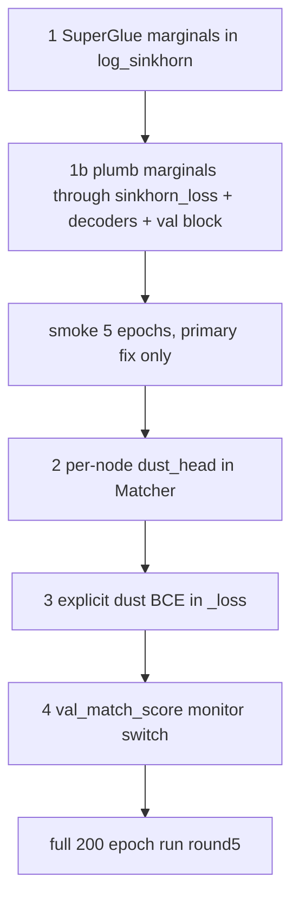

# Dense Matcher Round 5

## Diagnosis (from Round 4 W&B)

- `val_row_acc_hungarian` ≈ 0.96 — Round 4 features + Hungarian decisively worked.
- `val_acc_unchanged_split` ≈ 0.95 — strong.
- `val_acc_disappeared` collapsed 0.88 → ~0.05 with growing variance. **Failure mode.**
- `val_acc_newly_appearing` degraded 1.0 → ~0.4. Same family of failure.
- `val_ap_sinkhorn` plateaued at 0.85. Modest gain; consistent with mass being mis-allocated.

The aggregate row accuracy hides this because most BLs have a true match.

## Root cause

[tracking/train/sinkhorn.py](tracking/train/sinkhorn.py) uses **uniform marginals** on the augmented `(n_bl+1) x (n_fu+1)` matrix:

```13:14:tracking/train/sinkhorn.py
    log_a = torch.full((r,), -math.log(r), device=M.device, dtype=M.dtype)
    log_b = torch.full((c,), -math.log(c), device=M.device, dtype=M.dtype)
```

Consequences:

- Dustbin column total mass = `1/(n_fu+1)`.
- Each real row only owns `1/(n_bl+1)` of mass.
- Maximum BLs that can co-vote dustbin: `(n_bl+1)/(n_fu+1)` ≈ 1 for square graphs.

So the Sinkhorn relaxation **cannot represent more than ~1 disappeared lesion per graph**, no matter what the logits say. SuperGlue (Sarlin 2020) explicitly uses non-uniform marginals where the dustbin row has mass `n_fu` and dustbin column has mass `n_bl`; this is exactly the missing piece.

Compounding factors in [tracking/matcher.py](tracking/matcher.py):

- `self.dust_bl = nn.Parameter(torch.zeros(()))` and same for `dust_fu` are **single shared scalars** — one global "match-propensity" knob for an inherently per-node question.
- `sinkhorn_loss` supervises dustbin only through marginal flow, never directly with `no_match_label`.

## Change set (ordered by leverage)

### 1. SuperGlue marginals in Sinkhorn (THE lever)

File: [tracking/train/sinkhorn.py](tracking/train/sinkhorn.py)

```python
def superglue_marginals(n_bl: int, n_fu: int, device, dtype):
    norm = math.log(n_bl + n_fu)
    log_a = torch.zeros(n_bl + 1, device=device, dtype=dtype)
    log_a[n_bl] = math.log(n_fu)
    log_b = torch.zeros(n_fu + 1, device=device, dtype=dtype)
    log_b[n_fu] = math.log(n_bl)
    return log_a - norm, log_b - norm


def log_sinkhorn(M, iters=20, log_a=None, log_b=None):
    r, c = M.shape
    if log_a is None:
        log_a = torch.full((r,), -math.log(r), device=M.device, dtype=M.dtype)
        log_b = torch.full((c,), -math.log(c), device=M.device, dtype=M.dtype)
    u = torch.zeros(r, device=M.device, dtype=M.dtype)
    v = torch.zeros(c, device=M.device, dtype=M.dtype)
    for _ in range(iters):
        u = log_a - torch.logsumexp(M + v.unsqueeze(0), dim=1)
        v = log_b - torch.logsumexp(M + u.unsqueeze(1), dim=0)
    return M + u.unsqueeze(1) + v.unsqueeze(0)
```

Every call site that builds an augmented `(n_bl+1) x (n_fu+1)` matrix must pass SuperGlue marginals: `sinkhorn_loss`, `MatcherModule.validation_step` (val_ap_sinkhorn block), `decode_sinkhorn`, `decode_sinkhorn_hungarian`.

### 2. Per-node dustbin head

File: [tracking/matcher.py](tracking/matcher.py)

```python
class Matcher(nn.Module):
    def __init__(self, cfg):
        ...
        # was: self.dust_bl = nn.Parameter(torch.zeros(()))
        #      self.dust_fu = nn.Parameter(torch.zeros(()))
        self.dust_head = nn.Linear(cfg.d, 1)  # shared across BL/FU

    def forward(self, data):
        ...
        dust_bl = self.dust_head(z["bl"]).squeeze(-1)  # (n_bl,)
        dust_fu = self.dust_head(z["fu"]).squeeze(-1)  # (n_fu,)
        return MatcherOutput(self.head(h).squeeze(-1), dust_bl, dust_fu, z["bl"], z["fu"])
```

`sinkhorn_loss`, `decode_sinkhorn`, `decode_sinkhorn_hungarian` already index `S[:n_bl, n_fu] = dust_bl` — tensor assignment from shape `(n_bl,)` is correct. Just remove the implicit scalar broadcast.

The shared head is deliberate: "do I look unmatchable?" is a property of a node, not of which side it came from. Saves params, regularizes.

### 3. Explicit BCE supervision on dustbin

File: [tracking/train/module.py](tracking/train/module.py) `_loss`

```python
dust_bl_logit = out.dust_bl  # shape (sum_n_bl,)
dust_fu_logit = out.dust_fu
no_bl = batch["bl"].no_match_label
no_fu = batch["fu"].no_match_label
dust_bce = 0.5 * (
    F.binary_cross_entropy_with_logits(dust_bl_logit, no_bl, pos_weight=self.dust_pos_w)
    + F.binary_cross_entropy_with_logits(dust_fu_logit, no_fu, pos_weight=self.dust_pos_w)
)
total = (self.hparams.sinkhorn_w * sk_loss
         + self.hparams.pair_w * pair_focal
         + self.hparams.nce_w * nce
         + self.hparams.dust_w * dust_bce)
```

New hparams: `dust_w=0.3`, `dust_pos_w=5.0` (rough class-imbalance ratio; tighten by computing from cache_meta if convenient).

### 4. Honest monitor (small but important)

[tracking/cli/train.py](tracking/cli/train.py) currently monitors `val_row_acc_hungarian`, which is dominated by `unchanged_split`. Switch to a clinical composite:

```python
# log this in on_validation_epoch_end:
val_match_score = (0.5 * val_acc_unchanged_split
                   + 0.25 * val_acc_disappeared
                   + 0.25 * val_acc_newly_appearing)
self.log("val_match_score", val_match_score, prog_bar=True)
```

`ModelCheckpoint` and `EarlyStopping` monitor `val_match_score`.

## File touch summary

- [tracking/train/sinkhorn.py](tracking/train/sinkhorn.py): add `superglue_marginals`, plumb through `log_sinkhorn`, update `sinkhorn_loss` (~30 LOC).
- [tracking/matcher.py](tracking/matcher.py): swap two scalar params for `self.dust_head`; update three callers of `log_sinkhorn` (decoders + matcher) to pass marginals (~15 LOC delta).
- [tracking/train/module.py](tracking/train/module.py): dust BCE in `_loss`, `val_match_score` computation in `on_validation_epoch_end` (~25 LOC delta).
- [tracking/train/sinkhorn.py](tracking/train/sinkhorn.py) callers in `validation_step` need to pass `log_a, log_b` from `superglue_marginals` too.
- [tracking/cli/train.py](tracking/cli/train.py): monitor switches to `val_match_score` (2 lines).

**No cache rebuild** — feature dims unchanged. v4 caches stay valid. Round 4 checkpoint will not load (dustbin params changed shape); retrain from scratch.

## Order of execution



## Verification

1. **Marginal-only smoke (5 epochs)**: confirm `val_acc_disappeared > 0.6` at epoch 5 (today: collapses by epoch 50). If this alone fixes it, the per-node head is bonus.
2. **Full Round 5 smoke (5 epochs)**: `val_match_score > 0.7`, all losses finite, dust_bce decreasing.
3. **200-epoch run**: target `val_acc_disappeared ≥ 0.85`, `val_acc_newly_appearing ≥ 0.85`, `val_row_acc_hungarian` holds at ≥ 0.95, `val_match_score ≥ 0.92`.
4. **Ablation**: load best round-5 checkpoint; rerun val with `dust_w=0` re-applied at inference — quantifies marginal-vs-supervision split.
5. **Inference sanity**: load checkpoint, run `tracking/cli/predict.py` on one val patient, confirm at least one BL gets `decoded=0` (dustbin) when the truth has a disappeared lesion.

## Risks & rollback

- **Marginal fix changes loss scale.** SuperGlue marginals concentrate mass differently; the existing `lr=1e-4` should still be fine but watch first epoch's `sinkhorn_loss` for blow-up — if so, halve LR.
- **Per-node dustbin could over-explain.** Mitigated by 128 → 1 small head and weight decay 1e-2 already in optimizer.
- **Conflicting gradients between Sinkhorn-marginal pressure and explicit BCE.** Start `dust_w=0.3`; if `train_sinkhorn_loss` stops decreasing, drop to 0.1.
- **Hungarian decode unchanged** — still uses `decode_sinkhorn_hungarian` with the now-correct P. tau may need slight retune (try 0.15, 0.2, 0.25 on val).
- **Rollback**: `git revert`; old v4 caches stay valid since FEAT_DIM/CROSS_DIM unchanged.

## Deferred to round 6 (deliberately)

- Anatomy-conditioned matching head (only if per-anatomy breakdown of `val_acc_disappeared` shows uneven failure).
- LightGlue-style alternating attention with confidence early-exit.
- 3D CNN appearance encoder.
- Cross-patient mixup.
