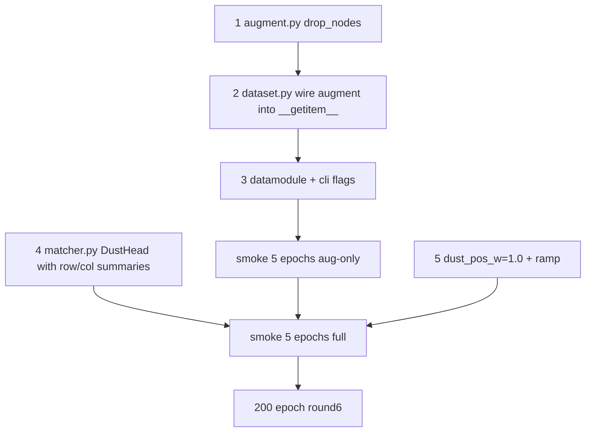

# Dense Matcher Round 6

## Diagnosis (from Round 5 W&B)

- **Matching half is solved.** `val_row_acc_hungarian` ~0.95, `val_acc_unchanged_split` ~0.95, `val_ap_sinkhorn` ~0.85, `val_auroc` ~0.97. All training/val losses healthy.
- **Dustbin half still leaks.** `val_acc_disappeared` decays 1.0 → ~0.4 with growing variance during training; `val_acc_newly_appearing` 1.0 → ~0.6. `val_match_score` plateaus at ~0.85 (plan target 0.92).
- **Smoking gun.** `val_dust_bce` *rises* from ~1.0 to ~3.0 while `train_dust_bce` *falls* from ~1.5 to ~0.1 — ~30x train/val gap on the same loss. The dustbin head is the only thing overfitting.

The Sinkhorn marginals fix (Round 5) was structurally correct: the matching mass budget is right. The new bottleneck is **the dustbin classifier**.

## Root cause (three reinforcing factors)

1. **Rare positives.** With ~224 train graphs and ~10–15% disappeared/newly-appearing rows, only a few hundred positive examples exist for either class. Linear-on-d=128 over that signal memorizes.
2. **`dust_pos_w=5.0` amplifies exactly the rare class.** This makes the gradient prefer memorizing the few positives over learning a generalizing rule.
3. **Structural mismatch.** "BL i has no match" is a *relational* property — it is true iff no FU j is a good partner for i. But [tracking/matcher.py](tracking/matcher.py) currently computes `dust_bl[i] = dust_head(z_bl[i])` — a single-node function. Even though `z_bl[i]` is cross-attended via the GNN, the head never directly sees the pair logits. So at train time it latches onto patient-specific intrinsic features ("this organ at this size was unmatchable"); at val those don't transfer.

## Change set (ordered by leverage)

### 1. Synthetic disappeared/newly-appearing via node-drop augmentation (THE lever)

File: [tracking/data/augment.py](tracking/data/augment.py)

For each training graph, with probability `p_drop_fu` per row (default 0.1), drop one randomly chosen FU node. Any BL that had its sole positive cross-edge to that FU becomes a real synthetic DISAPPEARED case: flip its `no_match_label` 0 → 1 and zero its positive `edge_label`. Symmetric `p_drop_bl`. Then rebuild the cross_attr (pair index needs to shrink) and intra kNN. Critically: graph dims change per sample, so this must be done in `__getitem__`, post-cache.

```python
def drop_nodes(data, p_drop_fu=0.1, p_drop_bl=0.1, rng=None):
    rng = rng or np.random.default_rng()
    n_bl, n_fu = data["bl"].x.size(0), data["fu"].x.size(0)
    keep_fu = rng.random(n_fu) >= p_drop_fu
    keep_bl = rng.random(n_bl) >= p_drop_bl
    if not keep_fu.any(): keep_fu[rng.integers(n_fu)] = True
    if not keep_bl.any(): keep_bl[rng.integers(n_bl)] = True
    # ... slice x/pos/lesion_id/no_match_label per side, recompute cross-edge index,
    # cross_attr, reverse_cross_attr, edge_label, intra kNN, and flip
    # no_match_label for BL rows whose only positive FU was dropped (and vice versa).
```

Call from `LesionDataset.get` when `augment=True`, after `jitter_both`.

This generates **infinite synthetic positives with realistic features** — every UNCHANGED BL whose matched FU we drop becomes a DISAPPEARED example. Multiplies the supervision for the failing metric by ~10x per epoch.

Order constraints (locality):
- Drop nodes first, then jitter (positions live only for surviving nodes).
- After both, rebuild cross_attr / intra kNN once.

### 2. Cross-aware dustbin head

File: [tracking/matcher.py](tracking/matcher.py)

Currently:

```87:88:tracking/matcher.py
        self.dust_head = nn.Linear(cfg.d, 1)
```

Replace with a head that conditions on the actual matching evidence. For BL i, summarize its row of the pair-logit matrix (max, mean, top-2 gap) and concatenate with `z_bl[i]`:

```python
class DustHead(nn.Module):
    def __init__(self, d, drop=0.5):
        super().__init__()
        self.net = nn.Sequential(
            nn.Linear(d + 3, d // 2), nn.ReLU(inplace=True),
            nn.Dropout(drop), nn.Linear(d // 2, 1),
        )
    def forward(self, z, pair_row_summary):
        return self.net(torch.cat([z, pair_row_summary], dim=1)).squeeze(-1)
```

Where `pair_row_summary` for BL i is `[max_j pair[i,j], mean_j pair[i,j], max_j - top2_j]` over the j that belong to the same graph. Symmetric for FU (col summaries). Compute it from `out.pair` after the head produces `out.pair`. This makes "no match" a function of the actual landscape of competing partners, not just intrinsic node features.

Heavy dropout (0.5) specifically on this head — small layer, high reg.

### 3. Drop `dust_pos_w` to 1.0

File: [tracking/cli/train.py](tracking/cli/train.py), [tracking/train/module.py](tracking/train/module.py)

`dust_pos_w=5.0` is amplifying the loss on the very class we are overfitting. Setting to 1.0 (default unweighted BCE) reduces gradient pressure to memorize rare positives. After augmentation (item 1), positives are no longer rare in the train batch, so re-weighting isn't needed anyway.

### 4. Schedule the dust loss weight

File: [tracking/train/module.py](tracking/train/module.py)

To avoid the dust head dominating early when its inputs (`out.pair`) are noise, ramp `dust_w` from 0.0 → 0.3 linearly over the first 20 epochs:

```python
dust_w = self.hparams.dust_w * min(1.0, self.current_epoch / 20)
```

Small change, prevents early instability with the new cross-aware head.

## File touch summary

- [tracking/data/augment.py](tracking/data/augment.py): add `drop_nodes` (~50 LOC).
- [tracking/data/dataset.py](tracking/data/dataset.py): call `drop_nodes` in `get` before `jitter_both`; new ctor args `p_drop_fu`, `p_drop_bl` (~6 LOC).
- [tracking/train/datamodule.py](tracking/train/datamodule.py): pass `p_drop_*` through (~4 LOC).
- [tracking/matcher.py](tracking/matcher.py): `DustHead` module; `Matcher.forward` computes pair-row/col summaries from `out.pair` and passes them to the head (~25 LOC delta).
- [tracking/train/module.py](tracking/train/module.py): epoch-ramped `dust_w` (~5 LOC delta).
- [tracking/cli/train.py](tracking/cli/train.py): `--p-drop-fu`, `--p-drop-bl` flags; default `dust_pos_w` to 1.0 (~6 LOC).

**No cache rebuild** — feature dims unchanged. v4 caches stay valid. Round 5 checkpoint won't load (DustHead shape changed); retrain from scratch.

## Order of execution



## Verification

1. **Augmentation-only smoke (5 epochs)**: with default Round 5 model (per-node dust head as-is) plus the new node-drop aug, expect `val_acc_disappeared > 0.65` at epoch 5 and `val_dust_bce` flat (not rising). This isolates the data lever.
2. **Full Round 6 smoke (5 epochs)**: `val_match_score > 0.75`, `val_dust_bce` strictly decreasing or flat, all losses finite.
3. **200-epoch run**: target `val_acc_disappeared ≥ 0.85`, `val_acc_newly_appearing ≥ 0.85`, `val_row_acc_hungarian` holds at ≥ 0.95, `val_match_score ≥ 0.92`.
4. **Augmentation ablation**: train two runs differing only in `--p-drop-fu`/`--p-drop-bl` (0.0 vs 0.1). Delta on `val_acc_disappeared` quantifies the lever.
5. **Cross-aware head ablation**: train with `DustHead` accepting only `z` (no summary). Delta isolates the structural fix.
6. **Inference sanity**: rerun the existing predict path on a val patient with disappeared lesions; check dustbin precision is up vs Round 5.

## Risks & rollback

- **Augmentation distribution drift.** Dropping too many nodes (high `p_drop`) creates degenerate graphs (e.g. n_fu=0). Mitigated by per-row prob and the "keep at least one" guard. Start at 0.1 each side.
- **`drop_nodes` correctness on edge_label.** When a FU is dropped, the positive flag for the matched BL must be moved to its no_match_label, *not* silently lost. Asserts in tests.
- **Cross-aware head + Sinkhorn = self-referential loop.** The dust score now depends on `pair`, and Sinkhorn's output depends on dust. There's no actual loop since we compute dust from `pair` once, *before* the Sinkhorn iterations. But verify gradients still flow through pair-summary path.
- **Pair-summary is a leakage shortcut at train time.** When labels are explicit, the model could learn "if my max pair logit is low, predict dust." This is exactly the behaviour we *want* — it's the structurally correct inductive bias. The augmentation prevents memorization of which patient-specific lesions are dustbin.
- **Schedule `dust_w` ramp interacts with cosine LR**. Both anneal, but in opposite phases. Fine because the ramp is only the first 20 epochs (well before cosine peak).
- **Rollback**: `git revert`; v4 caches stay valid.

## Deferred to round 7

- LightGlue-style alternating self/cross-attention with confidence-based early exit.
- 3D CNN appearance encoder.
- Cross-patient mixup (synthetic patients made by stitching FU sets across patients).
- Anatomy-conditioned matching head.
