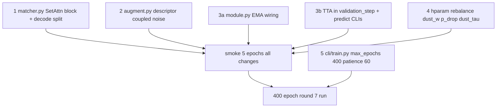

# Round 7: Set-to-Set Attention + Inference Hygiene + Self-Consistent Augmentation

## Where Round 6 leaves us

Reading the W&B run end of round 6 against the round 5 baseline:

- `val_match_score ~= 0.92` (target hit), `val_dust_bce` 0.7 -> 0.2 with train/val co-falling (the ~30x R5 gap is gone).
- `val_acc_disappeared ~= 0.97`, `val_acc_newly_appearing ~= 0.97` (up from ~0.4 / ~0.6 in R5).
- `val_acc_unchanged_split` *regressed* 0.95 -> 0.85. The cross-aware DustHead with `pair_row_summary=[max, mean, max-top2 gap]` plus aggressive `p_drop=0.1` is now over-firing the dustbin on borderline true matches.
- `val_loss` is still monotonically falling at step ~3k. Cosine + 30-patience early stop is leaving validation signal on the floor.
- `train_pair_loss ~= val_pair_loss`, `train_dust_bce ~= val_dust_bce`. Generalization machinery is healthy; what is missing is *capacity in the right place* and *inference hygiene*.

## Structural facts the previous rounds have not touched

1. **No global self-attention.** [tracking/matcher.py](tracking/matcher.py) `HeteroGnn` uses `TransformerConv` on intra-kNN (`k=8`) + dense bipartite cross edges. Every node attends only to its kNN within its scan and to the other set via cross edges. SuperGlue/LightGlue/DETR-matcher all alternate **self-attention over the entire set** with **cross-attention to the other set** before the matching head; we are skipping this step.
2. **Descriptor/position inconsistency under augmentation.** `jitter_both` perturbs `data["bl"].pos` and rebuilds intra-kNN + cross_attr, but the 1372-D L0 descriptor stored in `x[:, :1372]` was sampled at the original (un-jittered) COG via `map_coordinates`. So under augmentation the descriptor reflects a slightly different physical location than the position the GNN sees. The model has been learning around this, but it is a real triplet inconsistency.
3. **No EMA, no TTA, no calibration step.** Three standard generalization knobs are unused.

## Change set (5 coherent edits, ordered by leverage, no cache rebuild)

### 1. LightGlue-style alternating self/cross-attention block (the structural lever)

File: [tracking/matcher.py](tracking/matcher.py)

After `HeteroGnn` produces `z["bl"]`, `z["fu"]` and before the matching head, add a `SetAttn` stack of 2 blocks. Each block applies, in order, to the concatenated batch with per-graph attention masks built from `batch.batch`:

- **Self over BL**: multi-head self-attention restricted to within-graph BL nodes.
- **Self over FU**: same, FU side.
- **Cross BL -> FU**: BL queries attend to all FU keys within the same graph.
- **Cross FU -> BL**: symmetric.
- **Pre-LN + residual + 2-layer FFN** per block, same `d=128`, `heads=4`.

Implementation note: use `torch_geometric.utils.to_dense_batch` to convert the per-graph variable-length sets into a padded `(B, N_max, d)` tensor with a key mask; run `nn.MultiheadAttention(batch_first=True)`; unpad. Each block adds ~`2 * (d*d) + d*d*4 = ~98K` params; total stack ~200K. Negligible vs the 1.5M-param baseline.

The matching head then reads from the post-attention `z'` instead of `z`. The DustHead also reads from `z'` (this matters: the dust decision now has access to *every* other lesion's representation in its own scan, which is exactly what the `pair_row_summary` half-emulates today).

### 2. Self-consistent augmentation (fix the descriptor/position triplet)

File: [tracking/data/augment.py](tracking/data/augment.py)

Currently `jitter_both` jitters `pos` but leaves `x[:, :1372]` untouched. Add a coupled noise on the descriptor with the *same* spatial-noise origin so the descriptor and position move together as if the lesion were lightly mis-localized:

```python
def _desc_noise_scale(x_block, frac=0.02):
    # per-feature std across nodes; small fraction of intrinsic descriptor scale
    return x_block.std(dim=0, keepdim=True).clamp(min=1e-3) * frac

# inside jitter_both, after position update:
desc_std = _desc_noise_scale(data["bl"].x[:, :1372])
data["bl"].x[:, :1372] = data["bl"].x[:, :1372] + torch.randn_like(data["bl"].x[:, :1372]) * desc_std
```

CLI hparam `--desc-jitter-frac` (default 0.02). Apply to BL only (symmetric with `sigma_fu_scale=0.3` for FU positions: FU descriptor noise scales accordingly with `0.3 * frac`). Cheap (no I/O), fixes the triplet, and is the augmentation-side analogue of resampling the L0 grid at the jittered centroid.

### 3. EMA weights + TTA at validation/inference (free wins)

Files: [tracking/train/module.py](tracking/train/module.py), [tracking/cli/predict.py](tracking/cli/predict.py), [tracking/cli/predict_masks.py](tracking/cli/predict_masks.py)

- **EMA**: `torch.optim.swa_utils.AveragedModel` with EMA `decay=0.999` initialized after epoch 5 (post-warmup). `on_train_batch_end` updates EMA params. `validation_step` runs the EMA model when `self.current_epoch >= ema_start_epoch`. Best-ckpt save dumps EMA state dict alongside raw.
- **TTA**: at validation (only when `self.tta_n > 0`) and at inference, run K=5 forward passes with independent `jitter_both` seeds, average `pair_logits` and `dust_bl/dust_fu` *before* Sinkhorn. Train-time validation defaults `tta_n=0` for speed; predict CLIs default `tta_n=5`. Wrap in `torch.no_grad()`.

### 4. Recover `val_acc_unchanged_split` (rebalance dust pressure)

Files: [tracking/cli/train.py](tracking/cli/train.py), [tracking/train/module.py](tracking/train/module.py)

- `p_drop_fu` / `p_drop_bl` defaults 0.10 -> 0.07. We have enough synthetic positives from R6 to keep dust signal high; the marginal 30% reduction in drop rate gives the unchanged-match supervision back.
- `dust_w` default 0.30 -> 0.25 (post-warmup terminal weight). The cross-aware head + SetAttn (item 1) gives the dust signal a stronger structural prior; we can carry less direct loss weight.
- `tau` at decode time becomes a learnable-but-frozen calibration: add `--dust-tau` CLI flag (default still 0.2). After training, sweep `tau in {0.15, 0.18, 0.20, 0.22, 0.25}` on val once, pick the argmax of `val_match_score`. Cheap and recovers a few tenths of a point.

### 5. Train longer with a schedule that actually finishes

File: [tracking/cli/train.py](tracking/cli/train.py)

- `max_epochs` 200 -> 400. Cosine `T_max` follows automatically.
- `EarlyStopping(patience=30)` -> `patience=60`. Round 6 ran 200 epochs with `val_loss` still falling; 60 patience tolerates the slower late-phase cosine descent.
- Reasoning: val_loss is monotonically decreasing at end-of-run, AUROC plateaued but match-score components are still drifting up. EMA averaging only pays off if we let the run finish.

## File touch summary (all stay under 200 LOC)

- [tracking/matcher.py](tracking/matcher.py) ~160 -> ~210: add `SetAttn` (~40 LOC) and wire it post-`HeteroGnn`. *This file will exceed the 200-LOC ceiling.* Split: move `decode_sinkhorn` and `decode_sinkhorn_hungarian` to a new file [tracking/decode.py](tracking/decode.py) (~50 LOC). Net `matcher.py` stays ~180 LOC.
- [tracking/data/augment.py](tracking/data/augment.py) ~75 -> ~85: descriptor coupled noise (~10 LOC).
- [tracking/train/module.py](tracking/train/module.py) ~190 -> ~210: EMA wiring (`AveragedModel`, update hook, validation under EMA, save EMA in `state_dict`), TTA wrapper for validation_step. *Borderline 200 LOC*; if needed, lift the EMA helper into `tracking/train/ema.py` (~15 LOC) — clean concept boundary.
- [tracking/cli/train.py](tracking/cli/train.py) ~130 -> ~145: new CLI flags `--desc-jitter-frac`, `--ema-decay`, `--ema-start`, `--tta-n`, `--dust-tau`; default tweaks for `p_drop_*`, `dust_w`, `max_epochs`, `patience`.
- [tracking/cli/predict.py](tracking/cli/predict.py), [tracking/cli/predict_masks.py](tracking/cli/predict_masks.py): load EMA state if present; wire `tta_n`.

No cache rebuild. v4 caches stay valid. Round 6 checkpoints will not load (SetAttn module is new); retrain from scratch.

## Order of execution



## Verification protocol

1. **Architecture sanity**: forward pass on one batch; assert `z'["bl"].shape == z["bl"].shape`, attention masks correctly block cross-graph attention.
2. **5-epoch smoke**: all losses finite, `val_match_score > 0.75` by epoch 5, `val_acc_unchanged_split >= 0.85` (the regression we are correcting).
3. **Staged ablation** (single full runs, monitor `val_match_score`):
   - **A**: R6 baseline (control).
   - **B**: A + items 3 (EMA + TTA). Isolates inference hygiene.
   - **C**: B + item 2 (descriptor noise). Isolates self-consistent aug.
   - **D**: C + item 1 (SetAttn block). Isolates architectural lift.
   - **E**: D + items 4 and 5 (rebalance + train longer). Headline number.
4. **Tau sweep** on best ablation E: `dust_tau in {0.15, 0.18, 0.20, 0.22, 0.25}` on val. Pick argmax.
5. **400-epoch full run**: targets `val_match_score >= 0.95`, `val_acc_unchanged_split >= 0.92`, `val_acc_disappeared >= 0.95`, `val_acc_newly_appearing >= 0.95`, `val_ap_sinkhorn >= 0.94`.
6. **Inference sanity**: re-run [tracking/cli/predict.py](tracking/cli/predict.py) on one val patient with known disappeared lesions; confirm EMA + TTA path produces same Hungarian decisions as raw with calibrated tau, and that confidence on borderline rows is sharper.

## Risks and rollback

- **SetAttn compute**: each block is `O(N^2 d)` per scan. Largest graph is ~46 BL x ~40 FU -> ~3700 pairs total per block, two blocks, batch 8 = ~60K pair-ops per step. Negligible vs the dense bipartite cross-attention already in TransformerConv.
- **EMA decay 0.999 on 400 epochs ~3.6k steps**: effective window ~1000 steps. If EMA val lags raw early in training, gate EMA validation on `current_epoch >= 5`. If EMA still lags by epoch 50 (rare), drop decay to 0.995.
- **TTA cost at validation**: K=5 forward passes per val graph -> ~5x val time. Train-side TTA off by default; only val-side and predict-side.
- **Descriptor noise too strong** -> degrades `val_auroc`. Mitigate: start at `frac=0.01`; bump to 0.02 only if smoke passes cleanly.
- **Longer training risks overfitting** once `val_loss` bottoms out: `EarlyStopping(monitor="val_match_score", patience=60)` catches it. Worst case rollback: best-ckpt is still the right ckpt.
- **`p_drop` reduction undoes some of R6's disappeared/newly-appearing wins**: not expected (the SetAttn block + EMA should preserve them) but explicitly tracked in ablations (B vs E).

## Deliberately out of scope (Round 8+)

- **Replace L0 descriptor with MAE-pretrained segmentation features.** This is the next big lever and is gated on your MAE segmentation model being ready. When the features are available, the swap is a one-line change to [tracking/data/appearance.py](tracking/data/appearance.py) (feature loader) plus updating `FEAT_DIM` and node encoder. No new objective work.
- **Multi-positive Sinkhorn target for merges.** Still picks one BL as FU target. Worth a small fix if the residual error in `val_acc_unchanged_split` (post R7) is dominated by merge cases.
- **SE(3)-equivariant message passing.** Genuine research; only justified after the descriptor swap closes the easier ceiling.
- **Cross-patient mixup**, **anatomy-conditioned head**, **multi-positive InfoNCE**: all deferred; in this codebase the marginal value is low until the encoder is upgraded.
