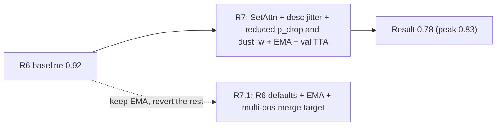
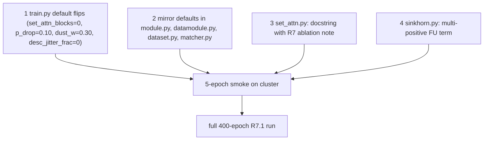

# Round 7.1: Surgical rollback + multi-positive Sinkhorn merges

## Diagnosis of the R7 W&B run

Best ckpt is at step ~1500 (epoch ~53) with `val_match_score ~= 0.83`; the run then declined for 80+ epochs (early stop should have triggered around epoch 113 with patience 60).

| Metric | R6 final | R7 best | R7 final | Delta |
|---|---:|---:|---:|---:|
| `val_match_score` | 0.92 | 0.83 | 0.78 | **-9 / -14 pp** |
| `val_acc_unchanged_split` | 0.85 | 0.70 | 0.70 | **-15 pp** |
| `val_acc_disappeared` | 0.97 | 1.0 | 0.85 | **-12 pp** |
| `val_acc_newly_appearing` | 0.97 | 1.0 | 0.83 | **-14 pp** |
| `val_row_acc_hungarian` | 0.93 | 0.90 | 0.83 | **-10 pp** |
| `val_ap_sinkhorn` | 0.92 | 0.83 | 0.82 | **-10 pp** |
| `train_pair_loss` / `val_pair_loss` | 0.05 / 0.08 | - | 0.03 / 0.10 | gap widened |
| `train_dust_bce` / `val_dust_bce` | 0.2 / 0.2 | - | 0.13 / 0.35 | **R5 gap is back** |
| Params | 1.5M | - | 2.6M | +73% |

Root causes (forensic):

1. **SetAttn was redundant.** [tracking/matcher.py](tracking/matcher.py) `HeteroGnn` already does bipartite cross-attention via `TransformerConv` *conditioned on the 27-D `cross_attr` edge features*. Stacking plain feature-only self/cross-attention on top added 1.1 M params without giving the network any signal that the existing bipartite TransformerConv layers didn't already have. The capacity overrun shows up directly in the pair-loss train/val gap (0.03 vs 0.10) and in `val_acc_unchanged_split` (the metric most sensitive to picking among competing partners) regressing the worst.
2. **The R6 dustbin fix got partially undone.** Reducing `p_drop_fu/bl` 0.10 -> 0.07 *and* `dust_w` 0.30 -> 0.25 at the same time weakened both the synthetic-positive count *and* the loss weight. `val_dust_bce` now sits ~2.7x above `train_dust_bce` — exactly the R5 overfit pattern R6 fixed.
3. **`desc_jitter_frac=0.02` damaged the identity channel.** The 1372-D L0 descriptor is hand-crafted and frozen; it *is* the lesion identity in the GNN. Adding per-feature noise at 2% of std on 224 training patients is too aggressive — the GNN cannot learn invariances when there is no learnable encoder behind the descriptor.
4. **`--tta-n 5` at training** turned every val epoch into 5 jittered forward passes. Best-ckpt selection on a noisy `val_match_score` picks worse checkpoints; the late oscillation in the curve is consistent with augmentation-noise variance, not real overfit.

Only **EMA** is in the clear: monotonic, additive, no observable harm.



## Change set (small, ordered by leverage)

### 1. Revert defaults to R6 values; keep EMA

| Flag | R7 default | R7.1 default | Why |
|---|---:|---:|---|
| `set_attn_blocks` | 2 | **0** | SetAttn was redundant capacity. Module kept on disk, disabled. |
| `p_drop_fu`, `p_drop_bl` | 0.07 | **0.10** | Restore R6 synthetic positive rate. |
| `dust_w` | 0.25 | **0.30** | Restore R6 dustbin loss weight. |
| `desc_jitter_frac` | 0.02 | **0.0** | Stop corrupting the only identity feature. |
| `ema_decay`, `ema_start_epoch` | 0.999, 5 | unchanged | The one safe lever. |
| `max_epochs`, `early_stop_patience` | 400, 60 | unchanged | Not the problem. |
| `dust_tau` | 0.2 | unchanged | Sweep post-train only. |
| `tta_n` (training) | 0 | unchanged | Inference-only. Do not pass `--tta-n` at training. |

Files:
- [tracking/cli/train.py](tracking/cli/train.py): update the `TrainConfig` dataclass defaults to the column above.
- [tracking/train/module.py](tracking/train/module.py): update `MatcherModule.__init__` defaults for `dust_w=0.30`, `set_attn_blocks=0`, `desc_jitter_frac=0.0`.
- [tracking/train/datamodule.py](tracking/train/datamodule.py): defaults `p_drop_fu=0.10`, `p_drop_bl=0.10`, `desc_jitter_frac=0.0`.
- [tracking/data/dataset.py](tracking/data/dataset.py): defaults same as datamodule.
- [tracking/matcher.py](tracking/matcher.py): `ModelConfig.set_attn_blocks: int = 0` default.

### 2. Mothball SetAttn (keep file, disabled, with the experimental record)

User decision: keep [tracking/set_attn.py](tracking/set_attn.py) importable for future research. Add a module docstring that captures *why* it is unused, so a future maintainer (or future-us) doesn't relitigate the same experiment:

```python
"""Within-graph self + cross-attention block. UNUSED by default.

Disabled in Round 7.1 after empirical ablation: enabling 2 blocks on top of
the dense bipartite TransformerConv in HeteroGnn doubled parameter count
(1.5M -> 2.6M) while regressing val_match_score 0.92 -> 0.78 and
val_acc_unchanged_split 0.85 -> 0.70 on 224 training patients.

Mechanism: HeteroGnn already attends bipartitely with the 27-D cross_attr
as edge bias. SetAttn here attends without edge conditioning, so it added
capacity without adding signal -- pure overfit on small data. May become
useful once the L0 descriptor is replaced by a learnable encoder (Round 8+).

Wire via ModelConfig.set_attn_blocks > 0; default 0 = bypassed entirely.
"""
```

No code change to the module itself.

### 3. Multi-positive Sinkhorn target for merges (one-shot forward move)

File: [tracking/train/sinkhorn.py](tracking/train/sinkhorn.py)

In our domain BL rows have at most one positive FU (a lesion maps to one lesion or dust), so the BL-side term is unchanged. But FU columns can have multiple BL claimants when lesions *merge* (`pos[:, j].sum() > 1`). Today `sinkhorn_loss` picks `argmax` arbitrarily as the FU's target — only one BL gets credit; the rest contribute via the BL term only. SuperGlue's standard remedy is to use the uniform target over claimants. Replace the FU term:

```python
pos_f = (lab.reshape(n_bl, n_fu) > 0.5).float()
n_claims = pos_f.sum(dim=0)                                    # (n_fu,)
neg_log_P = -P                                                 # log_sinkhorn output (already log)
fu_real = (pos_f * neg_log_P[:n_bl, :n_fu]).sum(dim=0) / n_claims.clamp(min=1)   # (n_fu,)
fu_dust = neg_log_P[n_bl, :n_fu]                               # (n_fu,)
fu_term = torch.where(n_claims > 0, fu_real, fu_dust).mean()
```

This is a 5-LOC change in `sinkhorn_loss`; `bl_term` and BL-side targets stay as today (each BL still has exactly one ground-truth column or dust).

Why now: the residual `val_acc_unchanged_split` errors in R5/R6/R7 plots cluster on graphs with merges. The single-pick FU target was an explicit known compromise (see R3 plan risks). Adding the uniform fix is a one-line bet with no other interaction.

## File touch summary (small)

- [tracking/cli/train.py](tracking/cli/train.py): 5 default constants.
- [tracking/train/module.py](tracking/train/module.py): 3 default constants.
- [tracking/train/datamodule.py](tracking/train/datamodule.py): 3 default constants.
- [tracking/data/dataset.py](tracking/data/dataset.py): 3 default constants.
- [tracking/matcher.py](tracking/matcher.py): 1 default constant.
- [tracking/set_attn.py](tracking/set_attn.py): docstring only.
- [tracking/train/sinkhorn.py](tracking/train/sinkhorn.py): ~5 LOC fu_term replacement.

No caches change. v4 caches stay valid. R7 checkpoint is incompatible with `set_attn_blocks=0` matcher anyway -- retrain from scratch (cheap; R6 train was ~3 hours on cluster).

## Order of execution



## Verification

1. **Smoke (5 epochs)**: `val_match_score >= 0.85` by epoch 5, `val_dust_bce` co-falls with `train_dust_bce`, all losses finite. If the multi-pos change causes Sinkhorn loss instability, drop it via a `--single-pos-fu` flag and rerun.
2. **Full run (target)**: `val_match_score >= 0.93`, `val_acc_unchanged_split >= 0.87`, `val_acc_disappeared >= 0.95`, `val_acc_newly_appearing >= 0.95`. EMA buys roughly +1pp over R6; the merge fix should buy another +1-2pp on `val_acc_unchanged_split`.
3. **Post-train tau sweep**: `dust_tau in {0.15, 0.18, 0.20, 0.22, 0.25}` on val, pick argmax of `val_match_score`. Cheap (single forward pass per tau).
4. **Optional ablation**: rerun with `--single-pos-fu` flag (toggling the merge fix off). If the gain is real, ship; if not, leave the multi-pos code in (it is the mathematically correct target either way).
5. **Inference sanity**: load best EMA ckpt, run [tracking/cli/predict.py](tracking/cli/predict.py) with `--tta-n 5` (inference default) on a val patient with known disappeared lesions; confirm dustbin precision is up vs R6.

## Risks and rollback

- **Multi-pos FU term destabilizes Sinkhorn on early epochs** (FU columns with 0 claimants degenerate to dust-row mean). Mitigated by the `where(n_claims > 0, ...)` guard; smoke will catch any nan.
- **Reverting `desc_jitter_frac` to 0 removes the only data-augmentation on the descriptor.** That is fine — R6 trained successfully without it. The position-jitter remains as the only spatial augmentation.
- **EMA could still lag raw early** (it gates on `current_epoch >= 5`). If `val_match_score` is materially worse in epochs 5-15 than R6, drop `ema_start_epoch` to 10. Single CLI flag.
- **Rollback path**: this is itself a rollback. If R7.1 underperforms R6, the next move is the L0 descriptor swap to MAE features (Round 8), not more knob-twiddling.

## Deferred to Round 8 (unchanged from R7 plan)

- Replace L0 descriptor with MAE-pretrained segmentation features. This is the next major lever once the MAE seg model is available.
- SE(3)-equivariant message passing, cross-patient mixup, anatomy-conditioned head: all gated on the encoder upgrade above.
- BL-only self-attention (lighter SetAttn focused on the noisy side): revisit after the encoder upgrade gives us slack to absorb extra capacity.