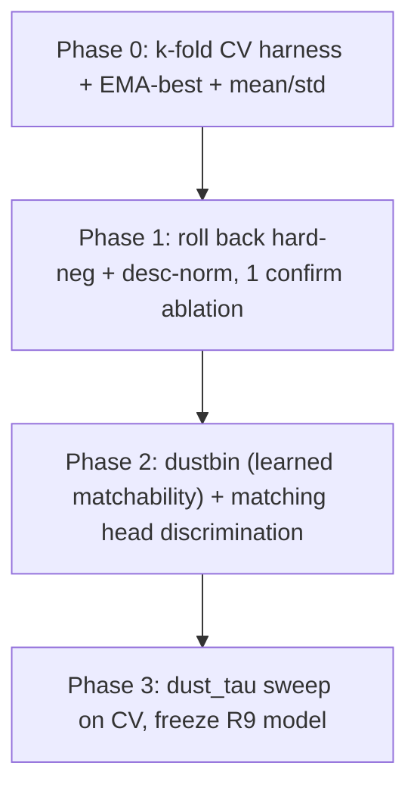

# Round 9: Trustworthy CV + Matcher/Dustbin Architecture

Personas: Ilya (representation/regularization in the small-data regime), Jure (GNN/matching structure), Fabian (medical validation rigor). All three agree: **measurement before modeling.**

## Coding philosophy (HARD RULE - read before writing any code)

This repo follows nanochat-style. The implementing agent MUST obey this; do not assume prior knowledge. Distilled from Karpathy's nanochat + the user's style guides. Non-negotiable.

Spirit: minimal, dense, correct. One file = one concept. Few lines, high information density. Remove layers, do not add them. Distrust magic. Maintain it alone in 5 years.

Hard rules (apply to every file touched in R9):

- **R1 <200 LOC per file.** Hard limit. If a file would exceed it, split on a concept boundary, not arbitrarily. (`tracking/matcher.py` is already near the ceiling - if dustbin + matching-head changes push it over, lift the new module into a sibling file with a real noun name, e.g. `tracking/matchability.py`, NOT a `utils/`.)
- **R2 no <30 LOC file** that exists to host one function. Inline into nearest sibling or `tracking/common.py`.
- **R3 no abstract base classes, no factories, no registries, no plugins.** Two cases is `if cfg.x == "a": ... else: ...`, not a registry. (The optional edge-conditioned cross-attn in Phase 2b is a flag + branch, not a strategy class.)
- **R4 no `utils/` / `helpers/` package.** Real noun names only: `splits.py`, `matchability.py`.
- **R5 no defensive programming.** `assert` on invariants; raise only at the boundary (CLI / config / file I/O). No try/except that just logs and re-raises. (`assert fold in range(n_folds)`, `assert n_folds >= 2`.)
- **R6 one module-level docstring per file.** Short, lists what is in the file + any non-obvious feature. No section banners, no decorative comments.
- **R7 type hints on public signatures + dataclasses only.** Skip inside small helpers. No `Optional[Union[...]]` walls.
- **R8 dataclasses for config, argparse for CLI, JSON on disk.** No Hydra/OmegaConf/Pydantic. (Fold config extends the existing `TrainConfig` dataclass in `tracking/cli/train.py`.)
- **R9 constants + detected facts at module top** as `UPPER_CASE`. No `Settings()` singleton.
- **R10 comments explain WHY** (intent, invariant, trade-off, gotcha), never what. Delete any comment that paraphrases the next line.
- **R11 no print** outside `common.py` (`print0` for rank-0). Use Lightning/logger elsewhere.
- **R12 no fallbacks for missing data, ever.** Missing split/cache/ckpt -> raise. No silent recompute, no synthetic defaults.
- **R13 CLI scripts are top-to-bottom procedural.** argparse -> setup -> call into library -> exit. No `def main()` wrapper. (`tracking/cli/cv.py` mirrors the existing `tracking/cli/train.py` shape exactly.)
- **R14 no abstractions over Lightning.** Use `LightningModule`, `LightningDataModule`, `Trainer`, `WandbLogger`, `ModelCheckpoint` directly. No `BaseTrainer`. Non-trivial logic lives in the `LightningModule`, not in callbacks.
- **R15 errors loud and immediate.** Validate config at load, inputs at CLI entry, crash. The training loop assumes valid state.
- **R16 tests are temporary.** Write to validate, then delete. Final repo has no `tests/`.

Naming: `snake_case` functions/vars/files/folders; `PascalCase` classes/dataclasses; `UPPER_CASE` constants. Short and precise (`fold`, `n_bl`, `z`, `tau`), not `query_tensor` when `q` is unambiguous. File names are nouns (`splits.py`, not `split_utils.py`).

Anti-patterns to refuse: a `BaseSampler` + subclasses + registry; a one-function `*_helpers.py`; an ABC with one concrete impl; try/except-with-fallback around library calls; a `Settings` singleton. If you catch yourself writing any of these, stop and inline.

## Diagnosis (from W&B rounds 7-8, peaks not finals)

- Peak `val_match_score`: R6 ~0.936, R7 ~0.83 (regressed, correctly rolled back), R7.1 ~0.917 (did not beat R6), **R8 l0 ~0.946 (best)**, R8 mae ~0.919, R8 yerebakan ~0.893.
- Net R6->R8 gain is ~1pp, which is **inside the noise floor** of a tiny val set (`unchanged_split` quantized to ~0.027, `disappeared` ~0.011, `newly` ~0.03). Round deltas are untrustworthy.
- Overfit is universal: every run's `val_acc_disappeared` decays 1.0->~0.955 and `val_acc_newly_appearing` 1.0->~0.94 during training -> **dustbin still memorizes** (R5/R6 reduced, did not kill).
- The ceiling metric is `val_acc_unchanged_split` ~0.90 (disappeared/newly already ~0.97-1.0) -> **same-anatomy matching discrimination** is the real lever.
- MAE/yerebakan descriptors underperform L0 -> stay on L0; spend effort on the matcher (user decision).

## Phase 0 - Trustworthy measurement (FOUNDATION, do first)

Goal: make a 1pp delta meaningful. Without this every later result is noise-chasing.

- Patient-level k-fold (k=5) over the train+val pool. Add `tracking/data/splits.py`: deterministic patient-id -> fold map (seeded), no patient leakage across BL/FU of the same patient.
- `tracking/train/datamodule.py` [tracking/train/datamodule.py](tracking/train/datamodule.py): accept `fold: int` and `n_folds: int`; build train = folds != f, val = fold == f. Keep the held-out test split untouched as the final gate.
- `tracking/cli/train.py` [tracking/cli/train.py](tracking/cli/train.py): add `--fold`, `--n-folds`; a thin `tracking/cli/cv.py` loops folds and writes per-fold best (raw + EMA) `val_match_score` and the 3 sub-accuracies.
- Reporting: aggregate **mean +/- std across folds** at the best-EMA checkpoint; also log peak-raw. Add to `tracking/report.py` [tracking/report.py](tracking/report.py).
- `tracking/train/module.py` [tracking/train/module.py](tracking/train/module.py): explicitly track and checkpoint on the **EMA** `val_match_score` (validation already runs EMA after `ema_start_step` via `_val_net`), and log a smoothed (EWMA over val checks) monitor to reduce best-ckpt jitter. Keep `ModelCheckpoint` monitoring the EMA metric.

Acceptance: report R8-baseline (current defaults) under 5-fold as the reference number with std. Every subsequent change is judged on overlapping-vs-separated CIs, not single-split point estimates.

## Phase 1 - Roll back the unproven R8 knobs (one confirmatory ablation)

New R9 defaults (rollback to OFF), keeping batch-independence + EMA + step-clock + dust_tau:

- `tracking/cli/train.py`: `hard_pair_w: float = 0.0` (was 0.2), `desc_norm: bool = False` (was True). Mirror in `tracking/train/module.py` and `ModelConfig.desc_norm` in `tracking/matcher.py` [tracking/matcher.py](tracking/matcher.py).
- Rationale: `hard_pair_bce` in [tracking/train/match_utils.py](tracking/train/match_utils.py) is triple-covered (focal pair loss + same-anatomy InfoNCE + Sinkhorn global competition) and uses a brittle `ea[:,:,3]/ea[:,:,10]` python loop; `desc_norm` LayerNorm strips per-lesion magnitude that `pack_node` already scaled, removing identity signal.
- Keep both code paths behind flags (no deletion). Run ONE 5-fold confirmatory comparison: R9-base (both OFF) vs bundle-ON. Ship whichever wins on CV mean; expectation is OFF >= ON.

## Phase 2 - Attack the two real ceilings (the lever)

### 2a. Dustbin: learned matchability instead of 3 hand scalars

- Problem: `DustHead` reads `[z, (max, mean, top2-gap)]` of the pair row -> still overfits late.
- Change in [tracking/matcher.py](tracking/matcher.py): replace the 3-scalar summary with a permutation-invariant **learned row encoder** (LightGlue-style matchability): softmax-attention pooling over the BL row's pair logits (and the symmetric FU column), plus the row's Sinkhorn dustbin marginal as an input. Concretely, feed top-k sorted pair logits (k~5, padded) + attention-pooled context vector into the dust MLP instead of `[max, mean, gap]`.
- Keep heavy dropout on the head; this is a regularization + better-inductive-bias move, not added capacity. Target: stop the `disappeared/newly` decay during training.

### 2b. Matching head: discrimination on same-anatomy competitors

- Problem: head is an MLP on `[z_bl, z_fu, cross_attr]`; `unchanged_split` stuck ~0.90.
- Change in [tracking/matcher.py](tracking/matcher.py): add an explicit bilinear/scaled-dot identity term `z_bl . W . z_fu` alongside the existing concat-MLP, so the score has a direct metric-learning component on the descriptor-derived embedding (where same-anatomy identity lives). Cheap, few params.
- Optional (only if 2b alone underwhelms on CV): one **edge-conditioned** cross-attention refine layer that uses `cross_attr` as attention bias (the missing piece behind R7 SetAttn's failure, which was NOT edge-conditioned). Gate behind a flag; add only if CV shows gain. Do not stack plain self-attention again.
- Tiny-data discipline (Ilya/Fabian): prefer inductive bias + regularization over width/depth. No new descriptor, no cache rebuild.

### 2c. Keep the contrastive identity pressure

- Leave same-anatomy InfoNCE (graph scope) as-is; it is the cross-patient identity signal that distance baselines lack. Re-confirm its weight under CV (quick `nce_w` check) once 2a/2b land.

## Phase 3 - Threshold + freeze

- `dust_tau` post-hoc sweep `{0.10,0.15,0.18,0.20,0.22,0.25,0.30,0.35}` on each fold's val (single forward per tau), pick CV-argmax `val_match_score`. Already supported via `--dust-tau` in [tracking/cli/eval.py](tracking/cli/eval.py).
- Final R9 model = best Phase-2 config, retrained, evaluated once on the held-out test split (the gate touched only at the end).

## Targets

- Primary: R9 5-fold mean `val_match_score` with non-overlapping CI above R8 baseline; `unchanged_split` mean +>=2pp; `disappeared`/`newly` no longer decay during training (peak == near-final).
- Guardrail: no per-file LOC blowup (nanochat style), no cache rebuild, L0 features unchanged.

## Explicitly out of scope

- Descriptor swap/fusion (MAE/yerebakan) - underperformed L0, user deferred.
- v6 cross-edge geometry cache (R8 stage-2) - deferred; revisit only if matcher work plateaus.
- SE(3) equivariance, cross-patient mixup - premature until CV shows the matcher ceiling is actually hit.