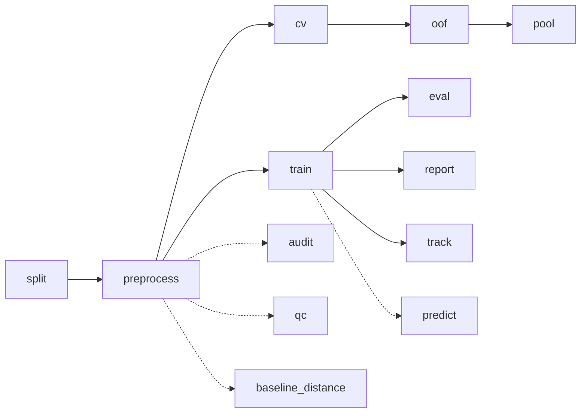

# LesionGlue

LesionGlue matches lesions between a baseline CT and a follow-up CT. A graph neural network (PyTorch Geometric + Lightning) builds dense bipartite BL to FU edges and predicts pair logits plus dust (no-match) heads. The deployed matcher is a local checkpoint scoring 0.9701 match on the 57-graph cache_v7 holdout (see [README.md](../README.md)). Graph construction, losses and metrics are in [technical.md](technical.md).



Solid arrows are the main pipeline. Dotted branches are side tools. `report` trains (or loads) a checkpoint and benchmarks it against the nearest-mask baseline.

## Quickstart

```bash
lesionglue_split --root /nnunet_data/Longitudinal-CT
lesionglue_preprocess --split all --jobs 16
lesionglue_train --config lesionglue/configs/base.json --out runs/base
lesionglue_eval --split test
lesionglue_track --root /nnunet_data/Longitudinal-CT --split test --out /tmp/track_test
```

Optional: `lesionglue_cv --config lesionglue/configs/base.json --out runs/cv` for patient-level cross-validation, `lesionglue_audit --split val` for a label audit.

## Commands

| Command | Stage | Step doc |
|---|---|---|
| `lesionglue_split`, `lesionglue_preprocess`, `lesionglue_audit` | Data | [data.md](steps/data.md) |
| `lesionglue_train`, `lesionglue_cv`, `lesionglue_oof`, `lesionglue_pool` | Training | [train.md](steps/train.md) |
| `lesionglue_eval`, `lesionglue_report`, `lesionglue_predict`, `lesionglue_baseline_distance` | Evaluation | [eval.md](steps/eval.md) |
| `lesionglue_track` | Deployment | [track.md](steps/track.md) |
| `lesionglue_qc` | Graph viewer | [qc.md](steps/qc.md) |
