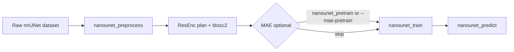

# nanoUNet documentation

Minimal prompt-aware 3D ResEnc U-Net with PyTorch Lightning and optional MAE pretraining. The U-Net preprocessing, training, and setup pipeline draws a lot of inspiration from [nnU-Net](https://github.com/MIC-DKFZ/nnUNet).

## Pipeline overview



**Standard path:** fingerprint → plan → preprocess (`3d_fullres`) → (optional MAE) → supervised train → prompt-driven predict.

## Quickstart

Set environment variables (see [README](../README.md#environment)) then run:

```bash
nanounet_preprocess -d 001 --planner nnUNetPlannerResEncL -np 8
nanounet_train -d 001 -f 0 --plans nnUNetResEncUNetLPlans --config nanounet/configs/default.json
nanounet_predict -i /path/to/scans -o /path/to/out -m /path/to/run --ckpt last.ckpt
```

Linking lesions across a BL/FU pair is the [segtrack](../../segtrack/README.md) project (`segtrack_run`), which calls `nanounet_predict`'s engine and then LesionGlue.

Tiny laptop smoke train:

```bash
nanounet_train -d 001 -f 0 --plans nnUNetResEncUNetTinyPlans --config nanounet/configs/default.json \
  --epochs 2 --iters-per-epoch 50 --accelerator cpu --precision 32-true --batch-size 1 --no-wandb
```

## Documentation map

| Topic | Link |
|-------|------|
| Preprocess | [steps/preprocess.md](steps/preprocess.md) |
| Planning knobs | [steps/plan.md](steps/plan.md) |
| MAE pretrain | [steps/pretrain.md](steps/pretrain.md) |
| Supervised train | [steps/train.md](steps/train.md) |
| Inference (clustered + scores) | [steps/predict.md](steps/predict.md) |
| Track (scans + clicks → linked masks) | [segtrack/README.md](../../segtrack/README.md) |
| Fixed valset | [steps/valset.md](steps/valset.md) |
| Lesion weights | [steps/lesion_weights.md](steps/lesion_weights.md) |
| Instance targets | [reference/instance_targets.md](reference/instance_targets.md) |
| Tracking ids on masks | [segtrack/docs/track_ids.md](../../segtrack/docs/track_ids.md) |
| ROI / prompt config | [reference/config.md](reference/config.md) |
| Patch size playbook | [reference/patch_size.md](reference/patch_size.md) |
| Loss functions | [reference/losses.md](reference/losses.md) |
| Host RAM / cgroup OOM | [dev-notes/cgroup_memory.md](dev-notes/cgroup_memory.md) |
